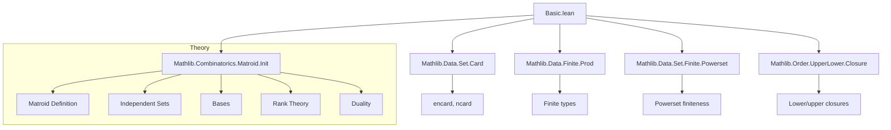
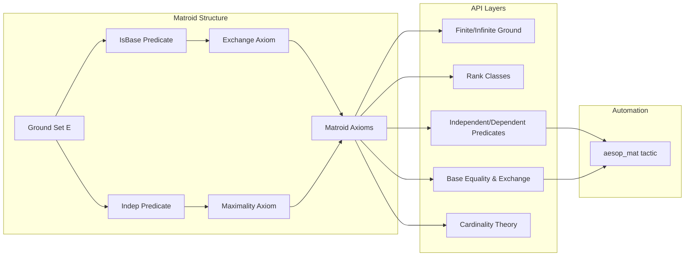

### Technical Brief: `Basic.lean` — Matroid Foundations in Lean 4

---

#### **1. Key Definitions & Theorems**

| Name | Type / Signature | Purpose |
|------|------------------|---------|
| `Matroid.ExchangeProperty P` | `Prop` | Formalizes the *basis exchange property*: for bases `X, Y`, any `a ∈ X \ Y` can be swapped with some `b ∈ Y \ X` to preserve `P`. |
| `Matroid.ExistsMaximalSubsetProperty P X` | `Prop` | Ensures every `P`-subset of `X` extends to a *maximal* `P`-subset of `X`. |
| `Matroid α` | `Type u → Type u` | Structure defining a matroid: ground set `E : Set α`, predicates `IsBase`, `Indep`, with axioms (exchange, maximality, etc.). |
| `M.E` | `Set α` | Ground set of matroid `M`. |
| `M.IsBase B` | `Prop` | Predicate: `B` is a base of `M`. |
| `M.Indep I` | `Prop` | Predicate: `I` is independent in `M`. |
| `M.Dep D` | `Prop` | Defined as `¬M.Indep D ∧ D ⊆ M.E`. |
| `M.IsBasis I X` | *Not defined in this file* (likely in later files) | `I` is a maximal independent subset of `X`. |
| `M.Finite` | `Class` | Wrapper for `M.E.Finite`. |
| `M.Nonempty` | `Class` | Wrapper for `M.E.Nonempty`. |
| `RankFinite M` | `Class` | Exists a finite base. |
| `RankInfinite M` | `Class` | Exists an infinite base. |
| `RankPos M` | `Class` | Empty set is not a base (ensures bases are nonempty). |
| `Finitary M` | *Not defined here* | Independent iff all finite subsets are independent. |
| `aesop_mat` | `tactic` | Discharges goals of the form `X ⊆ M.E` using matroid-specific rules. |
| `IsBase.exchange` | `M.IsBase B₁ → M.IsBase B₂ → e ∈ B₁ \ B₂ → ∃ y ∈ B₂ \ B₁, M.IsBase (insert y (B₁ \ {e}))` | Core exchange lemma for bases. |
| `IsBase.encard_eq_encard_of_isBase` | `B₁.encard = B₂.encard` | All bases have same `ℕ∞`-cardinality (key for rank). |
| `isBase_iff_maximal_indep` | `M.IsBase B ↔ Maximal M.Indep B` | Bases = maximal independent sets. |
| `ext_isBase` / `ext_iff_isBase` | Equality criterion for matroids via ground set + base predicate. | Enables extensionality proofs. |
| `isBase_compl_iff_maximal_disjoint_isBase` | `M.IsBase (M.E \ B) ↔ Maximal (fun I ↦ I ⊆ M.E ∧ ∃ B, M.IsBase B ∧ Disjoint I B) B` | Dual basis characterization (used in duality). |

---

#### **2. Naming Conventions**

- **Prefixes / Suffixes**:
  - `isBase_`, `indep_`, `dep_`, `finite_`, `rankFinite_`, `rankInfinite_`, `rankPos_`: predicate-related lemmas.
  - `diff_`, `encard_`, `ncard_`: cardinality/difference lemmas.
  - `exchange_`: basis exchange lemmas.
  - `subset_ground`, `mem_ground_of_mem_of_subset`: ground-set containment lemmas.
  - `compl_`: *set difference* w.r.t. `M.E`, not full complement (e.g., `compl_isBase_dual`).
  - Suffixes like `_iff_`, `_of_`, `_comm`, `_superset`, `_ssubset` follow standard Lean conventions.

- **Predicate order in names**: `ground_indep_iff_isBase` (not `indep_ground_`) — reflects explicit reference to `ground` and suffix usage.

---

#### **3. Tactic Stack**

| Tactic | Usage Frequency | Purpose |
|--------|-----------------|---------|
| `aesop_mat` | High | Proves `X ⊆ M.E` using matroid-specific rules (e.g., `insert_subset_ground`, `diff_subset_ground`). |
| `aesop` | Medium | General automation (used inside `aesop_mat`). |
| `simp_rw` | Medium | Rewriting with `indep_iff'`, `dep_iff`, `isBase_iff_maximal_indep`, etc. |
| `rw` | Medium | Rewriting definitions (e.g., `ncard_def`, `encard_diff_add_encard_inter`). |
| `gcongr` | Low | For inequalities involving `encard`. |
| `contrapose!`, `by_contra`, `by_cases` | Medium | Classical reasoning (e.g., `not_rankFinite`, `dep_of_not_indep`). |
| `exact`, `assumption`, `intro`, `cases` | High | Basic proof structure. |
| `termination_by` | Low | In `encard_diff_le_aux`, for well-founded recursion on `encard`. |

---

#### **4. Proof Logic**

- **Inductive/structural style**: Proofs often proceed by:
  1. Unfolding definitions (`indep_iff`, `dep_iff`, `isBase_iff_maximal_indep`).
  2. Using `aesop_mat` to discharge subset-of-ground-set hypotheses.
  3. Applying `exchange` lemmas to manipulate bases.
  4. Using `encard`-based arguments (especially `encard_diff_eq`, `encard_isBase_eq`) to compare sizes.
  5. Leveraging maximality (e.g., `Maximal.antisymm`) to prove equality of bases.

- **Common pattern**:
  ```lean
  obtain ⟨B, hB, hIB⟩ := hI.exists_isBase_superset
  -- then use hB's properties (finite/infinite, exchange, encard_eq)
  ```

- **Cardinal arithmetic**: Heavy use of `Set.encard : Set α → ℕ∞` to avoid case splits on finiteness.

---

#### **5. Imports**

| Module | Purpose |
|--------|---------|
| `Mathlib.Combinatorics.Matroid.Init` | Core matroid definitions (this file is part of that module). |
| `Mathlib.Data.Finite.Prod` | Finite product properties (used for `Finite α → M.Finite`). |
| `Mathlib.Data.Set.Card` | `encard`, `ncard`, cardinal arithmetic. |
| `Mathlib.Data.Set.Finite.Powerset` | Finite subsets, powersets. |
| `Mathlib.Order.UpperLower.Closure` | `lowerClosure`, used in `setOf_indep_eq`. |

---

#### **6. Mermaid Diagrams**

##### **Dependency Graph (Top-Level)**



##### **File Overview (Structure)**



---

#### **7. Design Highlights & Tradeoffs**

- **Ground set as `Set α`** (not `α`): Enables *propositional equality* for submatroids (`M ↾ R`, `M ⟋ e`), avoiding isomorphism headaches.
- **B-matroids (Bruhn et al.)**: Infinite matroids with full duality and rank theory; avoids pathological infinite definitions.
- **`encard` over `ncard`**: Uniform handling of finite/infinite sets; avoids case splits.
- **Explicit `X ⊆ M.E` hypotheses**: Necessary due to ground-set-as-set design; mitigated by `aesop_mat`.
- **No typeclass for `Matroid`**: Avoids ambiguity when multiple matroids share the same `α`.

---

#### **8. References Cited**

- Oxley, *Matroid Theory* (2011)  
- Bruhn et al., *Axioms for Infinite Matroids* (2013)  
- Bowler & Geschke, *Self-dual uniform matroids on infinite sets* (2016)

--- 

This file forms the foundational API for matroids in Lean, emphasizing *generality* (infinite matroids), *usability* (`aesop_mat`), and *proof automation* (via `encard` and tactic support).
