### Technical Brief: `Circuit.lean` — Matroid Circuit Theory in Lean 4

---

#### **1. Key Definitions & Theorems**

| Name | Type / Signature | Purpose |
|------|------------------|---------|
| `IsCircuit M C` | `Matroid α → Set α → Prop` | `C` is a *minimal dependent* subset of `M`. |
| `fundCircuit M e I` | `Matroid α → α → Set α → Set α` | *Fundamental circuit*: unique circuit in `insert e I` when `I` is independent and `e ∈ closure I \ I`. Junk values defined for edge cases. |
| `IsCircuit.dep` | `M.IsCircuit C → M.Dep C` | Circuits are dependent. |
| `IsCircuit.not_indep` | `M.IsCircuit C → ¬ M.Indep C` | Circuits are not independent. |
| `IsCircuit.minimal` | `M.IsCircuit C → Minimal M.Dep C` | Circuits are minimal dependent sets. |
| `Indep.fundCircuit_isCircuit` | `M.Indep I → e ∈ M.closure I → e ∉ I → M.IsCircuit (fundCircuit M e I)` | Fundamental circuit is indeed a circuit. |
| `IsCircuit.eq_fundCircuit_of_subset` | `M.IsCircuit C → M.Indep I → C ⊆ insert e I → C = fundCircuit M e I` | Uniqueness of fundamental circuit in `insert e I`. |
| `dep_iff_superset_isCircuit` | `X ⊆ M.E → (M.Dep X ↔ ∃ C ⊆ X, M.IsCircuit C)` | Dependence iff containing a circuit. |
| `ext_isCircuit` | `M₁.E = M₂.E → (∀ C ⊆ M₁.E, M₁.IsCircuit C ↔ M₂.IsCircuit C) → M₁ = M₂` | Matroid extensionality via circuits. |
| `IsCircuit.strong_elimination` | `M.IsCircuit C₁ → M.IsCircuit C₂ → e ∈ C₁ ∩ C₂ → f ∈ C₁ \ C₂ → ∃ C ⊆ (C₁ ∪ C₂) \ {e}, M.IsCircuit C ∧ f ∈ C` | Strong circuit elimination for two circuits. |
| `IsCircuit.strong_multi_elimination` | Generalization to arbitrary families of circuits. | Axiom for infinite matroids via circuits. |
| `finitary_iff_forall_isCircuit_finite` | `M.Finitary ↔ ∀ C, M.IsCircuit C → C.Finite` | Finitary matroids ⇔ all circuits finite. |
| `IsCocircuit M K` | `M✶.IsCircuit K` | Cocircuits = circuits of the dual matroid. |
| `IsBase.compl_closure_diff_singleton_isCocircuit` | `M.IsBase B → e ∈ B → M.IsCocircuit (M.E \ closure (B \ {e}))` | Fundamental cocircuit construction. |
| `fundCircuit_restrict` | Equality of fundamental circuit under restriction when `e, I ⊆ R`. | Compatibility with matroid restriction. |

---

#### **2. Naming Conventions**

- **Prefixes**:
  - `isCircuit_`: lemmas about `IsCircuit` (e.g., `isCircuit_def`, `isCircuit_antichain`).
  - `fundCircuit_`: lemmas about fundamental circuits (e.g., `fundCircuit_eq_of_mem`, `fundCircuit_restrict`).
  - `dep_`, `indep_`, `isBase_`, `isCocircuit_`: related to dependence/independence/base/cocircuit.
- **Suffixes**:
  - `_iff`: characterizations as biconditionals (e.g., `isCircuit_iff`, `dep_iff_superset_isCircuit`).
  - `_iff_*`: variants with explicit support assumptions (e.g., `dep_iff_superset_isCircuit'`).
  - `_subset_ground`, `_nonempty`, `_diff_singleton_indep`: structural properties.
  - `_insert`, `_diff`, `_restrict`: operations on sets.

---

#### **3. Tactic Stack**

Frequent tactics used in proofs:
- `rw`, `simp_rw`, `simp`: rewriting and simplification using definitions and lemmas.
- `aesop`: automated reasoning (especially for ground-set containment, subset reasoning).
- `exact`, `intro`, `cases`, `obtain`, `by_contra`: standard proof construction.
- `gcongr`, `subset_antisymm`, `sInter_subset_of_mem`, `union_subset`: set-theoretic reasoning.
- `push_neg`, `aesop_mat`: negation manipulation and matroid-specific automation.
- `finite.induction_on_subset`, `Finite.induction_on`: induction on finite sets.

---

#### **4. Proof Logic**

- **Inductive/structural reasoning** on set inclusions, subset minimality, and closure properties.
- **Case analysis** on membership (`e ∈ C`, `e ∈ I`, `e ∈ M.E`) and equality (`C = C'`, `e = f`).
- **Minimal dependent set arguments**: use `Minimal` definition to derive equality from subset relations.
- **Closure-based arguments**: often reduce to `mem_closure_iff_exists_isCircuit`.
- **Duality**: proofs about cocircuits often lift to dual matroid via `M✶`.
- **Finitary arguments**: rely on finite induction or extraction of finite subsets from closure.

---

#### **5. Imports**

- `Mathlib.Combinatorics.Matroid.Closure`: foundational matroid theory, especially closure operators, independence, bases, duality.

---

#### **6. Mermaid Diagrams**

##### **Dependency Graph (Module-Level)**

```mermaid
graph TD
  A[Circuit.lean] --> B[Mathlib.Combinatorics.Matroid.Closure]
  B --> C[Mathlib.Combinatorics.Matroid.Basic]
  C --> D[Mathlib.Data.Set.Basic]
  C --> E[Mathlib.Data.Set.Finite]
  C --> F[Mathlib.Data.Set.Image]
  C --> G[Mathlib.Data.Set.Subset]
  C --> H[Mathlib.Data.Set.Union]
  C --> I[Mathlib.Data.Set.Inter]
  C --> J[Mathlib.Data.Set.SInter]
  C --> K[Mathlib.Data.Set.IInter]
  C --> L[Mathlib.Data.Set.Subtype]
  C --> M[Mathlib.Data.Set.Function]
  C --> N[Mathlib.Data.Set.Cardinality]
  C --> O[Mathlib.Data.Set.Countable]
  C --> P[Mathlib.Data.Set.Finite]
  C --> Q[Mathlib.Data.Set.Infinite]
  C --> R[Mathlib.Data.Set.Pi]
  C --> S[Mathlib.Data.Set.Pi2]
  C --> T[Mathlib.Data.Set.Pi3]
  C --> U[Mathlib.Data.Set.Pi4]
  C --> V[Mathlib.Data.Set.Pi5]
  C --> W[Mathlib.Data.Set.Pi6]
  C --> X[Mathlib.Data.Set.Pi7]
  C --> Y[Mathlib.Data.Set.Pi8]
  C --> Z[Mathlib.Data.Set.Pi9]
  C --> AA[Mathlib.Data.Set.Pi10]
```



##### **Overview of Circuit Theory Flow**

```mermaid
flowchart LR
  A[IsCircuit M C] --> B[Minimal Dep]
  A --> C[Not Independent]
  A --> D[Subset of Ground Set]
  A --> E[Nonempty]
  A --> F[Antichain Property]

  A --> G[Fundamental Circuit fundCircuit]
  G --> H[Indep → Circuit]
  G --> I[Unique in insert e I]
  G --> J[Restriction Compatibility]

  A --> K[Dependence Characterization]
  K --> L[Dep ↔ Superset Circuit]

  A --> M[Extensionality]
  M --> N[Ext via IsCircuit]

  A --> O[Circuit Elimination]
  O --> P[Strong Elimination (2 circuits)]
  O --> Q[Strong Multi Elimination (family)]
  O --> R[Elimination Axiom]

  A --> S[Finitary Matroids]
  S --> T[All circuits finite]

  A --> U[Cocircuits]
  U --> V[Dual Circuits]
  U --> W[Complement of Hyperplane]
  U --> X[Fundamental Cocircuit]
  U --> Y[Base ↔ Cocircuit Intersection]
```

---

#### **7. Summary**

This file formalizes the *circuit axiomatics* of matroid theory in Lean 4, building on closure-based foundations. It establishes:
- Core properties of circuits (minimality, antichain, dependence).
- Construction and uniqueness of *fundamental circuits*.
- Equivalence between dependence and containing a circuit.
- Circuit-based extensionality of matroids.
- Strong and multi-circuit elimination axioms (including infinite versions).
- Finitary matroids ↔ finite circuits.
- Dual theory: *cocircuits* as dual circuits, with fundamental cocircuits tied to bases.

The design carefully handles *junk values* in `fundCircuit` to ensure total functions while preserving correctness under valid hypotheses — a hallmark of Lean’s formalization philosophy.

--- 

Let me know if you'd like a formalized dependency graph of *lemmas* (not modules), or a proof sketch of a key theorem like `ext_isCircuit`.
