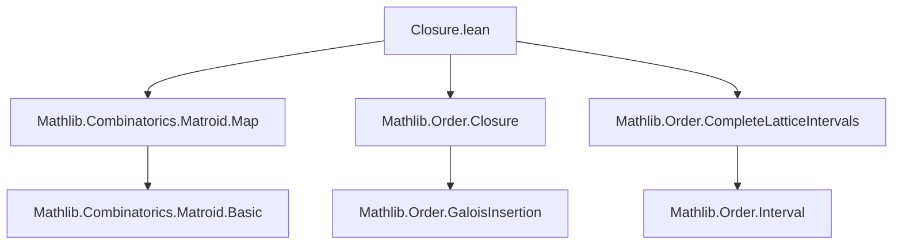
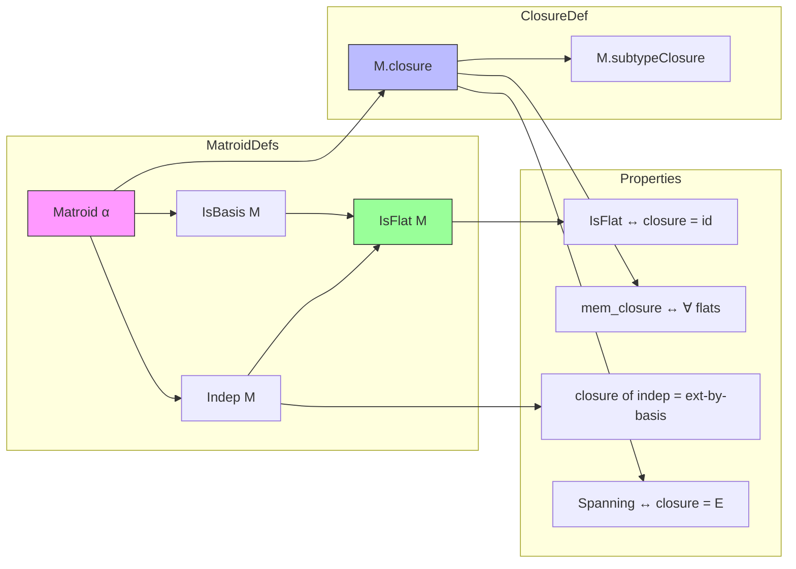

### Technical Brief: `Closure.lean` — Matroid Closure Formalization

---

#### **1. Key Definitions & Theorems**

| Name | Type / Signature | Purpose |
|------|------------------|---------|
| `M.IsFlat F` | `Prop` | Predicate for *flats*: maximal sets with a given basis; `F` is a flat iff any basis of `F` is also a basis of any superset `X ⊆ F`. |
| `M.closure X` | `Set α` | Closure of `X`: defined as `⋂₀ {F | M.IsFlat F ∧ X ∩ M.E ⊆ F}`. Handles arbitrary `X` via intersection with ground set. |
| `M.subtypeClosure` | `ClosureOperator (Iic M.E)` | Closure operator on the subtype of subsets of `M.E`; corresponds to flats as closed sets. |
| `M.Spanning S` | `Prop` | `S` is *spanning* iff `M.closure S = M.E`, equivalently `S` contains a basis. |
| `isFlat_iff_isClosed` | `M.IsFlat F ↔ ∃ h : F ⊆ M.E, M.subtypeClosure.IsClosed ⟨F, h⟩` | Relates flats in `M` to closed sets in the subtype closure operator. |
| `isFlat_closure` | `M.IsFlat (M.closure X)` | Closure of any set is a flat. |
| `isFlat_iff_closure_eq` | `M.IsFlat F ↔ M.closure F = F` | Characterizes flats as fixed points of closure. |
| `closure_eq_subtypeClosure` | `M.closure X = M.subtypeClosure ⟨X ∩ M.E, inter_subset_right⟩` | Connects global closure to subtype closure. |
| `mem_closure_iff_forall_mem_isFlat` | `e ∈ M.closure X ↔ ∀ F, M.IsFlat F → X ⊆ F → e ∈ F` | Membership in closure iff in every flat containing `X`. |
| `Indep.closure_eq_setOf_isBasis_insert` | `M.closure I = {x | M.IsBasis I (insert x I)}` (for `M.Indep I`) | Describes closure of an independent set as elements that extend it to a basis. |
| `Indep.mem_closure_iff` | `x ∈ M.closure I ↔ M.Dep (insert x I) ∨ x ∈ I` | Membership in closure of independent set iff dependent extension or already in set. |
| `isBasis_iff_indep_subset_closure` | `M.IsBasis I X ↔ M.Indep I ∧ I ⊆ X ∧ X ⊆ M.closure I` | Basis characterization via independence and closure bounds. |
| `isBase_iff_indep_closure_eq` | `M.IsBase B ↔ M.Indep B ∧ M.closure B = M.E` | Basis is spanning independent set. |
| `closure_iUnion_closure_eq_closure_iUnion` | `M.closure (⋃ i, M.closure (Xs i)) = M.closure (⋃ i, Xs i)` | Closure distributes over arbitrary unions of closures. |
| `Indep.closure_inter_eq_inter_closure` | `M.closure (I ∩ J) = M.closure I ∩ M.closure J` (if `M.Indep (I ∪ J)`) | Closure preserves intersections under independence. |

---

#### **2. Naming Conventions**

- **Prefixes**:
  - `isFlat_`: lemmas about flats (`isFlat_closure`, `isFlat_iff_closure_eq`)
  - `closure_`: general closure properties (`closure_subset_ground`, `closure_mono`, `closure_closure`)
  - `mem_closure_`: membership in closure (`mem_closure_of_mem`, `mem_ground_of_mem_closure`)
  - `subset_closure_`: subset relations into closure (`subset_closure`, `subset_closure_of_subset`)
  - `isBasis_`, `isBase_`, `Indep_`: basis/independence-related closure lemmas

- **Suffixes**:
  - `_iff`: equivalence lemmas (`isFlat_iff_closure_eq`, `isBase_iff_indep_closure_eq`)
  - `_closure`: closure applied to structured sets (`closure_union_closure_right_eq`, `closure_insert_closure_eq_closure_insert`)
  - `_of_subset`: implications assuming subset relations (`subset_closure_of_subset`, `mem_closure_of_mem`)
  - `_congr`, `_eq`: congruence or equality lemmas (`closure_union_congr_left`, `closure_eq_subtypeClosure`)
  - `_iff_of_notMem`, `_iff_of_subset`: conditional equivalences (`mem_closure_iff_of_notMem`, `insert_indep_iff_of_notMem`)

- **Special**:
  - `subtypeClosure`: closure on subtype `Iic M.E`
  - `ground_spanning` (not shown but mentioned): would follow `spanning_ground` pattern — suffixes use `spanning`, `isFlat` as suffixes.

---

#### **3. Tactic Stack**

Frequent tactics used in proofs:

| Tactic | Usage |
|--------|-------|
| `aesop` / `aesop_mat` | Automated reasoning, especially for set-theoretic inclusions and `M.E`-bounded reasoning. |
| `simp` / `simp_rw` | Simplification using `@[simp]` lemmas (e.g., `closure_ground`, `closure_closure`). |
| `rw` | Rewriting using definitions (`closure_def`, `closure_eq_subtypeClosure`). |
| `exact`, `refine`, `convert` | Proof construction, especially with subtype or `sInter`/`iInter` manipulations. |
| `ext` | Extensionality for set equality. |
| `aesop_mat` (custom) | Extended `aesop` for matroid-specific rules (e.g., `IsFlat.subset_ground`). |
| `by_contra!` | Contradiction-based arguments (e.g., `exists_of_closure_ssubset`). |
| `obtain` / `cases` | Decomposing existential/universal hypotheses (e.g., basis decompositions). |
| `convert` + `simp` | Aligning terms modulo definitional equality (e.g., `closure_iUnion_congr`). |

---

#### **4. Proof Logic**

- **Inductive/structural reasoning** is rare; most proofs are *set-theoretic* and rely on:
  - **Intersection characterizations** of closure and flats.
  - **Basis exchange properties** (e.g., `Indep.mem_closure_iff`, `isBasis_iff_indep_subset_closure`).
  - **Monotonicity & idempotence** of closure (e.g., `closure_mono`, `closure_closure`).
  - **Subtype lifting**: many properties are proved on `Iic M.E` via `subtypeClosure`, then projected back.

- **Typical proof flow**:
  1. Unfold `closure` or `IsFlat`.
  2. Reduce to `sInter`/`iInter` membership/inclusion.
  3. Use basis properties (`isBasis_union`, `isBasis_subset`) or independence lemmas.
  4. Apply `subset_antisymm` or `iff.intro` for equivalences.
  5. Use `aesop_mat` for routine set containment.

- **Key lemmas used repeatedly**:
  - `closure_eq_subtypeClosure`
  - `mem_closure_iff_forall_mem_isFlat`
  - `Indep.closure_eq_setOf_isBasis_insert`
  - `isBasis_iff_indep_subset_closure`
  - `closure_iUnion_closure_eq_closure_iUnion`

---

#### **5. Imports & Dependencies**

| Module | Purpose |
|--------|---------|
| `Mathlib.Combinatorics.Matroid.Map` | Core matroid definitions (`Matroid`, `IsBasis`, `Indep`, `IsBase`, etc.) |
| `Mathlib.Order.Closure` | General closure operators, Galois insertions, closure systems |
| `Mathlib.Order.CompleteLatticeIntervals` | Intervals like `Iic M.E`, used for subtype closure |

---

#### **6. Mermaid Diagrams**

##### **Dependency Graph (Module-Level)**



##### **Overview of Theory Flow**



##### **Closure Operator Hierarchy**

```mermaid
graph LR
  subgraph GlobalClosure
    cl[Matroid.closure : Set α → Set α]
  end

  subgraph SubtypeClosure
    sc[Matroid.subtypeClosure : ClosureOperator (Iic M.E)]
  end

  cl -->|via X ↦ ⟨X ∩ M.E, _⟩| sc
  sc -->|IsClosed ↔ IsFlat| flats[Flats of M]

  style cl fill:#f96,stroke:#333
  style sc fill:#69f,stroke:#333
```

---

#### **7. Design Notes & Rationale**

- **Choice (1) for `closure`**: `M.closure X := M.closure (X ∩ M.E)`  
  - Ensures `M.closure X ⊆ M.E` always.
  - Enables `aesop_mat` to reason uniformly about ground-set containment.
  - Tradeoff: `X ⊆ M.closure X` only holds if `X ⊆ M.E`.

- **Subtype approach (`subtypeClosure`)**:  
  - Provides full `ClosureOperator` API on `Iic M.E`.
  - Flats ↔ closed sets in this operator.
  - Enables use of `GaloisInsertion`, `ClosureOperator` API.

- **No primed version yet**, but suggested for future: `closure'` corresponding to choice (2), which would be a full `ClosureOperator (Set α)`.

---

#### **8. Future Work / Extensions**

- Define `Matroid.closure' : ClosureOperator (Set α)` (choice 2).
- Develop API for `Matroid.IsFlat` (currently deferred to another file).
- Explore `GaloisInsertion` connections via `subtypeClosure`.
- Formalize matroid dual via closure (e.g., flats ↔ cyclic sets in dual).

--- 

Let me know if you'd like a **Lean tactic cheat sheet** or **proof sketch templates** for common closure lemmas.
