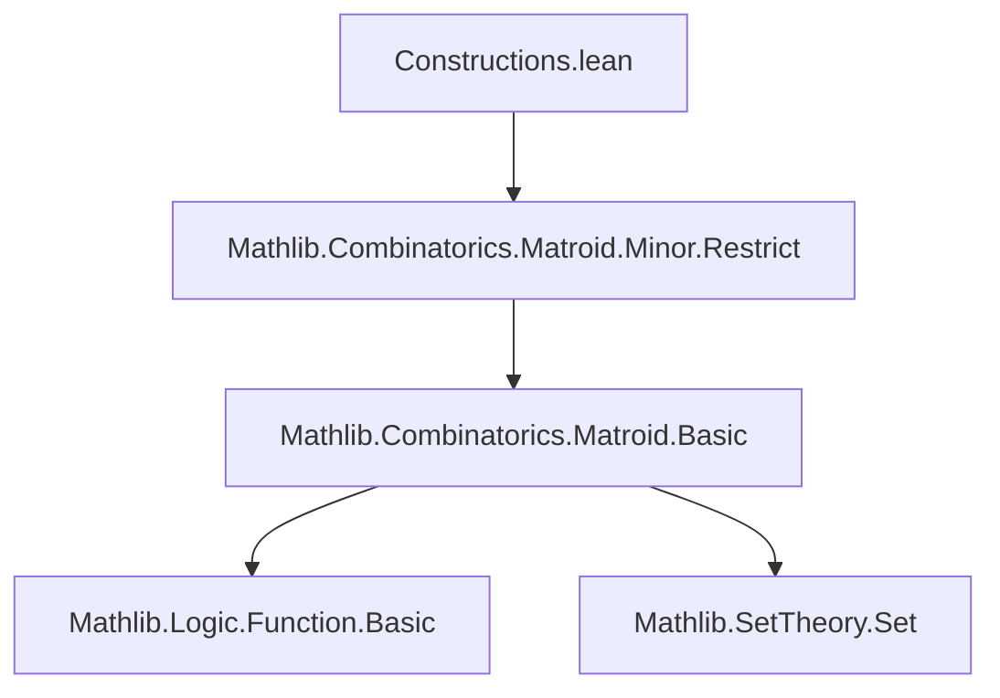

### Technical Brief: `Constructions.lean`

---

#### **1. Key Definitions & Theorems**

| Name | Type / Signature | Purpose |
|------|------------------|---------|
| `emptyOn α` | `Matroid α` | Matroid with empty ground set; only base is `∅`. |
| `loopyOn E` | `Set α → Matroid α` | Matroid on ground set `E` where all elements are loops; only base is `∅`. Defined as `emptyOn α ↾ E`. |
| `freeOn E` | `Set α → Matroid α` | Free matroid on `E`; only base is `E`. Defined as `(loopyOn E)✶`. |
| `uniqueBaseOn I E` | `Set α → Set α → Matroid α` | Matroid on ground set `E` with unique base `I ∩ E`. Defined as `(freeOn I) ↾ E`. |
| `ground_eq_empty_iff` | `M.E = ∅ ↔ M = emptyOn α` | Characterizes when a matroid is empty. |
| `empty_isBase_iff` | `M.IsBase ∅ ↔ M = loopyOn M.E` | Characterizes loopy matroids via empty base. |
| `eq_freeOn_iff` | `M = freeOn E ↔ M.E = E ∧ M.Indep E` | Characterizes free matroids. |
| `uniqueBaseOn_isBase_iff` | `I ⊆ E ⇒ (uniqueBaseOn I E).IsBase B ↔ B = I` | Uniqueness of base in `uniqueBaseOn`. |
| `uniqueBaseOn_dual_eq` | `(uniqueBaseOn I E)✶ = uniqueBaseOn (E \ I) E` | Duality for `uniqueBaseOn`. |
| `freeOn_restrict` | `R ⊆ E ⇒ (freeOn E) ↾ R = freeOn R` | Restriction of free matroid. |
| `restrict_eq_freeOn_iff` | `M ↾ I = freeOn I ↔ M.Indep I` | When a restriction is free. |

---

#### **2. Naming Conventions**

- **Prefixes**:
  - `emptyOn`, `loopyOn`, `freeOn`, `uniqueBaseOn`: indicate construction type.
  - `isBase`, `indep`, `isBasis`, `isBasis'`: standard matroid predicate names.
- **Suffixes**:
  - `_iff`: theorems giving biconditional characterizations.
  - `_iff'`: variant of `_iff`, often with slightly different form (e.g., involving `∩`).
  - `_restrict`, `_dual`: indicate behavior under restriction/duality.
- **Pattern**: `X_on_Y` for constructions parameterized by sets; `X_on` for type-parameterized (e.g., `emptyOn α`).

---

#### **3. Tactic Stack**

Frequently used tactics in proofs:

| Tactic | Usage |
|--------|-------|
| `simp` | Dominant tactic; simplifies using `@[simp]` lemmas (e.g., `emptyOn_ground`, `loopyOn_indep_iff`). |
| `rw` / `rwa` | Rewriting using equalities, often with `@[simp]` lemmas or definitions. |
| `exact` / `intro` / `rintro` | Basic proof structure; `intro`/`rintro` for destructuring hypotheses. |
| `refine` | Constructing proofs with holes, especially for `↔` or `∧` goals. |
| `ext_*` (e.g., `ext_indep`, `ext_isBase`) | Extensionality lemmas for matroids (equality via indep/base sets). |
| `tauto` | Used in set-theoretic reasoning (e.g., `uniqueBaseOn_restrict'`). |
| `rw [← ...]` | Rewriting backwards to apply known lemmas. |
| `apply`, `assumption` | Minimal use; mostly replaced by `simp`/`exact`. |

No heavy automation like `linarith`, `ring`, or `aesop` — proofs are mostly direct simplifications.

---

#### **4. Proof Logic**

- **Structure**: All definitions are bootstrapped from `emptyOn α`, using:
  - **Restriction** (`↾`) to restrict ground sets.
  - **Duality** (`✶`) to derive complementary structures (e.g., `freeOn = loopyOn✶`).
- **Proof Strategy**:
  1. Define via construction (e.g., `loopyOn E := emptyOn ↾ E`).
  2. Prove key properties (`ground`, `indep`, `isBase`) via `@[simp]` lemmas.
  3. Use `ext_*` lemmas to prove equality of matroids (e.g., `ext_indep`, `ext_isBase`).
  4. For characterizations (`eq_*_iff`), prove both directions using `ext_*` + simplification.
  5. Duality and restriction lemmas often follow from known lemmas like `dual_isBase_iff`, `restrict_indep_iff`.
- **Induction**: Not used — all proofs are algebraic/set-theoretic.

---

#### **5. Imports**

- **Primary**:
  ```lean
  Mathlib.Combinatorics.Matroid.Minor.Restrict
  ```
  - Provides restriction (`↾`) and related lemmas.
- **Implicit**:
  - `Mathlib.Combinatorics.Matroid.Basic` (via `Matroid` typeclass).
  - `Mathlib.SetTheory.Set` (for set operations: `∩`, `∖`, `subset`, etc.).
  - `Mathlib.Logic.Equiv.Basic` (for `ext_iff_*` lemmas).
  - `Mathlib.Logic.Function.Basic` (for `singleton_subset_iff`, etc.).

---

#### **6. Mermaid Diagrams**

##### **Dependency Graph (Module-Level)**



##### **Overview of Matroid Constructions**

```mermaid
graph TD
  emptyOn[emptyOn α] -->|restriction| loopyOn[loopyOn E]
  loopyOn -->|dual| freeOn[freeOn E]
  freeOn -->|restriction| uniqueBaseOn[uniqueBaseOn I E]
  uniqueBaseOn -->|dual| uniqueBaseOn_dual[uniqueBaseOn (E \ I) E]
  loopyOn -->|empty ground| emptyOn
  freeOn -->|empty ground| emptyOn
  uniqueBaseOn -->|I = E| freeOn
  uniqueBaseOn -->|I = ∅| loopyOn
```

##### **Proof Strategy Flow (Example: `freeOn`)**

```mermaid
graph LR
  A[Define freeOn E := (loopyOn E)✶] --> B[Prove ground = E]
  B --> C[Prove indep ↔ I ⊆ E]
  C --> D[Prove isBase ↔ B = E]
  D --> E[Characterize via eq_freeOn_iff]
  E --> F[Restriction: (freeOn E) ↾ R = freeOn R]
```

---

#### **7. Summary**

This module provides a **minimal but complete** toolkit for constructing matroids with **at most one base**, using:
- `emptyOn` as the base case,
- restriction to add ground elements,
- duality to flip between "all loops" and "all independent".

All constructions are **explicitly verified** via `@[simp]` lemmas and extensionality principles, avoiding manual axiom checking. The design reflects Lean’s emphasis on **modularity** and **reusability** — e.g., `uniqueBaseOn` subsumes `freeOn` and `loopyOn` as special cases.

--- 

Let me know if you'd like a formalized dependency graph or a proof outline for a specific theorem.
