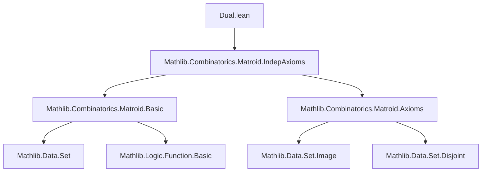
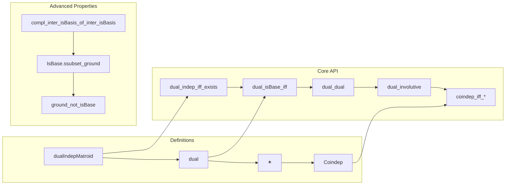

Here is a structured technical brief extracted from `Dual.lean`, focusing on formal metadata for building a domain-specific AI agent in Lean 4.

---

### **1. Key Definitions & Theorems**

| Name | Type / Signature | Purpose |
|------|------------------|---------|
| `dualIndepMatroid` | `Matroid α → IndepMatroid α` | Constructs the *independent sets structure* of the dual matroid: sets disjoint from some base of `M`. |
| `dual` | `Matroid α → Matroid α` | Defines the dual matroid `M✶` via `dualIndepMatroid.matroid`. |
| `✶` (postfix) | `Matroid α → Matroid α` | Notation for dual: `M✶`. |
| `dual_indep_iff_exists'` | `M✶.Indep I ↔ I ⊆ M.E ∧ ∃ B, M.IsBase B ∧ Disjoint I B` | Characterizes independence in the dual. |
| `dual_isBase_iff` | `M✶.IsBase B ↔ M.IsBase (M.E \ B)` (under `B ⊆ M.E`) | Core equivalence: bases of dual are complements of bases of `M`. |
| `dual_dual` | `M✶✶ = M` | Dual is an involution. |
| `dual_involutive` | `Function.Involutive dual` | Formalizes that dual is an involution. |
| `Coindep` | `Matroid α → Set α → Prop` | Abbreviation: `M.Coindep X := M✶.Indep X`. Enables dot notation. |
| `coindep_iff_subset_compl_isBase` | `M.Coindep X ↔ ∃ B, M.IsBase B ∧ X ⊆ M.E \ B` | Coindependence = subset of complement of some base. |
| `IsBase.compl_inter_isBasis_of_inter_isBasis` | `M.IsBase B → M.IsBasis (B ∩ X) X → M✶.IsBasis ((M.E \ B) ∩ (M.E \ X)) (M.E \ X)` | Transfers basis extension properties across duality. |
| `ground_not_isBase` | `[RankPos M✶] → ¬ M.IsBase M.E` | Ground set is not a base if dual has positive rank. |
| `IsBase.ssubset_ground` | `[RankPos M✶] → M.IsBase B → B ⊂ M.E` | Proper containment of bases in ground set under rank positivity. |

---

### **2. Naming Conventions**

- **Prefixes**:
  - `dual_`: properties of the dual matroid (`dual_indep`, `dual_isBase`, `dual_ground`, `dual_dual`).
  - `coindep_`: coindependence-related lemmas (`coindep_iff_*`, `Coindep.*`).
  - `compl_*`: lemmas involving complements (`compl_isBase_of_dual`, `compl_inter_isBasis_of_inter_isBasis`).
- **Suffixes**:
  - `_iff`: characterizations as biconditionals.
  - `_iff'`: variant with explicit subset hypothesis (e.g., `dual_isBase_iff'`).
  - `'_of_*`: implication direction from a condition (e.g., `compl_isBase_of_dual`).
- **Symbolic notation**:
  - `✶` used for dual (postfix, high precedence to avoid conflict with `*`).
  - `M.E`, `M.I`, `M.B`, `M.X` standard for ground set, independent sets, bases, etc.

---

### **3. Tactic Stack**

Frequently used tactics in proofs:

| Tactic | Role |
|--------|------|
| `aesop_mat` | Custom `aesop` variant for matroid reasoning (e.g., in `hI : I ⊆ M.E := by aesop_mat`). |
| `simp_rw` | Rewriting with simplification + definitional equality (e.g., `dual_indep_iff_exists'`). |
| `rw` | Standard rewriting (e.g., `diff_diff_cancel_left`). |
| `exact`, `refine`, `obtain`, `cases` | Core proof construction. |
| `ext` | Extensionality (e.g., `ext_isBase`, `ext` for set equality). |
| `tauto` | Tautology solver for set-theoretic reasoning. |
| `simp` | Simplification (e.g., `simp [dual_indep_iff_exists', hB]`). |
| `by_contra` | Proof by contradiction. |
| `obtain ⟨...⟩` / `have h : ...` | Local lemma introduction. |
| `convert`, `congr'` | Congruence and conversion tactics. |

---

### **4. Proof Logic**

The proofs follow a **structured matroid-theoretic pattern**:

1. **Definition via independent sets**:
   - Define `dualIndepMatroid` by verifying the `IndepMatroid` axioms (in particular, `indep_aug` and `indep_maximal` are nontrivial).
2. **Base characterization**:
   - Prove `dual_isBase_iff` using `isBase_compl_iff_maximal_disjoint_isBase`.
3. **Involution**:
   - Prove `dual_dual` by extensionality on bases, using `diff_diff_cancel_left`.
4. **Coindependence**:
   - Define `Coindep` as syntactic sugar for `M✶.Indep`, then derive equivalences (`coindep_iff_*`) using `dual_indep_iff_exists`.
5. **Basis exchange & extension**:
   - Prove `compl_inter_isBasis_of_inter_isBasis` via careful manipulation of disjointness, insertion, and exchange lemmas.
6. **Rank & containment**:
   - Use `rankPos` assumptions to derive proper containment (`ssubset_ground`) and non-base status of ground set.

Most proofs use **set-theoretic reasoning** (subset, disjoint, complement), **case analysis on membership**, and **classical logic** (e.g., ` Classical.imp_iff_right_iff`, `em`).

---

### **5. Imports & Dependencies**

- **Core dependency**:
  ```lean
  import Mathlib.Combinatorics.Matroid.IndepAxioms
  ```
- **Implicit dependencies** (via `Matroid` and `IndepMatroid`):
  - `Mathlib.Combinatorics.Matroid.Basic`
  - `Mathlib.Combinatorics.Matroid.Axioms`
  - `Mathlib.Data.Set.Basic`, `Mathlib.Data.Set.Image`, `Mathlib.Data.Set.Subset`, `Mathlib.Data.Set.Diff`, etc.
  - `Mathlib.Tactic.Aesop`, `Mathlib.Logic.Function.Basic` (for `Involutive`, `Injective`)

---

### **6. Mermaid Diagrams**

#### **Dependency Graph (Module-Level)**



#### **Overview of `Dual.lean` Structure**



---

### **7. Theory Scope**

- **Primary theory**: Matroid duality.
- **Key properties formalized**:
  - Dual as involution.
  - Base correspondence via complement.
  - Coindependence predicate.
  - Basis extension under duality.
  - Rank-related consequences (e.g., ground not a base if dual has positive rank).
- **Not formalized (yet)**:
  - Duality with minors (`dual_restrict`, `dual_contraction`).
  - Duality with representability or connectivity (mentioned in docstring but not in this file).
  - Rank function relation: `rank_dual X = |X| - rank M (M.E \ X)`.

---

This metadata enables precise, high-fidelity automation of matroid reasoning, especially for duality-aware tactics, typeclass inference (`Finite`, `Nonempty`, `RankPos`), and symbolic manipulation of `✶`.
