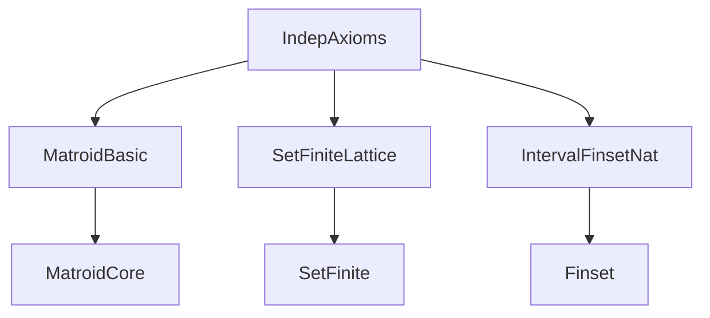

### Technical Brief: `IndepAxioms.lean`

---

#### **1. Key Definitions & Theorems**

| Name | Type / Structure | Purpose |
|------|------------------|---------|
| `IndepMatroid α` | `Structure` | Encodes a matroid via ground set `E : Set α`, independence predicate `Indep : Set α → Prop`, and axioms (nontriviality, monotonicity, augmentation, maximality, subset-ground). Serves as an intermediate encoding for constructing `Matroid α`. |
| `IndepMatroid.matroid (M)` | `M : IndepMatroid α → Matroid α` | Converts an `IndepMatroid` into a `Matroid`, where bases are maximal `M.Indep`-independent sets. |
| `IndepMatroid.ofFinitary` | `IndepMatroid α` constructor | Builds an `IndepMatroid` when independence is *finitely determined* (i.e., `Indep I ↔ ∀ J ⊆ I, J finite, Indep J`). Uses Zorn’s Lemma for maximality. |
| `IndepMatroid.ofFinitaryCardAugment` | `IndepMatroid α` constructor | Variant of `ofFinitary` using *cardinality-based augmentation*: if `I ⊂ J` finite independent, then ∃`e ∈ J \ I` with `insert e I` independent. |
| `IndepMatroid.ofBdd` | `IndepMatroid α` constructor | Builds an `IndepMatroid` when independent sets are uniformly bounded in size (`∃ n, ∀ I, Indep I → I.encard ≤ n`). Uses boundedness to replace maximality axiom. |
| `IndepMatroid.ofBddAugment` | `IndepMatroid α` constructor | Same as `ofBdd`, but uses *cardinality-augmentation* instead of general augmentation. |
| `IndepMatroid.ofFinite` | `IndepMatroid α` constructor | Special case of `ofBddAugment` when ground set `E` is finite. |
| `IndepMatroid.ofFinset` | `IndepMatroid α` constructor | Constructs a *finitary* matroid from an independence predicate on `Finset α`. |
| `Matroid.ofExistsMatroid` | `Matroid α` constructor | Constructs a `Matroid` from an *existential* witness that some `Matroid` has given `E` and `Indep`. |
| `Matroid.ofExistsFiniteIsBase` | `Matroid α` constructor | Constructs a `RankFinite` matroid from a nonempty collection of bases with exchange property and at least one finite base. |
| `Matroid.ofIsBaseOfFinite` | `Matroid α` constructor | Constructs a *finite* matroid from a nonempty collection of bases with exchange property over a finite ground set. |

**Simp Theorems** (crucial for usability):
- `matroid_indep_iff`: `M.matroid.Indep I ↔ M.Indep I`
- `ofFinitary_indep`, `ofFinitaryCardAugment_indep`, `ofBdd_indep`, `ofBddAugment_indep`, `ofFinite_indep`, `ofFinset_indep`, etc.: definitional equality or equivalence of `Indep` with the constructed predicate.
- `ofExistsFiniteIsBase_isBase`, `ofIsBaseOfFinite_isBase`: definitional equality of `IsBase`.

**Auxiliary Theorems**:
- `Matroid.existsMaximalSubsetProperty_of_bdd`: If independent sets are bounded in cardinality, then the maximal subset property holds.

---

#### **2. Naming Conventions**

- **Prefixes**:
  - `indep_`: properties of the independence predicate (e.g., `indep_empty`, `indep_subset`, `indep_aug`).
  - `of_`: constructors for `IndepMatroid` or `Matroid`.
  - `isBase_`: properties of the base predicate (e.g., `isBase_exchange`).
- **Suffixes**:
  - `_aug`: augmentation axiom variant used.
  - `_bdd`: bounded-size case.
  - `_finite` / `_finset`: finite ground set or `Finset`-based definition.
  - `_of_`: e.g., `ofFinitary`, `ofExistsFiniteIsBase`, `ofIsBaseOfFinite`.
- **Structure fields**:
  - `E`, `Indep`, `IsBase`: standard data fields.
  - `indep_*`, `isBase_*`, `maximality`, `subset_ground`: proof fields.

---

#### **3. Tactic Stack**

Frequently used tactics in proofs:
- `aesop`: for automated reasoning in simple goals.
- `simp` / `simp only`: for simplification using `@[simp]` lemmas and definitional equalities.
- `rw`: rewriting using equalities/iff lemmas.
- `obtain` / `cases`: destructing existential/universal hypotheses.
- `by_contra!`: for contradiction proofs.
- `zorn_subset_nonempty`: for applying Zorn’s Lemma (in `ofFinitary`).
- `finite_of_encard_le_coe`, `finite_subsets`, `finite_iUnion`: for finiteness reasoning.
- `ncard_*`, `encard_*`: lemmas about cardinalities (finite/infinite).
- `insert_comm`, `insert_diff_singleton`, `ssubset_insert`: set-theoretic rewrites.

---

#### **4. Proof Logic**

**General proof strategy** for constructing `IndepMatroid`:
1. **Define data**: `E`, `Indep`.
2. **Verify axioms**:
   - `indep_empty`, `indep_subset`: often definitional or by `simp`.
   - `indep_aug`: case analysis on maximality; often uses `exists_insert_of_not_maximal`.
   - `indep_maximal`: either:
     - Proven via Zorn’s Lemma (`ofFinitary`), or
     - Derived from boundedness (`ofBdd`, `ofBddAugment`, `ofFinite`), or
     - Derived from finiteness of ground set (`ofFinite`, `ofFinset`).
3. **Convert to `Matroid`** via `IndepMatroid.matroid`, verifying matroid axioms:
   - `indep_iff'`: equivalence between `Indep` and `Matroid.Indep`.
   - `exists_isBase`: existence of a base (maximal independent set).
   - `isBase_exchange`: base exchange property.
   - `maximality`, `subset_ground`: inherited from `IndepMatroid`.

**Key logical patterns**:
- **Zorn’s Lemma**: used in `ofFinitary` to get maximal independent subsets.
- **Cardinality comparison**: in augmentation lemmas, compare `I.ncard < J.ncard` or `I.encard < J.encard`.
- **Finite subset approximation**: in `ofFinitary`, use compactness: `Indep I ↔ ∀ J ⊆ I, J finite, Indep J`.
- **Bounding via finite base**: in `ofExistsFiniteIsBase`, use a finite base to bound all independent sets.

---

#### **5. Imports**

- `Mathlib.Combinatorics.Matroid.Basic`: core matroid definitions (`Matroid`, `IsBase`, `Indep`, `ExchangeProperty`, etc.).
- `Mathlib.Data.Set.Finite.Lattice`: finiteness and lattice-theoretic properties of sets.
- `Mathlib.Order.Interval.Finset.Nat`: finite intervals in `ℕ`, used for cardinality arguments.

---

#### **6. Mermaid Diagrams**

##### **Dependency Graph (Module-Level)**



##### **Conceptual Overview of `IndepMatroid` Constructions**

```mermaid
graph TD
  IndepMatroid -->|data| E
  IndepMatroid -->|data| Indep
  IndepMatroid -->|axioms| indep_empty
  IndepMatroid -->|axioms| indep_subset
  IndepMatroid -->|axioms| indep_aug
  IndepMatroid -->|axioms| indep_maximal
  IndepMatroid -->|axioms| subset_ground

  IndepMatroid -->|construction| IndepMatroid.matroid
  IndepMatroid.matroid --> Matroid

  IndepMatroid.ofFinitary -->|uses| Zorn
  IndepMatroid.ofFinitaryCardAugment -->|uses| finite_subset_approx
  IndepMatroid.ofBdd -->|uses| bounded_card
  IndepMatroid.ofBddAugment -->|uses| bounded_card + card_augment
  IndepMatroid.ofFinite -->|uses| finite_ground
  IndepMatroid.ofFinset -->|uses| Finset_pred + card_augment

  Matroid.ofExistsMatroid -->|uses| existential_witness
  Matroid.ofExistsFiniteIsBase -->|uses| finite_base + exchange
  Matroid.ofIsBaseOfFinite -->|uses| finite_ground + exchange
```

##### **Relationship Between Matroid Encodings**

```mermaid
graph LR
  Matroid <--|via .Indep, .IsBase| IndepMatroid
  IndepMatroid -->|matroid| Matroid

  subgraph "Construction Paths"
    IndepMatroid.ofFinitary --> IndepMatroid
    IndepMatroid.ofBdd --> IndepMatroid
    IndepMatroid.ofFinite --> IndepMatroid
    Matroid.ofExistsFiniteIsBase --> Matroid
    Matroid.ofIsBaseOfFinite --> Matroid
  end

  IndepMatroid.ofFinset -->|finitary| Matroid
```

---

#### **7. Theory Scope**

This file formalizes **multiple equivalent axiomatizations of matroids** in terms of:
- **Independent sets**, with varying augmentation axioms (infinite, finite, cardinality-based).
- **Bases**, with exchange and finiteness assumptions.

It bridges the gap between:
- The *standard* `Matroid` definition (based on bases and maximality),
- More *constructive* or *finitary* presentations (e.g., via `Finset` or bounded rank),
- *Classical* set-theoretic constructions (Zorn’s Lemma for infinite matroids).

It is foundational for:
- Proving equivalence of matroid definitions,
- Constructing matroids from known independence predicates (e.g., linear independence, graphic independence),
- Developing theory for *finitary*, *rank-finite*, or *finite* matroids separately.

---

#### **8. Key Lemmas & Properties**

| Lemma | Type | Significance |
|-------|------|--------------|
| `matroid_indep_iff` | `M.matroid.Indep I ↔ M.Indep I` | Ensures correctness of `matroid` construction. |
| `ofFinitary_finitary` | `Finitary M.matroid` | `ofFinitary` produces a finitary matroid. |
| `ofBddAugment_rankFinite` | `RankFinite M.matroid` | Bounded independent sets ⇒ finite rank. |
| `ofFinite_finite` | `Finite M.matroid` | Finite ground set ⇒ finite matroid. |
| `ofExistsFiniteIsBase_rankFinite` | `RankFinite M` | Existence of finite base ⇒ finite rank. |
| `ofIsBaseOfFinite_finite` | `Finite M` | Finite ground set + nonempty bases ⇒ finite matroid. |

---

This file is a **central hub** for matroid construction in mathlib, enabling flexible and efficient reasoning about matroids in diverse settings (finite, infinite, rank-finite, etc.) by abstracting away the complexity of the base axioms.
