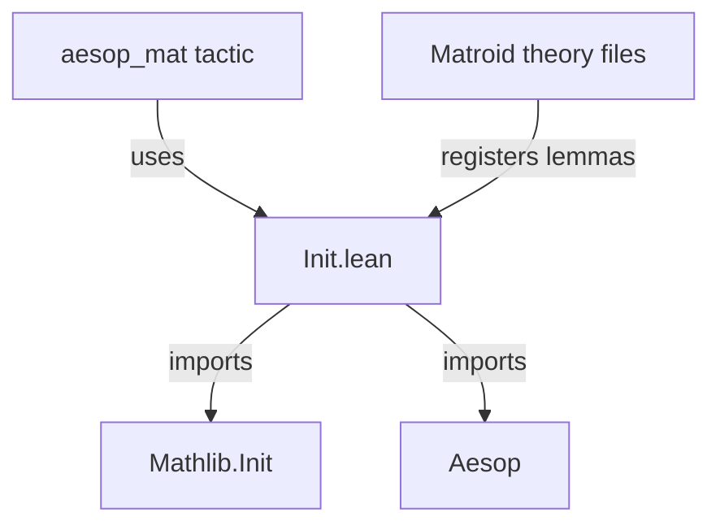

**Technical Brief: `Init.lean` (Matroid Rule Set Module)**

---

### 1. **Key Definitions & Theorems**

| Name | Type / Declaration | Purpose |
|------|--------------------|---------|
| `Matroid` | `declare_aesop_rule_sets [Matroid]` | Declares an Aesop rule set named `Matroid`, intended for use by the `aesop_mat` tactic. This rule set aggregates lemmas/tactics relevant to matroid reasoning for automated proof search. |

> **Note**: No theorems are defined in this file; it only *registers* a rule set. The actual matroid-specific lemmas are expected to be added elsewhere (e.g., via `@[aesop add Matroid]` attributes on lemmas in dependent files).

---

### 2. **Naming Conventions**

- **Rule set name**: `Matroid` — capitalized, no prefix/suffix.
- **Tactic name**: `aesop_mat` — derived from `aesop` + `mat` (short for *matroid*), following Lean/Aesop convention (`aesop_*` tactics correspond to rule sets named `*`).
- **Attribute pattern**: `@[aesop add Matroid]` — standard Aesop attribute syntax for registering lemmas into named rule sets.

---

### 3. **Tactic Stack**

- `aesop` — core tactic for automated reasoning using rule sets.
- `aesop_mat` — derived tactic (not defined here, but implied) that uses the `Matroid` rule set.
- `declare_aesop_rule_sets` — internal macro used to register rule sets.

No other tactics appear in this file.

---

### 4. **Proof Logic**

- **No proofs** are present in this file.
- The file is purely *declarative*: it sets up infrastructure for future matroid-related automation.
- Logic flow is trivial: import dependencies → declare rule set.

---

### 5. **Imports**

| Import | Role |
|--------|------|
| `Mathlib.Init` | Provides foundational definitions and tactics (including Aesop infrastructure). |
| `Aesop` | Supplies the `declare_aesop_rule_sets` macro and tactic infrastructure. |

> These imports indicate the module lives in the *Lean 4 + Mathlib* ecosystem and depends on Aesop’s extensible rule-set framework.

---

### 8. **Dependency & Theory Overview**

#### Mermaid Diagram: File Dependencies



#### Mermaid Diagram: Rule Set Integration

```mermaid
graph LR
    A[declare_aesop_rule_sets [Matroid]] -->|creates| B[Matroid rule set]
    C[lemmas with @aesop add Matroid] -->|added to| B
    D[aesop_mat] -->|uses| B
```

#### Theory Scope

- **Domain**: Matroid theory (combinatorics / discrete mathematics).
- **Purpose**: Enable automated reasoning (via `aesop_mat`) about matroid axioms (e.g., independence, basis, rank, circuit properties).
- **Modularity**: Rule set is isolated in its own file to avoid circular imports and ensure visibility only when explicitly imported.

--- 

✅ **Summary**: This file is a minimal, infrastructure-only module that declares the `Matroid` Aesop rule set. It enables downstream files to contribute matroid-specific lemmas and use the `aesop_mat` tactic for automated matroid proofs.
