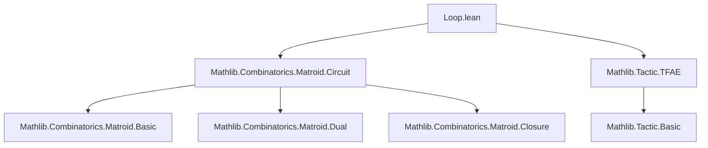

Here's a structured technical brief extracted from `Loop.lean`, focusing on definitions, naming conventions, proof patterns, and theory dependencies.

---

### **1. Key Definitions & Theorems**

| Name | Type / Signature | Purpose |
|------|------------------|---------|
| `loops M` | `Matroid α → Set α` | The set of loops: $M.\text{loops} = M.\text{closure}\ \emptyset$ |
| `IsLoop M e` | `α → Prop` | Predicate: $e$ is a loop iff $e \in M.\text{loops}$ |
| `IsNonloop M e` | `Structure` | $e \in M.E$ and $e$ is not a loop |
| `IsColoop M e` | `Prop` | $e$ is a coloop iff it is a loop in the dual: $M^\*.\text{IsLoop}\ e$ |
| `coloops M` | `Set α` | Set of coloops: $M^\*.\text{loops}$ |
| `Loopless M` | `Typeclass` | $M$ has no loops: $\forall e, \neg M.\text{IsLoop}\ e$ |
| `removeLoops M` | `Matroid α` | Restriction of $M$ to nonloop elements: $M \upharpoonright \{e \mid M.\text{IsNonloop}\ e\}$ |
| `isLoop_tfae` | `List.TFAE [...]` | 5 equivalent conditions for $e$ being a loop (e.g., $\{e\}$ dependent, circuit, not in any base) |
| `isColoop_tfae` | `List.TFAE [...]` | 7 equivalent conditions for $e$ being a coloop (e.g., $\{e\}$ cocircuit, in all bases, $e \in \text{cl}(X) \iff e \in X$) |
| `closure_empty` | `M.closure ∅ = M.loops` | Definition equivalence |
| `closure_loops` | `M.closure M.loops = M.loops` | Loops are closed |
| `closure_union_loops_eq` | `M.closure (X ∪ M.loops) = M.closure X` | Loops don’t affect closure |
| `closure_diff_loops_eq` | `M.closure (X \ M.loops) = M.closure X` | Removing loops doesn’t change closure |
| `map_loops`, `comap_loops` | `map/comap` behavior | `map` sends loops to loops (under injectivity); `comap` pulls back loops |
| `restrict_loops_eq` | `(M ↾ R).loops = M.loops ∩ R` (if $R \subseteq M.E$) | Restriction interacts with loops via intersection |
| `isNonloop_iff_mem_compl_loops` | $e \in M.E \setminus M.\text{loops} \iff M.\text{IsNonloop}\ e$ | Nonloops = ground set minus loops |
| `closure_inter_setOf_isNonloop_eq` | $\text{cl}(X \cap \text{nonloops}) = \text{cl}(X)$ | Nonloops suffice for closure |
| `isColoop_iff_forall_mem_isBase` | $e$ in every base $\iff e$ is a coloop | Key abstract characterization |
| `closure_inter_coloops_eq` | $\text{cl}(X) \cap \text{coloops} = X \cap \text{coloops}$ | Coloops are “closed under closure” like loops, but dual |

---

### **2. Naming Conventions**

- **Prefixes**:
  - `isLoop_`, `isColoop_`, `isNonloop_`: Predicate-related lemmas.
  - `closure_`: Closure-related identities.
  - `map_`, `comap_`, `restrict_`: Operations on matroids.
- **Suffixes**:
  - `_tfae`: “Theorems for all equivalent conditions” (To Be Equivalent).
  - `_iff`: Biconditional lemmas (↔).
  - `_eq`: Equality lemmas (e.g., `closure_loops`, `closure_union_loops_eq`).
  - `_subset`: Subset relations (e.g., `loops_subset_ground`, `coloops_subset_ground`).
- **Structure names**:
  - `IsLoop`, `IsNonloop`, `IsColoop`: Predicate structures/props.
  - `Loopless`: Typeclass for loopless matroids.

---

### **3. Tactic Stack**

- **Core tactics**:
  - `tfae_have`, `tfae_finish`: For proving equivalence chains.
  - `simp`, `simp_rw`, `rw`: Extensive use of simplification and rewriting, especially with `isLoop_iff`, `isColoop_iff`, `closure_` lemmas.
  - `aesop_mat`: Custom Aesop rule set for matroid reasoning (used in `@[aesop]` attributes).
  - `by_cases`, `by_contra`, `obtain`, `exact`, `convert`, `refine`: Standard Lean proof scripting.
  - `set_ext`, `funext`, `subset_antisymm`: Set equality proofs.
  - `rw [← dual_dual]`, `rw [← dual_isLoop_iff_isColoop]`: Dual matroid manipulations.

---

### **4. Proof Logic**

- **Inductive/structural reasoning**:
  - Many proofs use the equivalence of definitions (via `isLoop_tfae`/`isColoop_tfae`) to switch between closure, circuit, base, and independence characterizations.
- **Duality**:
  - Dual matroid reasoning is pervasive: `dual_isLoop_iff_isColoop`, `dual_coloops`, etc., allow translating loop proofs to coloop proofs and vice versa.
- **Closure properties**:
  - Closure monotonicity, idempotence, and interaction with unions/differences (especially with `loops`/`coloops`) are heavily used.
- **Case analysis**:
  - Common: `em (e ∈ M.E)`, `eq_or_ne e f`, `em (e ∈ X)`.
- **Minimal counterexample / contradiction**:
  - E.g., `IsLoop.notMem_of_indep`, `IsCircuit.isNonloop_of_mem_of_one_lt_card`.

---

### **5. Imports & Dependencies**

- **Core imports**:
  ```lean
  Mathlib.Combinatorics.Matroid.Circuit
  Mathlib.Tactic.TFAE
  ```
- **Implied dependencies** (via `Matroid.Circuit` and `TFAE`):
  - `Mathlib.Combinatorics.Matroid.Basic`
  - `Mathlib.Combinatorics.Matroid.Dual`
  - `Mathlib.Combinatorics.Matroid.Closure`
  - `Mathlib.Combinatorics.Matroid.Independence`
  - `Mathlib.Combinatorics.Matroid.Base`
  - `Mathlib.SetTheory.Cardinal.Encard`
  - Standard library: `Set`, `Function`, `Logic`, `Order.Closure`

---

### **6. Mermaid Diagrams**

#### **Dependency Graph (Module-Level)**



#### **Conceptual Overview of Loop/Coloop Theory**

```mermaid
flowchart LR
  A[Matroid M] --> B[loops M = cl(∅)]
  A --> C[coloops M = loops M✶]
  B --> D[IsLoop e ↔ e ∈ cl(∅)]
  B --> E[IsNonloop e ↔ e ∈ M.E ∧ e ∉ loops M]
  C --> F[IsColoop e ↔ e ∈ loops M✶]
  D --> G[isLoop_tfae: 5 equivalent defs]
  F --> H[isColoop_tfae: 7 equivalent defs]
  G --> I[Restriction, map, comap behavior]
  H --> I
  I --> J[Applications: minors, duals, decomposition]
```

#### **Matroid Operations & Loop Interaction**

```mermaid
flowchart LR
  M -->|restrict R| M↾R
  M -->|map f| M.map f
  M -->|comap f| M.comap f
  M -->|dual| M✶
  M -->|removeLoops| M ↾ nonloops
  subgraph LoopProps
    loops M
    IsLoop e
    IsNonloop e
  end
  subgraph ColoopProps
    coloops M
    IsColoop e
  end
  LoopProps -->|restrict| LoopProps
  LoopProps -->|dual| ColoopProps
  ColoopProps -->|dual| LoopProps
```

---

Let me know if you'd like a formalized dependency graph (e.g., for `leanpkg` or `lake`) or a summary of how `Loop.lean` fits into the broader `Matroid` hierarchy.
