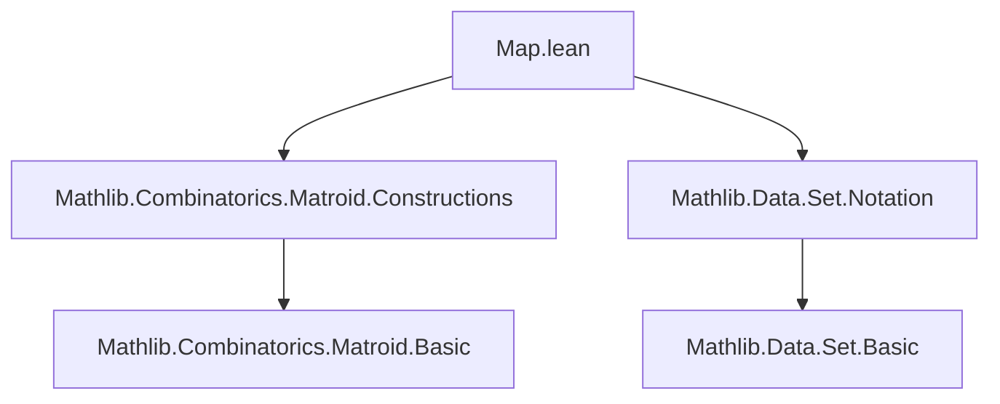

**Technical Brief: `Map.lean` — Matroid Maps and Comaps in Lean 4**

---

### 1. KEY DEFINITIONS & THEOREMS

| Name | Type / Signature | Purpose |
|------|------------------|---------|
| `comap` | `Matroid β → (α → β) → Matroid α` | Pullback of a matroid along a function; ground set is preimage of target ground set; independence requires injectivity on the set and image independence. |
| `comapOn` | `Matroid β → Set α → (α → β) → Matroid α` | Restriction of `comap` to a specified ground set `E ⊆ α`. |
| `mapSetEmbedding` | `Matroid α → (M.E ↪ β) → Matroid β` | Pushforward along an embedding defined on the subtype `M.E`; ground set = range of embedding. |
| `map` | `Matroid α → (α → β) → InjOn f M.E → Matroid β` | Pushforward along a function injective on `M.E`; ground set = image of `M.E`. |
| `mapEmbedding` | `Matroid α → (α ↪ β) → Matroid β` | Special case of `map` for globally injective embeddings; simplifies `simp` lemmas. |
| `mapEquiv` | `Matroid α → (α ≃ β) → Matroid β` | Special case of `map` for equivalences; gives strongest `simp` lemmas (e.g., `(M.mapEquiv f).Indep I ↔ M.Indep (f.symm '' I)`). |
| `mapSetEquiv` | `Matroid α → (M.E ≃ E) → Matroid β` | Pushforward along an equivalence between `M.E` and a subset `E ⊆ β`. |
| `restrictSubtype` | `Matroid α → Set α → Matroid α` | View restriction `M ↾ X` as a matroid on the type `↑X` with ground set `univ`. Isomorphic to `M ↾ X`. |
| `comap_indep_iff` | `(N.comap f).Indep I ↔ N.Indep (f '' I) ∧ InjOn f I` | Core characterization of independence in `comap`. |
| `map_indep_iff` | `(M.map f hf).Indep I ↔ ∃ I₀, M.Indep I₀ ∧ I = f '' I₀` | Core characterization of independence in `map`. |
| `mapEquiv_indep_iff` | `(M.mapEquiv f).Indep I ↔ M.Indep (f.symm '' I)` | Simplified independence for equivalences. |
| `map_comap` | `N.E ⊆ range f → InjOn f (f ⁻¹' N.E) → (N.comap f).map f hf = N` | `map` and `comap` are inverses under injectivity and surjectivity-on-range conditions. |
| `comap_map` | `f.Injective → (M.map f hf.injOn).comap f = M` | Dual inverse law. |
| `map_dual` | `(M.map f hf)✶ = M✶.map f hf` | Duality commutes with `map`. |
| `restrictSubtype_indep_iff` | `(M.restrictSubtype X).Indep I ↔ M.Indep ((↑) '' I)` | Independence in subtype restriction. |

---

### 2. NAMING CONVENTIONS

- **Prefixes**:
  - `comap_`: pullback constructions (preimage-based).
  - `map_`: pushforward constructions (image-based).
  - `mapSet_`: pushforward via subtype equivalences/embeddings.
  - `restrictSubtype`: restriction to subtype with re-typing.
- **Suffixes**:
  - `_equiv`: bundled equivalence (`α ≃ β`).
  - `_embedding`: bundled embedding (`α ↪ β`).
  - `_on E`: restriction to a ground set `E`.
- **Predicate prefixes**:
  - `isBasis`, `isBase`, `dep`, `indep`: standard matroid predicates.
  - `injOn`, `surjOn`, `bijOn`: injectivity/surjectivity/bijectivity on a set.

---

### 3. TACTIC STACK

- **Core proof automation**:
  - `aesop`, `grind`, `simp`, `rw`, `rwa`, `refine`, `exact`, `intro`, `cases`, `obtain`, `have`, `suffices`, `by_contra`, `contradiction`.
- **Set-theoretic reasoning**:
  - `image_subset_iff`, `preimage_image_eq`, `subset_image_iff`, `image_inter_preimage`, `image_diff_subset`.
- **Matroid-specific lemmas**:
  - `ext_indep`, `ext_isBase`, `isBase_iff_maximal_indep`, `indep_iff_forall_finite_subset_indep`.
- **Subtype reasoning**:
  - `Subtype.val_inj`, `image_preimage_eq`, `preimage_image_eq_iff`, `injOn_insert`, `bijOn_image`.

---

### 4. PROOF LOGIC

- **Inductive/constructive style**:
  - Most definitions use `Matroid.ofExistsMatroid`, requiring witness construction for matroid axioms.
  - Proofs often proceed by:
    1. Unfolding definitions (`simp [comap_indep_iff]`).
    2. Applying bijection/injectivity lemmas (`hf.image_eq_image_iff`, `injOn.image_eq_image_iff`).
    3. Using set-theoretic equivalences (`image_preimage_eq`, `subset_image_iff`).
    4. Leveraging matroid properties (e.g., maximal independence, augmentation).
- **Common pattern**:
  - For `map`/`comap` lemmas: reduce to `comap` (primitive), then use inverse laws (`map_comap`, `comap_map`).
  - For `mapEquiv`/`mapEmbedding`: use `mapEquiv_eq_map` + `map_indep_iff` to simplify to preimage/image forms.
  - For subtype restrictions: use `restrictSubtype = comap val` + `Subtype.val_injective`.

---

### 5. IMPORTS

- `Mathlib.Combinatorics.Matroid.Constructions`: core matroid constructions (e.g., `restrict`, `dual`, `emptyOn`, `loopyOn`, `freeOn`, `IndepMatroid`).
- `Mathlib.Data.Set.Notation`: set notation and operations (`preimage`, `image`, `subset`, `inter`, `diff`, `univ`).

---

### 6. DEPENDENCY & THEORY OVERVIEW

#### Mermaid Diagram: Module Dependencies



#### Mermaid Diagram: Theory Flow

```mermaid
graph LR
  A[Matroid α] -->|comap f| B[Matroid β]
  A -->|map f hf| C[Matroid β]
  A -->|restrictSubtype X| D[Matroid X]
  B -->|map f hf| A
  C -->|comap f| A
  A -->|mapSetEmbedding f| B
  A -->|mapEquiv f| B
  A -->|mapSetEquiv e| C
  D -->|isomorphism| A↾X
```

#### Theory Scope

- **Mathematical scope**: Transport of matroid structure along functions, embeddings, and equivalences.
- **Key insight**: `comap` is primitive; all other maps are defined via `comap` or `mapSetEmbedding`.
- **Infinite matroids**: `map` requires injectivity on `M.E` to avoid pathologies (unlike finite case via bipartite graphs).
- **Isomorphism characterization**: `N ≅ M` iff `N = M.map f hf` for some injective `f` (modulo degenerate empty cases).

---

### 7. NOTES ON IMPLEMENTATION

- **Definitional choices**:
  - `map` uses `∃ I₀, M.Indep I₀ ∧ I = f '' I₀` to avoid subtype machinery.
  - `mapEquiv`/`mapEmbedding` are separate to get stronger `simp` lemmas (e.g., no `hf` parameter needed).
  - `restrictSubtype` re-types the ground set to `X`, enabling cleaner reasoning on subtype types.
- **Simp lemmas**:
  - `mapEquiv_indep_iff`, `mapEmbedding_indep_iff`, `comap_indep_iff` are `@[simp]`.
  - `map`-based lemmas avoid `hf` in `simp` by using `mapEquiv`/`mapEmbedding`.

---

### 8. TODO & EXTENSIONS

- **Bundled matroid isomorphisms**: Not yet formalized; would improve usability.
- **Bipartite graph transport**: For finite matroids only (as infinite unions may fail).
- **Further lemmas**: e.g., interaction with `loop`, `closure`, `rank`, `connectivity`.

--- 

*End of Technical Brief.*
