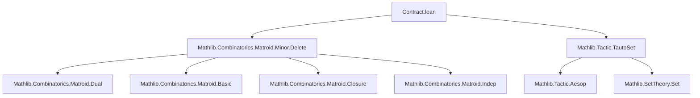

### Technical Brief: Matroid Contraction in Lean 4 (`Contract.lean`)

---

#### **1. Key Definitions & Theorems**

| Name | Type / Signature | Purpose |
|------|------------------|---------|
| `contract` | `Matroid α → Set α → Matroid α` | Defines contraction: $M ／ C := (M^\* \setminus C)^\*$ |
| `contract_ground` | `(M ／ C).E = M.E \ C` | Ground set of contraction is set difference |
| `dual_contract` | `(M ／ X)^\* = M^\* \setminus X` | Dual of contraction is deletion |
| `dual_delete` | `(M \setminus X)^\* = M^\* ／ X` | Dual of deletion is contraction |
| `contract_contract` | `M ／ C₁ ／ C₂ = M ／ (C₁ ∪ C₂)` | Iterated contraction = contraction of union |
| `contract_comm` | `M ／ C₁ ／ C₂ = M ／ C₂ ／ C₁` | Contraction commutes (up to union) |
| `contract_indep_iff` | `(M ／ I).Indep J ↔ Disjoint J I ∧ M.Indep (J ∪ I)` | Independent sets of contraction (basis-based def) |
| `IsBasis.contract_indep_iff` | `(M ／ X).Indep J ↔ M.Indep (J ∪ I) ∧ Disjoint X J` | Independent sets when $I$ is a basis for $X$ |
| `contract_isLoop_iff_mem_closure` | `(M ／ C).IsLoop e ↔ e ∈ cl(C) ∧ e ∉ C` | Loops in contraction = closure minus set |
| `contract_closure_eq` | `(M ／ C).closure X = cl(X ∪ C) \ C` | Closure in contraction |
| `contract_delete_comm` | `M ／ C \ D = M \ D ／ C` for disjoint $C, D$ | Contraction and deletion commute on disjoint sets |
| `IsCircuit.contract_isCircuit` | `M.IsCircuit K ∧ C ⊂ K ⇒ (M ／ C).IsCircuit (K \ C)` | Circuits contract to circuits |
| `IsCircuit.exists_subset_isCircuit_of_contract` | `(M ／ K).IsCircuit C ⇒ ∃ C', M.IsCircuit C' ∧ C ⊆ C' ⊆ C ∪ K$` | Lift circuits from contraction back to original |

---

#### **2. Naming Conventions**

- **Prefixes**:
  - `contract_`: general contraction lemmas (`contract_ground`, `contract_indep_iff`)
  - `contractElem_`: for single-element contraction $M ／ \{e\}$
  - `dual_`: duality lemmas (`dual_contract`, `dual_delete`)
  - `delete_`: deletion-related lemmas used in contraction proofs (`delete_indep_iff`, `delete_isCircuit_iff`)
  - `isLoop`, `isColoop`, `isCircuit`, `isCocircuit`, `isBase`: matroid structural properties

- **Suffixes**:
  - `_iff`: biconditional characterizations (`contract_indep_iff`, `contract_isLoop_iff_mem_closure`)
  - `_diff`: for set-difference variants (`contract_eq_contract_diff`, `contract_delete_diff`)
  - `_comm`: commutativity (`contract_comm`, `contract_delete_comm`)
  - `_eq_self_iff`: when contraction yields original matroid (`contract_eq_self_iff`)
  - `_iff_of_disjoint`: conditional versions under disjointness (`contract_indep_iff_of_disjoint`)

- **Infix notation**:
  - `／` (U+FF0F fullwidth solidus) for contraction: `M ／ C`

---

#### **3. Tactic Stack**

- **Core automation**:
  - `simp` / `simp_rw`: pervasive use for rewriting definitions and simplifying ground sets, closures, etc.
  - `rw`: for targeted rewrites using lemmas like `dual_contract`, `contract_indep_iff`
  - `aesop_mat`, `aesop unsafe`: custom tactic for matroid reasoning (e.g., `contract_ground_subset_ground`)
  - `tauto_set`: for set-theoretic tautologies (disjointness, subset relations)
  - `ext_indep`, `ext_iff_indep`: extensionality lemmas for matroids via independence
  - `obtain ⟨I, hI⟩ := M.exists_isBasis' C`: existential elimination for bases/cobases
  - `wlog ... with aux`: well-founded induction or symmetry arguments (e.g., assuming $C \subseteq M.E$)

- **Advanced reasoning**:
  - `nth_rw`: for rewriting at specific positions (e.g., `nth_rw 1 [← diff_union_of_subset]`)
  - `rwa`: rewrite + assumption (e.g., `rwa [← dual_ground, ← coindep_iff_compl_spanning]`)
  - `exact`, `refine`, `rotate_left`: for structured proof construction
  - `all_goals tauto_set`: bulk set reasoning after case splits

---

#### **4. Proof Logic**

- **High-level strategy**:
  - **Definition-first**: contraction defined via duality: $M ／ C := (M^\* \setminus C)^\*$
  - **Equivalence proofs**: derive basis-independent characterization (`contract_indep_iff`) using duality and deletion lemmas.
  - **Structural lifting**: properties of circuits, loops, closure, spanning sets lifted from deletion/duality.
  - **Disjointness handling**: many lemmas assume disjointness (e.g., `contract_delete_comm`), proven via reduction to disjoint case using `contract_eq_contract_iff` and set algebra.
  - **Closure-based simplifications**: e.g., `contract_closure_eq_contract_delete`, `contract_loops_eq`.
  - **Inductive/constructive reasoning**: for bases/circuits, often use `exists_isBasis'` to pick a basis, then apply `contract_eq_contract_delete`.

- **Typical proof flow**:
  1. Introduce basis $I$ for $C$ via `exists_isBasis'`.
  2. Rewrite contraction using `contract_eq_contract_delete`: $M ／ C = M ／ I \setminus (C \setminus I)$.
  3. Apply known deletion/contraction lemmas for independent sets, bases, loops.
  4. Simplify using `contract_indep_iff`, `contract_dep_iff`, `contract_closure_eq`, etc.
  5. Use set-theoretic reasoning (`tauto_set`, `disjoint_sdiff_left`, etc.) to finalize.

---

#### **5. Imports & Dependencies**

- **Core libraries**:
  ```lean
  Mathlib.Combinatorics.Matroid.Minor.Delete
  Mathlib.Tactic.TautoSet
  ```
- **Implied dependencies** (via `Matroid.Minor.Delete` and `TautoSet`):
  - `Mathlib.Combinatorics.Matroid.Dual`
  - `Mathlib.Combinatorics.Matroid.Basic`
  - `Mathlib.Combinatorics.Matroid.Closure`
  - `Mathlib.Combinatorics.Matroid.Indep`
  - `Mathlib.Combinatorics.Matroid.Loops`
  - `Mathlib.SetTheory.Set`
  - `Mathlib.Tactic.Aesop` (via `aesop_mat`)

---

#### **6. Mermaid Diagrams**

##### **Dependency Graph (Module-Level)**



##### **Conceptual Overview of Contraction Theory**

```mermaid
flowchart LR
  subgraph Definitions
    D1[Contract M C := (M* \ C)*]
    D2[Ground: M.E \ C]
    D3[Indep: J ⊆ M.E\C, J∪I indep in M (I basis of C)]
  end

  subgraph Duality
    D1 -->|dual_contract| D4[(M/C)* = M* \ C]
    D1 -->|dual_delete| D5[(M \ C)* = M* / C]
  end

  subgraph Structural Properties
    D1 --> L[Loops: cl(C) \ C]
    D1 --> Cl[Closure: cl(X ∪ C) \ C]
    D1 --> Ci[Circuits: K \ C for K circuit, C ⊂ K]
    D1 --> B[Base: I \ C for I base, C ⊆ I]
  end

  subgraph Algebra
    D1 --> Comm[Contraction commutes: M/C/D = M/(C∪D)]
    D1 --> DelComm[Contraction & deletion commute if disjoint]
  end

  D1 --> Matroid[Matroid structure preserved]
```

---

#### **7. Summary**

This file formalizes **matroid contraction** in Lean 4, leveraging duality to define contraction concisely as $(M^\* \setminus C)^\*$. It then proves equivalence with the classical basis-dependent definition, and develops a comprehensive theory of contraction—including behavior of independence, bases, loops, closure, circuits, and interaction with deletion and restriction. The proofs rely heavily on duality, set-theoretic reasoning, and the `aesop_mat` tactic suite for matroid-specific automation. The naming and structure follow Lean’s `Mathlib` conventions, with infix `／` for contraction and `contractElem_` for single-element cases.
