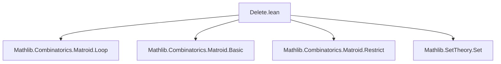

### Technical Brief: `Delete.lean` — Matroid Deletion in Lean 4

---

#### **1. Key Definitions & Theorems**

| Name | Type / Signature | Purpose |
|------|------------------|---------|
| `delete` | `Matroid α → Set α → Matroid α` | Defines deletion $M ＼ D$ as restriction to $M.E \ D$. |
| `infixl " ＼ "` | `Matroid.delete` | Notation for deletion: $M ＼ D$. |
| `delete_eq_restrict` | `M ＼ D = M ↾ (M.E \ D)` | Equivalence of deletion and restriction. |
| `delete_isRestriction` | `M ＼ D ≤r M` | Deletion is always a restriction (no subset assumption needed). |
| `isRestriction_iff_exists_eq_delete` | `N ≤r M ↔ ∃ D ⊆ M.E, N = M ＼ D` | Characterizes restrictions via deletion. |
| `delete_indep_iff` | `(M ＼ D).Indep I ↔ M.Indep I ∧ Disjoint I D` | Independence in deletion. |
| `delete_dep_iff` | `(M ＼ D).Dep X ↔ M.Dep X ∧ Disjoint X D` | Dependence in deletion. |
| `delete_isBase_iff` | `(M ＼ D).IsBase B ↔ M.IsBasis B (M.E \ D)` | Bases in deletion. |
| `delete_isCircuit_iff` | `(M ＼ D).IsCircuit C ↔ M.IsCircuit C ∧ Disjoint C D` | Circuits in deletion. |
| `delete_closure_eq` | `(M ＼ D).closure X = M.closure (X \ D) \ D` | Closure under deletion. |
| `delete_loops_eq` | `(M ＼ D).loops = M.loops \ D` | Loops in deletion. |
| `delete_delete` | `M ＼ D₁ ＼ D₂ = M ＼ (D₁ ∪ D₂)` | Iterated deletion = deletion of union. |
| `delete_comm` | `M ＼ D₁ ＼ D₂ = M ＼ D₂ ＼ D₁` | Deletion is commutative. |
| `Coindep.delete_isBase_iff` | Under $M.\text{Coindep}\ D$, $(M ＼ D).\text{IsBase}\ B ↔ M.\text{IsBase}\ B ∧ \text{Disjoint}\ B\ D$ | Bases under coindependent deletion. |
| `delete_isColoop_iff` | Characterization of coloops in deletion. | |

**Abbreviations & Shorthands**:
- `deleteElem` prefix: e.g., `deleteElem_indep_iff`, `deleteElem_eq_self` — for deletion of singleton $\{e\}$.

---

#### **2. Naming Conventions**

- **Prefixes**:
  - `delete_`: general deletion lemmas.
  - `deleteElem_`: deletion of a single element (`{e}`).
- **Suffixes**:
  - `_iff`: characterizations involving biconditionals.
  - `_of_`: implications from assumptions (e.g., `of_delete`, `delete_of_disjoint`).
  - `_delete`: reverse direction or application (e.g., `delete_delete`, `delete_comm`).
- **Infix**: `＼` (U+FF3C FULLWIDTH REVERSE SOLIDUS) for binary operator.

---

#### **3. Tactic Stack**

Frequently used tactics:
- `rw` / `rwa`: rewriting definitions and simplifications.
- `simp` / `simp_rw`: simplifying with lemmas like `delete_indep_iff`, `delete_ground`.
- `aesop_mat`: custom Aesop rule set for matroid reasoning.
- `tauto`: for propositional logic in `delete_dep_iff`, `delete_isColoop_iff`.
- `obtain`, `exact`, `refine`: for constructive proofs.
- `apply_fun`, `simp only`, `set_tac`: for set-theoretic manipulations.

---

#### **4. Proof Logic**

- **Structure**: Most proofs follow a pattern:
  1. Unfold `delete` as `restrict` using `delete_eq_restrict`.
  2. Apply known restriction lemmas (`restrict_indep_iff`, `restrict_closure_eq'`, etc.).
  3. Simplify set expressions using `diff`, `inter`, `union` identities.
  4. Use `disjoint` and `subset` reasoning (e.g., `disjoint_sdiff_left`, `diff_diff_cancel_left`).
- **Induction**: Not used here — deletion is defined directly, not inductively.
- **Case analysis**: Used in `delete_eq_self_iff`, `delete_isColoop_iff`, and `Coindep.delete_isBase_iff`.
- **Equational reasoning**: Heavy use of `rfl`, `congr_arg`, and `congr` for equality proofs.

---

#### **5. Imports & Dependencies**

- **Core dependency**: `Mathlib.Combinatorics.Matroid.Loop`
- **Implicit dependencies** (via `Matroid` and `restrict`):
  - `Mathlib.Combinatorics.Matroid.Basic`
  - `Mathlib.Combinatorics.Matroid.Restrict`
  - `Mathlib.Combinatorics.Matroid.Closure`
  - `Mathlib.Combinatorics.Matroid.Rank`
  - `Mathlib.SetTheory.Set`

---

#### **6. Mermaid Diagrams**

##### **Dependency Graph (Module-Level)**



##### **Conceptual Overview of Deletion Theory**

```mermaid
graph LR
  A[Matroid M] -->|Delete D| B[M ＼ D]
  B -->|Ground| C[M.E \ D]
  B -->|Indep| D[Indep in M ∧ Disjoint from D]
  B -->|Closure| E[closure_M(X \ D) \ D]
  B -->|Loops| F[Loops_M \ D]
  B -->|Bases| G[Bases_M within M.E \ D]
  C -->|Restriction| A
  style B fill:#f9f,stroke:#333
```

##### **Relationship to Restriction & Contraction**

```mermaid
graph LR
  M -->|Restrict R| M↾R
  M -->|Delete D| M＼D = M↾(M.E\D)
  M -->|Contract C| (M* ＼ C)*
  style M＼d fill:#9cf,stroke:#333
  style M↾R fill:#cfc,stroke:#333
  style (M* ＼ C)* fill:#fcc,stroke:#333
```

> **Note**: Deletion is dual to contraction: $M / C = (M^* ＼ C)^*$.

---

#### **7. Summary**

This file formalizes **matroid deletion**, a foundational operation in matroid theory. It leverages the existing `restrict` infrastructure but provides a more convenient and canonical form for deletion, especially useful in duality arguments. Key features include:
- No subset assumptions needed for `≤r` (unlike general restriction).
- Clean interaction with independence, bases, circuits, closure, loops, and coloops.
- Strong algebraic properties: associativity, commutativity, interaction with unions/differences.
- Specialized lemmas for coindependent deletions (e.g., `Coindep.delete_isBase_iff`).

The formalization is clean, modular, and aligns with standard matroid-theoretic conventions.
