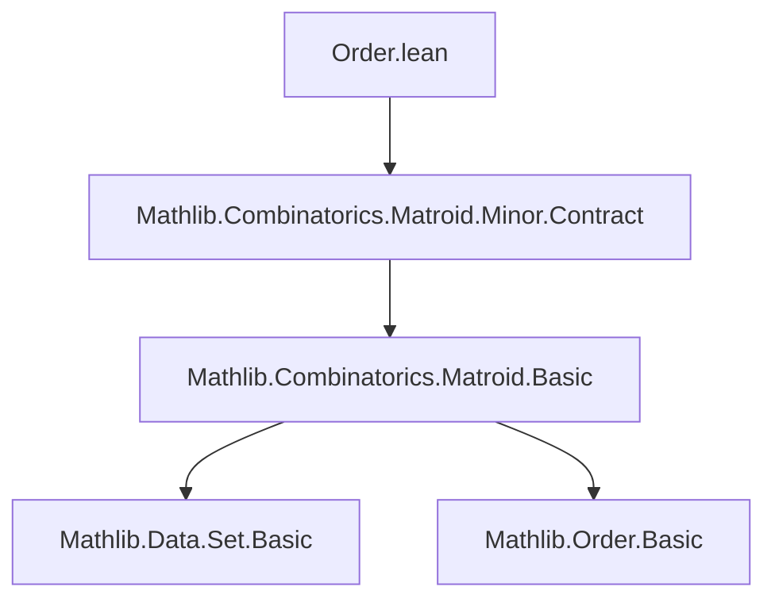
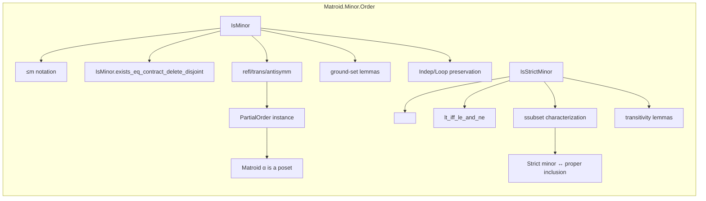
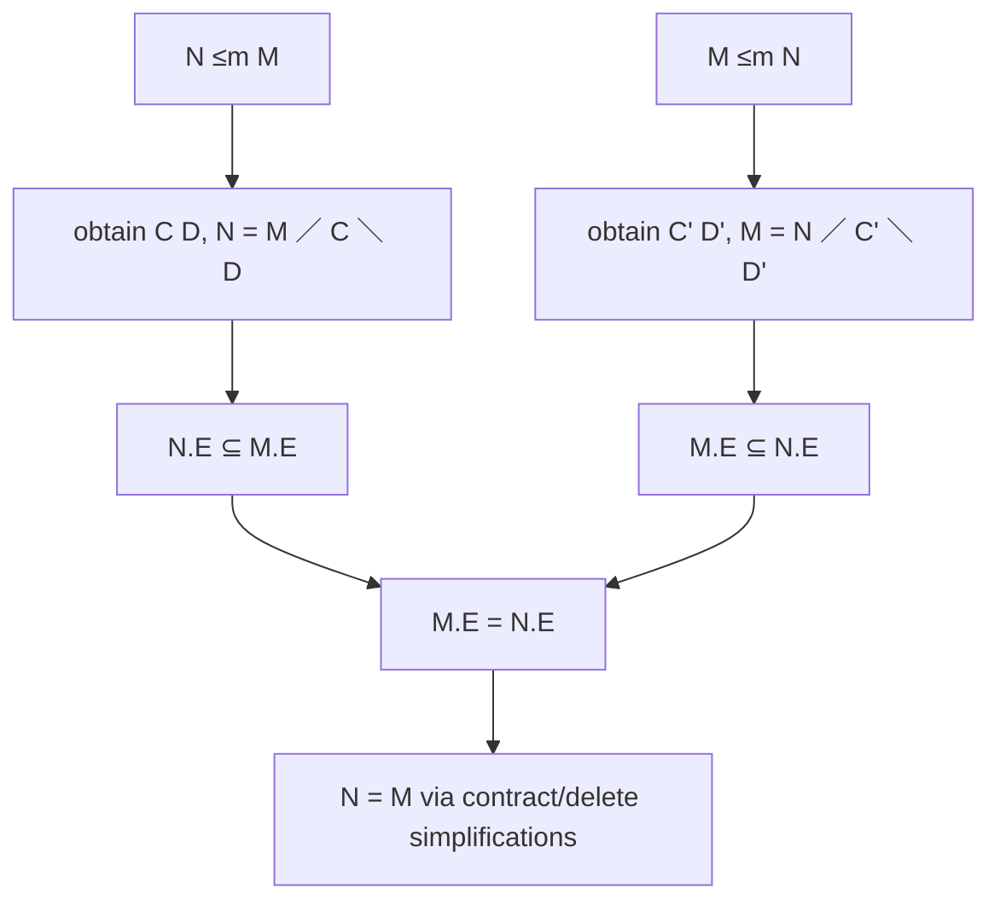

### Technical Brief: `Order.lean` — Matroid Minor Order in Lean 4

---

#### **1. Key Definitions & Theorems**

| Name | Type / Signature | Purpose |
|------|------------------|---------|
| `IsMinor` | `def IsMinor (N M : Matroid α) : Prop := ∃ C D, N = M ／ C ＼ D` | Defines that `N` is a *minor* of `M`, i.e., obtainable by contracting `C` then deleting `D`. |
| `IsStrictMinor` | `def IsStrictMinor (N M : Matroid α) : Prop := N ≤m M ∧ ¬ M ≤m N` | Defines *strict minor*: `N` is a minor of `M`, but `M` is not a minor of `N`. |
| `≤m`, `<m` | `infixl:50 " ≤m "`, `" <m "` | Notation for minor and strict minor relations. |
| `contract_delete_isMinor` | `M ／ C ＼ D ≤m M` | Immediate witness for minor relation via explicit contraction/deletion. |
| `IsMinor.exists_eq_contract_delete_disjoint` | `N ≤m M → ∃ C D, C ⊆ M.E ∧ D ⊆ M.E ∧ Disjoint C D ∧ N = M ／ C ＼ D` | Shows we can always choose disjoint subsets of the ground set for minor construction. |
| `IsMinor.refl` | `M ≤m M` | Reflexivity of minor order. |
| `IsMinor.trans` | `M₁ ≤m M₂ → M₂ ≤m M₃ → M₁ ≤m M₃` | Transitivity via recombination of contraction/deletion sets. |
| `IsMinor.antisymm` | `N ≤m M → M ≤m N → N = M` | Antisymmetry, using ground set inclusion equality. |
| `PartialOrder (Matroid α)` | `instance` | Induces a `PartialOrder` structure on matroids via `≤m`. |
| `isStrictMinor_iff_isMinor_ssubset` | `N <m M ↔ N ≤m M ∧ N.E ⊂ M.E` | Equivalence between strict minor and proper ground-set inclusion + minor. |
| `Indep.of_isMinor`, `IsNonloop.of_isMinor`, `Dep.of_isMinor`, `IsLoop.of_isMinor` | Various properties preserved under minors | Minor relations preserve independence, non-loops, and reflect loops/dependence under subset conditions. |

---

#### **2. Naming Conventions**

- **Prefixes**:
  - `is_` for predicate definitions (`IsMinor`, `IsStrictMinor`, `IsNonloop`, `IsLoop`).
  - `of_` for “pullback” properties (e.g., `of_isMinor`).
- **Suffixes**:
  - `_isMinor`, `_isStrictMinor`: for lemmas about the minor relations.
  - `_eq_of_ground_subset`: for lemmas using ground-set equality to deduce matroid equality.
- **Infixes**:
  - `≤m`, `<m`: chosen for dot-notation convenience (`N ≤m M` instead of `IsMinor N M`).

---

#### **3. Tactic Stack**

Frequently used tactics in proofs:

| Tactic | Usage |
|--------|-------|
| `obtain ⟨C, D, rfl⟩ := h` | Eliminate existential quantifier in `≤m` definition. |
| `simp [delete_eq_delete_iff, inter_assoc, inter_diff_assoc]` | Simplify set expressions involving `delete`, `contract`, intersections. |
| `rw [...] at hE` | Rewrite assumptions using lemmas about `delete`, `contract`, ground sets. |
| `subset_diff`, `diff_subset`, `inter_subset_right`, `disjoint_sdiff_right` | Set-theoretic reasoning for subset/disjointness. |
| `aesop`, `ring` | Not present here — this file is mostly `simp`/`rw`-heavy. |
| `exact`, `by rw [...]`, `by simpa` | Standard proof scripting. |

---

#### **4. Proof Logic**

- **Structure of proofs**:
  - Most proofs follow a *deconstruction → recombination* pattern:
    1. Unpack the minor assumption (`obtain ⟨C, D, rfl⟩`).
    2. Use known lemmas about `contract`/`delete` (e.g., associativity, interaction with ground set).
    3. Reassemble using `rw`, `simp`, and set-theoretic lemmas.
- **Induction is not used** — all arguments are *constructive* and *algebraic* over matroid operations.
- **Ground-set reasoning** is central:
  - `subset`, `eq_of_ground_subset`, `antisymm` rely on equality of ground sets.
  - Strict minor ↔ proper ground-set inclusion + minor.

---

#### **5. Imports & Dependencies**

- **Primary import**:
  ```lean
  import Mathlib.Combinatorics.Matroid.Minor.Contract
  ```
  - Provides definitions and lemmas for `contract`, `delete`, and their basic properties.
- **Implicit dependencies**:
  - `Mathlib.Combinatorics.Matroid.Basic` (via `Contract`), including:
    - `Matroid`, `Indep`, `Dep`, `IsLoop`, `IsNonloop`, `ground set` (`M.E`).
  - `Mathlib.SetTheory.Set` (for `subset`, `disjoint`, `inter`, `diff`, etc.).
  - `Mathlib.Order.PartialOrder` (for `PartialOrder` instance).

---

#### **6. Mermaid Diagrams**

##### **Dependency Graph (Module-Level)**



##### **Overview of File Structure**



##### **Proof Flow for `IsMinor.antisymm`**



---

#### **7. Summary**

This file formalizes the **minor order** on matroids, establishing it as a `PartialOrder`. It emphasizes:
- Constructive characterizations (`exists_eq_contract_delete_disjoint`).
- Preservation of matroid properties under minors.
- Equivalence between strict minors and proper ground-set inclusion.

The design avoids heavy notation (`≤`, `<`) in favor of `≤m`, `<m` for ergonomic dot-notation usage (`N ≤m M`), aligning with Lean’s style for relational operators.

--- 

Let me know if you'd like a formalized dependency graph for the entire `Matroid.Minor` hierarchy.
