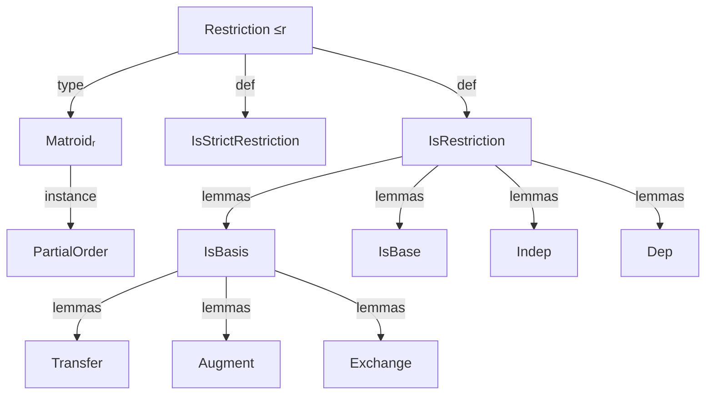

### Technical Brief: `Restrict.lean`

---

#### **1. Key Definitions & Theorems**

| Name | Type / Signature | Purpose |
|------|------------------|---------|
| `restrictIndepMatroid` | `Matroid α → Set α → IndepMatroid α` | Constructs the *independent matroid structure* on `R` with independent sets = `M`-independent subsets of `R`. |
| `restrict` | `Matroid α → Set α → Matroid α` | Defines the *restriction* `M ↾ R`: ground set `R`, independent sets = `M`-independent subsets of `R`. |
| `restrict_indep_iff` | `(M ↾ R).Indep I ↔ M.Indep I ∧ I ⊆ R` | Core equivalence for independence in restriction. |
| `restrict_ground_eq` | `(M ↾ R).E = R` | Ground set of restriction is exactly `R`. |
| `restrict_ground_eq_self` | `M ↾ M.E = M` | Restriction to full ground set recovers original matroid. |
| `restrict_restrict_eq` | `R₂ ⊆ R₁ ⇒ (M ↾ R₁) ↾ R₂ = M ↾ R₂` | Idempotency of restriction along nested sets. |
| `isBase_restrict_iff` | `(M ↾ X).IsBase I ↔ M.IsBasis I X` (under `X ⊆ M.E`) | Relates bases of restriction to `M`-bases in `X`. |
| `IsRestriction` (`≤r`) | `Prop` | `N ≤r M` iff `∃ R ⊆ M.E, N = M ↾ R`. |
| `IsStrictRestriction` (`<r`) | `Prop` | Strict version: `N = M ↾ R` for some `R ⊂ M.E`. |
| `Matroidᵣ α` | `Type*` | Type synonym of `Matroid α` equipped with partial order `≤r`. |
| `restrict_rankFinite`, `restrict_finitary` | Instance proofs | Closure properties of restriction under rank-finiteness and finitariness. |
| `IsBasis.transfer` | `M.IsBasis I X → M.IsBasis J X → X ⊆ Y → M.IsBasis J Y → M.IsBasis I Y` | Transfer of basis property across supersets (key lemma in `IsBasis` section). |
| `Indep.augment` | `M.Indep I → M.Indep J → I.encard < J.encard → ∃ e ∈ J \ I, M.Indep (insert e I)` | Augmentation lemma for independent sets (standard matroid property). |

---

#### **2. Naming Conventions**

- **Prefixes**:
  - `restrict_`: for lemmas about `restrict` (e.g., `restrict_indep_iff`, `restrict_ground_eq`).
  - `isBase_`, `isBasis_`, `isBasis'_`: for basis-related lemmas, especially those linking `IsBase` and `IsBasis`.
  - `of_`, `indep_`, `dep_`, `base_`: for morphism-like properties (e.g., `of_restrict`, `indep_isRestriction`, `dep_isRestriction`).
- **Suffixes**:
  - `_iff`: biconditional characterizations (e.g., `restrict_indep_iff`, `IsRestriction.dep_iff`).
  - `_restrict`: when referring to behavior under restriction (e.g., `isBasis_restrict_iff`, `isBase_restrict_iff`).
  - `_of_`: when deriving something *from* a hypothesis (e.g., `of_restrict`, `of_isRestriction`).
- **Infixes**:
  - `↾`: for `restrict` (e.g., `M ↾ R`).
  - `≤r`, `<r`: for restriction order and strict restriction.

---

#### **3. Tactic Stack**

Frequently used tactics in proofs:

| Tactic | Role |
|--------|------|
| `simp_rw` | Rewriting with simplification (especially for `isBase`, `isBasis`, `restrict_indep_iff`). |
| `aesop_mat` | Custom tactic for automatically discharging subset goals like `R ⊆ M.E`. |
| `rw` / `rwa` | Rewriting using equalities and assumptions (e.g., `restrict_ground_eq`, `restrict_restrict_eq`). |
| `exact`, `assumption`, `intro`, `cases` | Standard proof structure. |
| `tauto` | For propositional logic simplifications (e.g., in `restrict_indep_iff` proofs). |
| `ext_indep` | Extensionality for matroids via independence sets. |
| `subset_inter_iff`, `inter_eq_self_of_subset_left`, `union_subset_iff` | Set-theoretic simplifications. |
| `encard_eq_encard_of_isBase` | Cardinality reasoning for bases. |

---

#### **4. Proof Logic**

- **Structure of proofs**:
  - Most proofs about `restrict` proceed by:
    1. Unfolding definitions (`restrict`, `restrictIndepMatroid`, `restrict_indep_iff`).
    2. Using `ext_indep` or `ext` to reduce to equality of ground sets/independent sets.
    3. Applying `simp`/`rw` with lemmas like `restrict_ground_eq`, `restrict_restrict_eq`.
  - Proofs about `≤r` often:
    - Use `obtain ⟨R, hR, rfl⟩ := h` to unpack the existential witness.
    - Apply `restrict_ground_eq` to relate ground sets.
    - Use `subset_inter_iff`, `diff_subset`, etc., for set manipulations.
  - Basis lemmas (`IsBasis.*`) rely heavily on:
    - `isBase_restrict_iff` to translate between `IsBase` in restriction and `IsBasis` in `M`.
    - Known `IsBase` lemmas (e.g., exchange, augmentation, cardinality equality).
    - `restrict_restrict_eq` to reduce nested restrictions.

- **Induction**: Not used directly in this file; proofs are mostly algebraic/set-theoretic.

---

#### **5. Imports**

- `Mathlib.Combinatorics.Matroid.Dual`: Required for duality lemmas used in `restrictIndepMatroid.indep_aug` (e.g., `dual_indep_iff_exists`, `isBasis'_iff_isBasis_inter_ground`).

---

#### **6. Mermaid Diagrams**

##### **Dependency Graph (Top-Level)**

```mermaid
graph TD
  A[Restrict.lean] --> B[Mathlib.Combinatorics.Matroid.Dual]
  A --> C[Data.Matroid.Basic]  %% implicit via Matroid typeclass
  A --> D[Data.Set.Basic]
  A --> E[Data.Finset.Basic]
  A --> F[Data.Encard.Basic] %% for encard, cardinality
```

##### **Overview of Theory Flow**

```mermaid
graph LR
  M[Matroid α] -->|restrict R| M_R[M ↾ R]
  M_R -->|ground| R
  M_R -->|indep| {I | M.Indep I ∧ I ⊆ R}
  M_R -->|basis| {I | M.IsBasis I R}
  M_R -->|≤r| M
  N[Matroid α] -->|≤r M| M
  N -->|<r M| M
  Matroidᵣ[Matroidᵣ α] -->|PartialOrder| ≤r
```

##### **API Hierarchy**



---

#### **7. Key Insight**

- **Ground set flexibility**: The definition of `restrict` allows `R ⊈ M.E`, making `R \ M.E` consist of loops. This avoids unnecessary hypotheses and simplifies the API (e.g., `M ↾ univ` is always defined).
- **Ordering on `Matroidᵣ α`**: The `≤r` order is defined on the type synonym `Matroidᵣ α`, reserving `≤` on `Matroid α` for the *minor order* (see `Matroid.IsMinor`).
- **Basis ↔ Base correspondence**: The equivalence `(M ↾ X).IsBase I ↔ M.IsBasis I X` is central to transferring `IsBase` lemmas to `IsBasis`, enabling powerful basis manipulation lemmas (e.g., `IsBasis.transfer`, `IsBasis.exchange`).

--- 

Let me know if you'd like a formalized dependency graph or a summary of how `restrict` interacts with other matroid constructions (e.g., contraction, dual).
