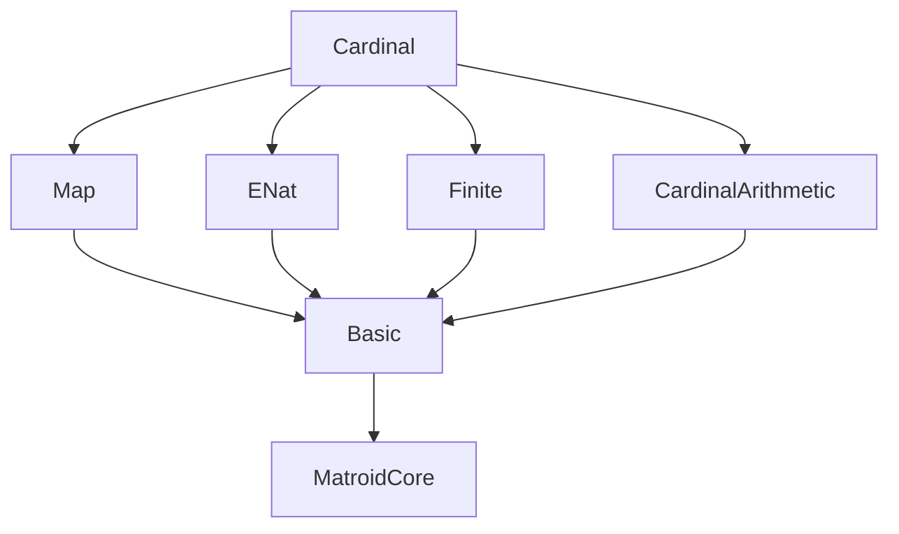
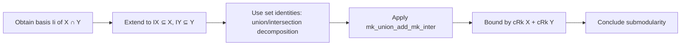

### Technical Brief: `Cardinal.lean`

---

#### **1. Key Definitions & Theorems**

| Name | Type | Purpose |
|------|------|---------|
| `cRank M` | `Cardinal` | Supremum of cardinalities of all bases of matroid `M`. |
| `cRk M X` | `Cardinal` | Supremum of cardinalities of bases of set `X` in `M`; defined as `cRank (M ↾ X)`. |
| `InvariantCardinalRank M` | `Prop` | Typeclass asserting all bases of `M` and its minors are equicardinal (i.e., `#(I \ J) = #(J \ I)` for any two bases `I`, `J` of same set `X`). |
| `invariantCardinalRank_of_finitary` | Instance | Shows that *finitary* matroids satisfy `InvariantCardinalRank`. |
| `cRk_inter_add_cRk_union_le` | Theorem | Cardinal rank is **submodular**: `cRk (X ∩ Y) + cRk (X ∪ Y) ≤ cRk X + cRk Y`. |
| `IsBasis.cardinalMk_eq` | Theorem | If `I`, `J` are bases of same set `X`, then `#I = #J`. |
| `IsBasis.cardinalMk_diff_comm` | Theorem | For bases `I`, `J` of `X`, `#(I \ J) = #(J \ I)`. |
| `cRk_closure` | Theorem | Under `InvariantCardinalRank`, `cRk (closure X) = cRk X`. |
| `rankFinite_iff_cRank_lt_aleph0` | Theorem | `M.RankFinite ↔ cRank M < ℵ₀`. |
| `toENat_cRank_eq` | Theorem | `cRank M` lifted to `ℕ∞` equals `eRank M`. |

---

#### **2. Naming Conventions**

- **Prefixes**:
  - `cRank`, `cRk`: `c` stands for *cardinal*-valued rank.
  - `isBase`, `isBasis`, `isBasis'`: standard matroid basis predicates.
  - `invariantCardinalRank_...`: naming for typeclass and its properties.
- **Suffixes**:
  - `_le_...`, `_eq_...`, `_diff_...`, `_closure_...`: indicate logical structure or operation.
  - `_restrict`, `_map`, `_comap`: denote operations on matroids.
- **Pattern**:
  - `cardinalMk_...`: lemmas about `#S` (cardinal of a set).
  - `lift_inj`, `mk_image_eq_of_injOn_lift`: use of `lift` and `mk` for universe polymorphism.

---

#### **3. Tactic Stack**

Frequent tactics used in proofs:

| Tactic | Usage |
|--------|-------|
| `simp_rw` | Rewriting with definitional equalities (e.g., `cRk`, `isBasis'_restrict_iff`). |
| `rw` / `rwa` | Rewriting using lemmas or assumptions, often with `at` or `hf` context. |
| `exact`, `refine`, `apply` | Constructing proofs via known lemmas. |
| `cases` / `obtain` | Extracting witnesses (e.g., `⟨I, hI⟩`, `⟨B, hB, hIB⟩`). |
| `antisymm` | Proving equality of cardinals via `≤` both ways. |
| `ciSup_le'`, `le_ciSup_of_le` | Reasoning about suprema over bases/independent sets. |
| `mk_le_mk_of_subset` | Monotonicity of cardinality under inclusion. |
| `aesop_mat` | Custom tactic for matroid reasoning (e.g., `hX : X ⊆ M.E`). |
| `lift_inj`, `lift_iSup`, `lift_le` | Universe lifting reasoning. |
| `by_cases` / `by_contra` | Splitting on finiteness or contradiction. |
| `iUnion_subset`, `mk_iUnion_le`, `mul_le_max_of_aleph0_le_left` | Cardinal arithmetic reasoning. |

---

#### **4. Proof Logic**

- **Structure of proofs**:
  - **Induction/Case analysis** is rare; instead, proofs rely on:
    - *Existence of bases* (`exists_isBase`, `exists_isBasis'`)
    - *Extension of independent sets* (`subset_isBasis'_of_subset`, `exists_isBase_superset`)
    - *Equicardinality assumptions* (`InvariantCardinalRank.forall_card_isBasis_diff`)
  - **Cardinal comparisons** are often done via:
    - `antisymm` + `mk_le_mk_of_subset`
    - `ciSup_le'` / `le_ciSup_of_le` for suprema
  - **Submodularity proof** (`cRk_inter_add_cRk_union_le`) uses:
    - Basis decomposition of `X ∩ Y`, `X`, `Y`
    - Set-theoretic identities: `A ∪ B = (A \ B) ∪ (B \ A) ∪ (A ∩ B)`
    - Disjoint union cardinal arithmetic: `#A + #B = #(A ⊔ B)` for disjoint `A`, `B`
  - **Instance proofs** (`invariantCardinalRank_of_finitary`, `map`, `comap`) use:
    - Reduction to known instances via `restrict`, `map`, `comap` properties
    - Finitary-specific arguments (e.g., finite subsets, dependence witnesses)

---

#### **5. Imports & Dependencies**

| Module | Role |
|--------|------|
| `Mathlib.Combinatorics.Matroid.Map` | Matroid operations: `map`, `comap`, `restrict`. |
| `Mathlib.Combinatorics.Matroid.Rank.ENat` | `eRank`, `eRk`: `ℕ∞`-valued rank (better-behaved, no equicardinality needed). |
| `Mathlib.Combinatorics.Matroid.Rank.Finite` | Finitary matroids, finite rank properties. |
| `Mathlib.SetTheory.Cardinal.Arithmetic` | Cardinal arithmetic: `+`, `*`, `≤`, `ℵ₀`, `finite`, `infinite`. |

---

#### **6. Mermaid Diagrams**

##### **Dependency Graph (Module-Level)**



##### **Overview of `Cardinal.lean`**

```mermaid
flowchart LR
  A[Matroid α] --> B[cRank M : Cardinal]
  A --> C[cRk M X : Cardinal]
  A --> D[InvariantCardinalRank M]
  D --> E[All bases equicardinal]
  D --> F[Submodularity of cRk]
  D --> G[cRk(closure X) = cRk X]
  D --> H[Instances: Finitary, Map, Comap]

  I[ENat Rank] -.->|coerce| B
  I[ENat Rank] -.->|coerce| C
  style D fill:#f9f,stroke:#333,stroke-width:2px
```

##### **Proof Strategy Flow (Submodularity)**



---

#### **7. Notes on Limitations & Future Work**

- **Non-`InvariantCardinalRank` matroids**: `cRank`, `cRk` are defined for all matroids but may be pathological (e.g., not submodular, not closure-invariant).
- **ZFC independence**: Equicardinality of bases is not provable in ZFC for arbitrary matroids.
- **TODO**: Higgs’ theorem (GCH ⇒ all matroids are `InvariantCardinalRank`).

--- 

This file formalizes a robust *cardinal-valued rank theory* for matroids, bridging combinatorics and set theory, with careful attention to when equicardinality holds (e.g., finitary case).
