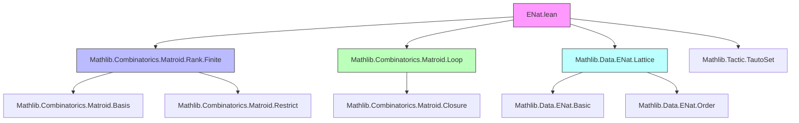
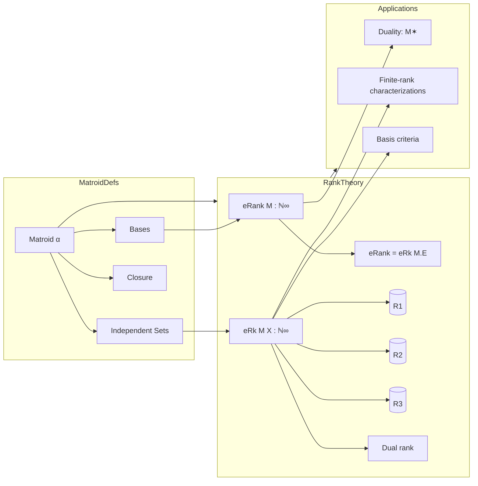

### Technical Brief: `ENat.lean` — `ℕ∞`-valued Rank in Matroid Theory (Lean 4)

---

#### **1. Key Definitions & Theorems**

| Name | Type / Signature | Purpose |
|------|------------------|---------|
| `eRank` | `Matroid α → ℕ∞` | Defines the rank of a matroid as the `ℕ∞`-valued cardinality of any base. |
| `eRk` | `Matroid α → Set α → ℕ∞` | Defines the rank of a subset `X` as the `ℕ∞`-valued cardinality of any basis of `X`. |
| `eRank_def` | `M.eRank = M.eRk M.E` | Equivalence of global rank and rank of the ground set. |
| `eRk_ground` | `M.eRk M.E = M.eRank` | Same as above, symmetric form. |
| `IsBase.encard_eq_eRank` | `M.IsBase B → B.encard = M.eRank` | All bases have same `ℕ∞`-cardinality = `eRank`. |
| `IsBasis'.encard_eq_eRk` | `M.IsBasis' I X → I.encard = M.eRk X` | All bases of `X` have same `ℕ∞`-cardinality = `eRk X`. |
| `eq_eRk_iff` | `M.eRk X = n ↔ ∃ I, M.IsBasis I X ∧ I.encard = n` | Characterizes `eRk X` via existence of a basis of size `n`. |
| `eRk_le_encard` | `M.eRk X ≤ X.encard` | Rank of a set ≤ its cardinality (R1). |
| `eRk_mono` | `X ⊆ Y → M.eRk X ≤ M.eRk Y` | Monotonicity (R2). |
| `eRk_submod` (alias `eRk_inter_add_eRk_union_le`) | `M.eRk (X ∩ Y) + M.eRk (X ∪ Y) ≤ M.eRk X + M.eRk Y` | Submodularity (R3). |
| `eRk_dual_add_eRank` | `M✶.eRk X + M.eRank = M.eRk (M.E \ X) + X.encard` | Subtraction-free dual rank formula. |
| `eRank_add_eRank_dual` | `M.eRank + M✶.eRank = M.E.encard` | Sum of primal and dual ranks = size of ground set. |
| `eRk_eq_zero_iff` | `M.eRk X = 0 ↔ X ⊆ M.loops` | Rank zero iff subset of loops. |
| `eRk_singleton_eq_one_iff` | `M.eRk {e} = 1 ↔ M.IsNonloop e` | Singleton rank 1 iff non-loop. |
| `eRk_lt_encard_iff_dep_of_finite` | `X.Finite → M.eRk X < X.encard ↔ M.Dep X` | Dependent iff rank < cardinality (finite case). |
| `indep_iff_eRk_eq_encard_of_finite` | `I.Finite → M.Indep I ↔ M.eRk I = I.encard` | Independence characterized by rank = cardinality (finite case). |
| `IsRkFinite.isBasis_of_subset_closure_of_subset_of_encard_le` | Basis criterion via closure & size. |
| `closure_eq_closure_of_subset_of_eRk_ge_eRk` | Equal closures when superset has no larger rank (finite rank case). |

---

#### **2. Naming Conventions**

- **Prefixes**:
  - `eRank`, `eRk`: `e` stands for *extended* (i.e., `ℕ∞`-valued, as opposed to `cRank`/`cRk` for cardinal-valued).
  - `isBasis'`, `isBasis`, `isBase`: variants for relative bases (`I ⊆ X`), absolute bases (`M.IsBase B`), and independence-based bases.
  - `encard`: `Set.encard` — extended cardinality (`ℕ∞`-valued).
  - `diff`, `inter`, `union`, `compl`, `insert`: standard set operations.
  - `closure`, `loops`, `spanning`, `indep`, `dep`, `circuit`: matroid-theoretic predicates.

- **Suffixes**:
  - `_def`: definition simplification lemmas.
  - `_eq`: equality lemmas (often `rfl` or `simp`-friendly).
  - `_le`, `_lt`: inequality lemmas.
  - `_iff`: biconditional characterizations.
  - `_iff'`: variant with weaker hypotheses (e.g., no `X ⊆ M.E`).
  - `_ground`, `_inter_ground`, `_union_ground`: interactions with ground set `M.E`.
  - `_restrict`, `_map`, `_comap`: behavior under matroid constructions.

---

#### **3. Tactic Stack**

Frequently used tactics in proofs:

| Tactic | Role |
|--------|------|
| `rw` / `simp` / `simp_rw` | Rewriting definitions, simplifying `eRk`, `eRank`, `encard`, `closure`, etc. |
| `obtain ⟨I, hI⟩ := ...` / `cases` | Extracting existence witnesses (e.g., bases, independent sets). |
| `exact`, `assumption`, `aesop_mat` | Solving subset ground membership goals (`aesop_mat` is a custom matroid tactic). |
| `gcongr`, `grw` | Goal-congruence and rewriting under `≤`, `+`, etc. |
| `tauto`, `tauto_set` | Set-theoretic tautologies (e.g., `X ∩ M.E ⊆ X`, `diff_union_self`). |
| `ring` / `linarith` | Arithmetic reasoning over `ℕ∞` (e.g., `a + b ≤ c + d`). |
| `antisymm` | Proving equality via mutual inequality. |
| `by_cases` / `by_contra` | Case splits or contradiction-based arguments. |
| `convert`, `congr_arg` | Congruence for function extensionality. |

---

#### **4. Proof Logic**

- **Inductive/constructive style**: Proofs rely heavily on *existence of bases* (`exists_isBasis`, `exists_isBase`) and *extension/augmentation* lemmas (`augment`, `subset_isBasis'_of_subset`).
- **Standard flow**:
  1. Extract a basis `I` or `B` for the set in question.
  2. Use `encard_eq_eRk` / `encard_eq_eRank` to reduce rank statements to cardinalities.
  3. Apply monotonicity, submodularity, or set-theoretic identities (e.g., `X = (X ∩ Y) ∪ (X \ Y)`).
  4. Use `encard_mono`, `encard_insert`, `encard_union_add_encard_inter`, etc., for arithmetic.
  5. For dual rank: use duality lemmas (`compl_isBase_dual`, `inter_isBasis_iff_compl_inter_isBasis_dual`).
- **Finite-rank assumptions**: Often handled via `IsRkFinite`, `RankFinite`, or `RankPos` typeclass arguments.
- **Case splits**: On finiteness (`finite_or_infinite`), membership (`mem_or_not_mem`), or loop/nonloop status.

---

#### **5. Imports & Dependencies**

| Import | Purpose |
|--------|---------|
| `Mathlib.Combinatorics.Matroid.Rank.Finite` | Finite-rank lemmas, `RankFinite`, `IsRkFinite`. |
| `Mathlib.Combinatorics.Matroid.Loop` | Loop definitions (`IsLoop`, `loops`, `loopless`). |
| `Mathlib.Data.ENat.Lattice` | `ℕ∞` arithmetic, lattice structure, `encard`. |
| `Mathlib.Tactic.TautoSet` | Set-theoretic automation (`tauto_set`). |

> **Note**: `Set.encard` is currently defined via `Cardinal`, but plans exist to refactor it to be independent — this file would remain valid.

---

#### **6. Mermaid Diagrams**

##### **Dependency Graph (Module-Level)**

##### **Overview of Theory Flow**

---

#### **7. Summary**

This file formalizes the **`ℕ∞`-valued rank function** for matroids, establishing:
- Equicardinality of bases (global and relative),
- Axiomatic properties (R1–R3),
- Duality formulas (subtraction-free),
- Finite-rank characterizations (e.g., basis criteria, closure equality),
- Behavior under matroid operations (`restrict`, `map`, `comap`, `dual`).

It serves as the quantitative backbone for finite matroid theory in Mathlib, offering a more tractable alternative to cardinal-valued rank (`cRank`/`cRk`) while remaining compatible with infinite matroids via `ℕ∞`.

--- 

Let me know if you'd like a **proof sketch of a key lemma** (e.g., `eRk_submod`) or a **dependency analysis of `cRank` vs `eRank`**.
