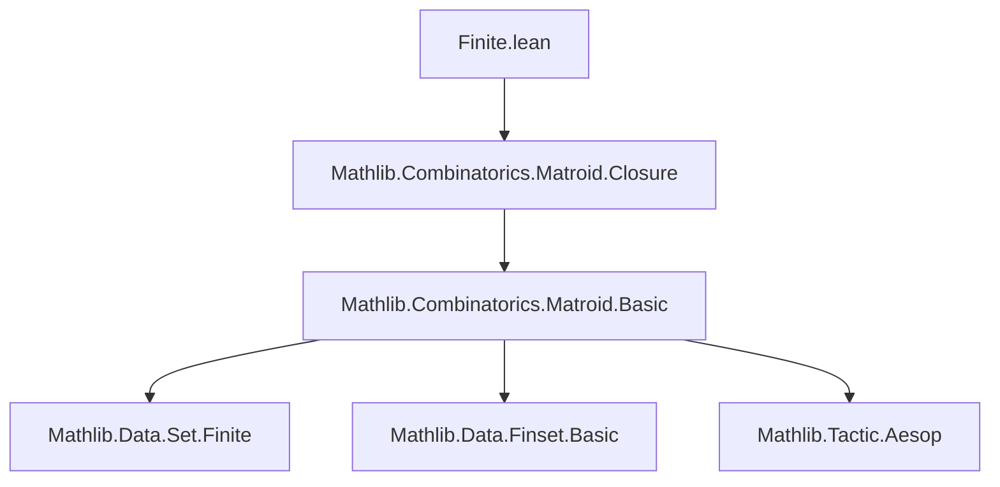

### Technical Brief: `Finite.lean` — Finite-Rank Sets in Matroids

---

#### **1. Key Definitions & Theorems**

| Name | Type / Signature | Purpose |
|------|------------------|---------|
| `IsRkFinite` | `def IsRkFinite (M : Matroid α) (X : Set α) : Prop := (M ↾ X).RankFinite` | Defines that every basis of `X` in `M` is finite (equivalently, the restriction `M ↾ X` has finite rank). |
| `rankFinite` | `lemma IsRkFinite.rankFinite (hX : M.IsRkFinite X) : (M ↾ X).RankFinite` | Extracts the witness of finite rank from `IsRkFinite`. |
| `isRkFinite_of_finite` | `lemma isRkFinite_of_finite (M : Matroid α) (hX : X.Finite) : M.IsRkFinite X` | Any finite set is `IsRkFinite`. |
| `isRkFinite_iff_exists_isBasis'` | `lemma isRkFinite_iff_exists_isBasis' : M.IsRkFinite X ↔ ∃ I, M.IsBasis' I X ∧ I.Finite` | Characterizes `IsRkFinite` via existence of a finite basis'. |
| `finite_of_isBasis'` | `lemma IsRkFinite.finite_of_isBasis' (h : M.IsRkFinite X) (hI : M.IsBasis' I X) : I.Finite` | Any basis' of an `IsRkFinite` set is finite. |
| `exists_finite_isBasis'` | `lemma IsRkFinite.exists_finite_isBasis' (h : M.IsRkFinite X) : ∃ I, M.IsBasis' I X ∧ I.Finite` | Guarantees existence of a finite basis' for `IsRkFinite` sets. |
| `subset` | `lemma IsRkFinite.subset (h : M.IsRkFinite X) (hXY : Y ⊆ X) : M.IsRkFinite Y` | Subsets of `IsRkFinite` sets are `IsRkFinite`. |
| `union` | `lemma IsRkFinite.union (hX : M.IsRkFinite X) (hY : M.IsRkFinite Y) : M.IsRkFinite (X ∪ Y)` | Finite unions preserve `IsRkFinite`. |
| `iUnion` | `lemma IsRkFinite.iUnion {ι : Type*} [Finite ι] {Xs : ι → Set α} (h : ∀ i, M.IsRkFinite (Xs i)) : M.IsRkFinite (⋃ i, Xs i)` | Arbitrary *finite-indexed* unions of `IsRkFinite` sets are `IsRkFinite`. |
| `closure` | `lemma IsRkFinite.closure (h : M.IsRkFinite X) : M.IsRkFinite (M.closure X)` | Closure of an `IsRkFinite` set is `IsRkFinite`. |
| `isRkFinite_closure_iff` | `lemma isRkFinite_closure_iff : M.IsRkFinite (M.closure X) ↔ M.IsRkFinite X` | Closure does not affect `IsRkFinite`. |
| `isRkFinite_ground_iff_rankFinite` | `lemma isRkFinite_ground_iff_rankFinite : M.IsRkFinite M.E ↔ M.RankFinite` | Connects `IsRkFinite` on the ground set to global finite rank. |

---

#### **2. Naming Conventions**

- **Prefixes**:
  - `isRkFinite_`: Predicates or lemmas about `IsRkFinite`.
  - `finite_of_`: Implications from finiteness of a basis or set to `IsRkFinite`.
  - `isRkFinite_of_`: Implications from other properties (e.g., finiteness) to `IsRkFinite`.
- **Suffixes**:
  - `_iff`: Biconditional characterizations.
  - `_iff_exists_isBasis'`: Characterizations via existence of finite basis'.
  - `_iff_finite`: For sets where `IsRkFinite` coincides with finiteness (e.g., independent sets).
- **Variants**:
  - `isBasis'` vs `isBasis`: Primed versions refer to *basis'* (basis of restriction), unprimed to full matroid basis.
  - `finite` vs `finset`: Lemmas distinguish between finite sets and finite *subsets* (via `Finset`).

---

#### **3. Tactic Stack**

Frequently used tactics in proofs:
- `aesop_mat`: Custom tactic for matroid reasoning (e.g., `by aesop_mat` for `X ⊆ M.E`).
- `rw`, `simp_rw`: Rewriting using lemmas like `isRkFinite_iff_exists_isBasis'`, `closure_union_congr_left`.
- `obtain ⟨_, _⟩`: Destructuring existential witnesses (e.g., bases).
- `refine`, `exact`: Constructing proofs via intermediate steps.
- `subset`, `inter_subset_*`, `diff_subset`: Set-theoretic reasoning.
- `finite_iUnion`, `finite_empty`, `subset.trans`: Finiteness and subset chaining.
- `simpa`: Simplify and discharge goal using assumptions.

---

#### **4. Proof Logic**

- **Inductive/constructive style**: Most proofs construct witnesses (e.g., finite bases) using `exists_isBasis'`.
- **Equational reasoning**: Heavy use of `rw`/`simp_rw` to reduce to known equivalences (e.g., `isRkFinite_iff_exists_isBasis'`).
- **Case analysis on basis existence**: Many lemmas reduce to reasoning about `M.IsBasis' I X` or `M.IsBasis I X`.
- **Closure & restriction interplay**: Many proofs go via restriction `M ↾ X`, then use properties of `RankFinite`.
- **Monotonicity arguments**: Subsets, unions, differences handled via monotonicity of restriction and closure.

---

#### **5. Imports & Dependencies**

- **Primary dependency**:
  ```lean
  import Mathlib.Combinatorics.Matroid.Closure
  ```
  - Provides `Matroid`, `closure`, `restrict`, `IsBasis'`, `RankFinite`, etc.

- **Implicit dependencies** (via `Matroid` and `RankFinite`):
  - `Mathlib.Combinatorics.Matroid.Basic`
  - `Mathlib.Data.Set.Finite`
  - `Mathlib.Data.Finset.Basic`
  - `Mathlib.Tactic.Aesop`

---

#### **6. Mermaid Diagrams**

##### **Dependency Graph (Module-Level)**



##### **Conceptual Overview of `IsRkFinite` Theory**

```mermaid
flowchart LR
  A[IsRkFinite X] --> B[(M ↾ X).RankFinite]
  A --> C[∃ finite I, M.IsBasis' I X]
  C --> D[finite_of_isBasis']
  C --> E[exists_finite_isBasis']
  A --> F[subset Y ⊆ X ⇒ IsRkFinite Y]
  A --> G[union X Y ⇒ IsRkFinite]
  A --> H[closure X ⇒ IsRkFinite]
  B --> I[RankFinite]
  I --> J[isRkFinite_ground_iff_rankFinite]
```

##### **Proof Strategy Flow (Example: `union`)**
```mermaid
flowchart TD
  Start[Given hX : IsRkFinite X, hY : IsRkFinite Y] --> Obtain1[Obtain finite I ⊆ X, J ⊆ Y]
  Obtain1 --> UnionFin[Union I ∪ J is finite]
  UnionFin --> Closure[Take closure: cl(I ∪ J) = cl(X ∪ Y)]
  Closure --> InterGround[Intersect with ground: (X ∪ Y) ∩ M.E ⊆ cl(I ∪ J)]
  InterGround --> Conclude[Use isRkFinite_of_finite + closure + subset]
```

---

#### **7. Summary**

This module formalizes the theory of *finite-rank sets* in a matroid — the largest class of sets where rank arithmetic is well-defined. Key innovations:
- Allows sets `X` not necessarily subsets of the ground set (`X ⊆ M.E`), enabling more flexible reasoning.
- Equates `IsRkFinite X` with existence of a finite basis' for `X`.
- Provides closure under all standard set operations (subsets, unions, differences, insertions, intersections).
- Enables reduction to finite sets via basis extraction, crucial for inductive arguments and rank calculations.

This theory underpins later developments in matroid rank functions, minors, and decomposition.
