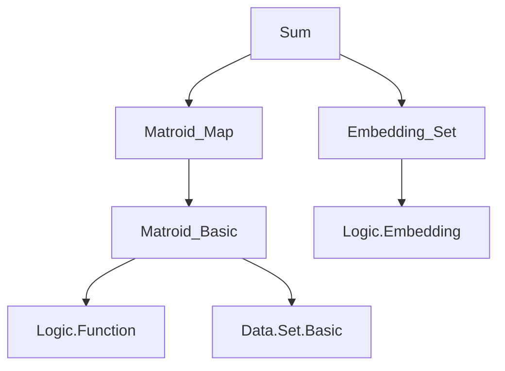
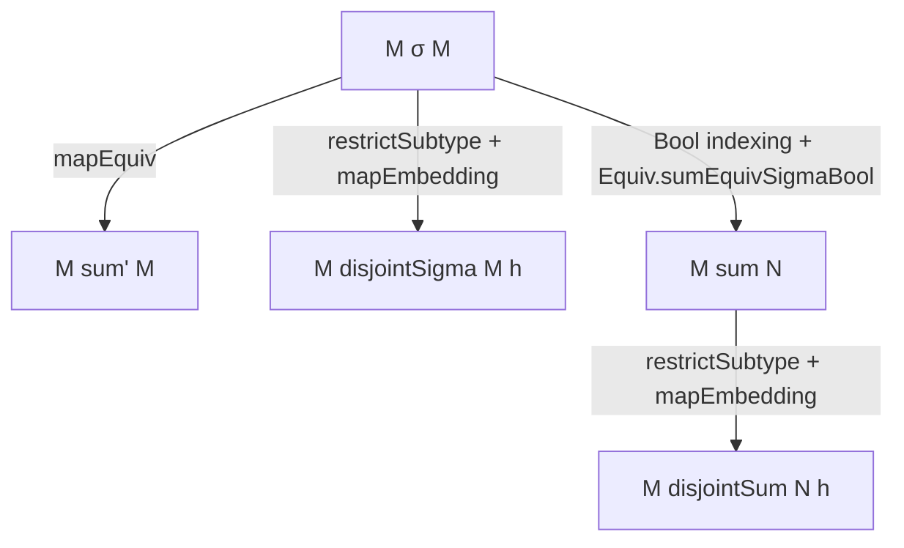
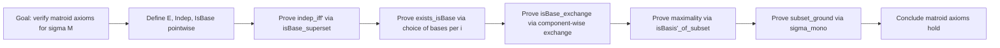

### Technical Brief: `Sum.lean` — Sums of Matroids in Lean 4

---

#### **1. Key Definitions & Theorems**

| Name | Type | Purpose |
|------|------|---------|
| `Matroid.sigma` | `(i : ι) → Matroid (α i) → Matroid (Σ i, α i)` | Defines the *sigma-sum*: disjoint union of matroids over dependent types (via `Σ`-type). Ground set = `Σ i, E_i`. Independent sets = pointwise independent. |
| `Matroid.sum'` | `ι → Matroid α → Matroid (ι × α)` | *Product-sum*: sum of matroids over same type, but embedded into `ι × α`. Defined via `sigma` + `mapEquiv`. |
| `Matroid.disjointSigma` | `(i : ι) → Matroid α → Pairwise (Disjoint on E) → Matroid α` | *Disjoint sigma-sum*: sum of matroids on same type with pairwise disjoint ground sets, resulting in a matroid on the original type `α`. Defined via `sigma` + `restrictSubtype` + `mapEmbedding`. |
| `Matroid.sum` | `Matroid α → Matroid β → Matroid (α ⊕ β)` | *Binary sum*: sum of two matroids on sum type `α ⊕ β`. Defined via `sigma` + `mapEquiv` + `Equiv.sumEquivSigmaBool`. |
| `Matroid.disjointSum` | `Matroid α → Matroid α → Disjoint E₁ E₂ → Matroid α` | *Binary disjoint sum*: sum of two matroids on same type with disjoint ground sets, resulting in a matroid on `α`. Defined via `sum` + `restrictSubtype` + `mapEmbedding`. |
| `sigma_indep_iff`, `sum'_indep_iff`, `disjointSigma_indep_iff`, `sum_indep_iff`, `disjointSum_indep_iff` | `↔` lemmas | Characterize independence in each sum construction. |
| `sigma_isBase_iff`, `sum'_isBase_iff`, etc. | `↔` lemmas | Characterize bases. |
| `sigma_isBasis_iff`, `sum'_isBasis_iff`, etc. | `↔` lemmas | Characterize bases relative to a superset (i.e., `IsBasis I X`). |
| `Finitary.sigma`, `Finitary.sum'` | `→ Finitary` | Prove that finitary-ness is preserved under sigma/sum'. |
| `disjointSum_comm` | `M.disjointSum N h = N.disjointSum M h.symm` | Symmetry of binary disjoint sum. |
| `Indep.eq_union_image_of_disjointSum`, `IsBase.eq_union_image_of_disjointSum` | `∃`-decomposition lemmas | Show that independent/bases in a disjoint sum decompose as unions of independent/bases from summands. |

---

#### **2. Naming Conventions**

- **Prefixes**:
  - `sigma_`: for constructions using `Σ`-type (dependent sum).
  - `sum'_`: for constructions using `ι × α` (product type).
  - `disjointSigma_`, `disjointSum_`: for constructions where ground sets are *disjoint* and result lives on original type.
  - `sum_`: binary sum on `α ⊕ β`.
- **Suffixes**:
  - `_indep_iff`, `_isBase_iff`, `_isBasis_iff`: characterizations of structural properties.
  - `_ground_eq`: ground set description.
- **Helper lemmas**:
  - `eq_union_image_of_…`: decomposition lemmas for disjoint sums.

---

#### **3. Tactic Stack**

| Tactic | Usage Frequency | Purpose |
|--------|------------------|---------|
| `simp` | Very High | Simplify using `@[simp]` lemmas (especially `sigma_*_iff`, `sum_*_iff`, etc.). |
| `rw` | High | Rewrite using equalities (e.g., `preimage_union`, `sigma_mk_preimage_image_eq_self`). |
| `exact`, `refine`, `convert` | High | Construct proofs; often with `convert Iff.rfl` + `simp`. |
| `intro`, `cases`, `obtain`, `have` | High | Standard proof decomposition. |
| `ext` | Medium | Extensionality for sets/functions (e.g., `sum_ground`). |
| `aesop` | Low | Not used here — proofs are mostly manual. |
| `ring` | None | Not needed (no arithmetic). |
| `subsets`, `set_tac` | Implicit | Used via `simp` + `set`-specific lemmas (`inter_union_distrib_left`, etc.). |

---

#### **4. Proof Logic**

- **Structure**: All proofs follow a *pointwise* strategy:
  - Reduce properties (independence, bases, basisness) to the component matroids via preimage under canonical embeddings (`Sigma.mk i`, `Prod.mk i`, `Sum.inl`, `Sum.inr`, etc.).
  - Use `mapEquiv`/`mapEmbedding` API to transfer matroid structure across equivalences/embeddings.
  - For `sigma`, proofs are *inductive* over the index type `ι`, but not by induction on `ι` itself — rather, by *pointwise reasoning* over all `i : ι`.
- **Key idioms**:
  - `preimage_mono`, `preimage_union`, `preimage_diff`, `preimage_singleton_eq_empty`, `sigma_mk_preimage_image_eq_self`.
  - `sigma_subset_iff`, `union_subset_iff`, `inter_union_distrib_left`.
  - `eq_or_ne` case splits (e.g., for `i = j` or `i ≠ j`).
  - `antisymm` for equality of sets via mutual inclusion.
- **Induction**: Not used directly — instead, *universal generalization* over `i : ι` and *pointwise* application of component matroid axioms.

---

#### **5. Imports**

| Import | Purpose |
|--------|---------|
| `Mathlib.Combinatorics.Matroid.Map` | Provides `mapEquiv`, `mapEmbedding`, `restrictSubtype`, and matroid morphism API. |
| `Mathlib.Logic.Embedding.Set` | Provides `Function.Embedding.sumSet`, `sigmaSet`, and related set-theoretic embeddings. |

---

#### **6. Mermaid Diagrams**

##### **Dependency Graph (Module-Level)**

##### **Overview of Sum Constructions**

##### **Proof Strategy Flow (for `sigma`)**

---

#### **7. Theory Scope**

- **Domain**: Combinatorics / Matroid theory.
- **Scope**: Construction and basic properties of *disjoint unions* (sums) of matroids.
- **Not covered**:
  - Duality of sums.
  - Connectivity, rank, closure, circuits.
  - Infinite sums beyond `σ`-type (though `sigma` handles arbitrary index types).
  - Monoidal structure (e.g., associativity, unit laws) — though `disjointSum_comm` hints at symmetry.

---

#### **8. Implementation Highlights**

- **Minimal primitive**: Only `sigma` is *directly* defined; all others are *derived* via `mapEquiv`/`mapEmbedding`.
- **Type-theoretic precision**:
  - Uses `Σ`-types for dependent sums, `×` for product, `⊕` for sum, and `subtype`/`restrictSubtype` for restriction.
  - Leverages `Equiv` and `Embedding` to transport structure without changing semantics.
- **Simp-normal form**: All key lemmas are marked `@[simp]`, enabling automatic simplification in downstream developments.

--- 

This file provides a foundational toolkit for reasoning about *disjoint unions* of matroids — a critical operation for building larger matroids from components, especially in decomposition theorems and categorical treatments.
