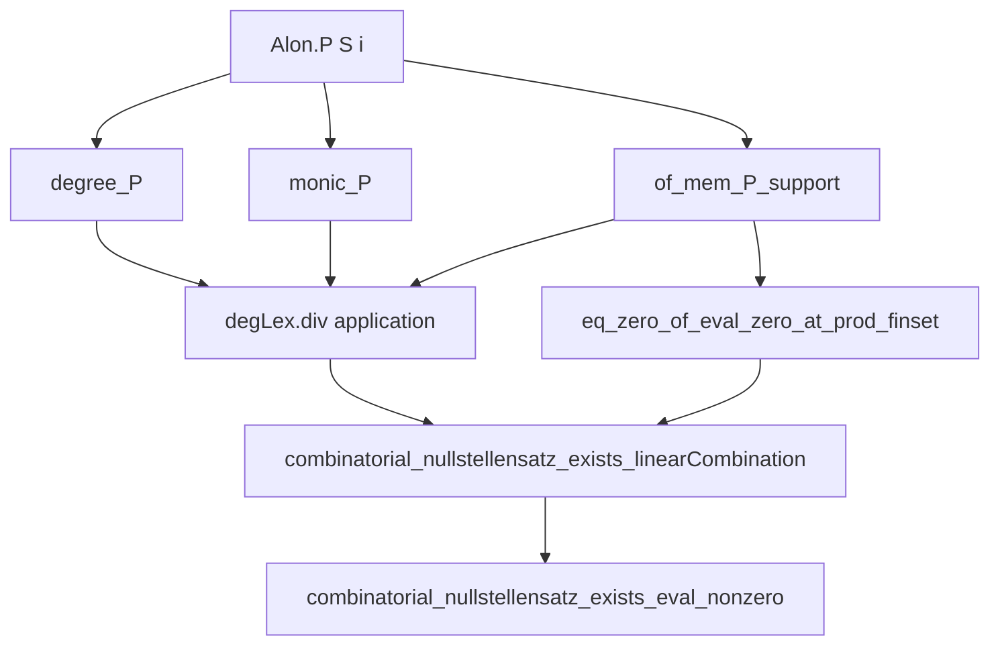
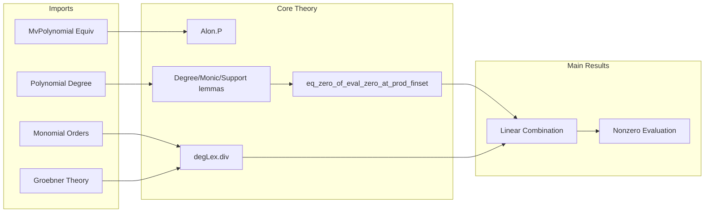

**Technical Brief: `Nullstellensatz.lean` — Alon’s Combinatorial Nullstellensatz in Lean 4**

---

### 1. KEY DEFINITIONS & THEOREMS

| Name | Type / Signature | Purpose |
|------|------------------|---------|
| `Alon.P S i` | `MvPolynomial σ R` | Polynomial $\prod_{r \in S} (X_i - r)$ vanishing on `S` in variable `X i`. |
| `eq_zero_of_eval_zero_at_prod_finset` | `(∀ i, P.degreeOf i < #S i) → (∀ x, x i ∈ S i → eval x P = 0) → P = 0` | If `P` vanishes on the full product $\prod S i$ and its *i*-degree is less than `#S i`, then `P = 0`. |
| `combinatorial_nullstellensatz_exists_linearCombination` | `(∀ i, (S i).Nonempty) → (∀ x, x i ∈ S i → eval x f = 0) → ∃ h, f = ∑ i, (∏_{r ∈ S i} (X i - r)) * h i ∧ ...` | If `f` vanishes on $\prod S i$, then `f` lies in the ideal generated by $\prod_{r ∈ S i} (X i - r)$, with degree control on the coefficients. |
| `combinatorial_nullstellensatz_exists_eval_nonzero` | `f.coeff t ≠ 0 ∧ f.totalDegree = t.degree ∧ ∀ i, t i < #S i → ∃ x, x i ∈ S i ∧ eval x f ≠ 0` | Converse: existence of a high-degree monomial with small support guarantees a non-vanishing point in the product set. |

---

### 2. NAMING CONVENTIONS

- **Prefixes**:
  - `Alon.`: Private namespace for auxiliary definitions/lemmas (e.g., `Alon.P`, `Alon.degree_P`).
  - `eq_zero_of_...`, `combinatorial_nullstellensatz_...`: Main theorems.
- **Suffixes**:
  - `_of_...`: Conditions on inputs (e.g., `degree_P_of_regular`, `eq_zero_of_eval_zero_at_prod_finset`).
  - `_mono`, `_le`, `_lt`: Monotonicity or inequality lemmas (e.g., `degLex_totalDegree_monotone`).
- **Variables**:
  - `S : σ → Finset R`: family of finite subsets.
  - `f`, `P`, `Q`: polynomials.
  - `t : σ →₀ ℕ`: multi-index (finsupp).
  - `x : σ → R`: evaluation point.

---

### 3. TACTIC STACK

| Tactic | Frequency | Role |
|--------|-----------|------|
| `induction ... using Finite.induction_empty_option` | High | Structural induction on finite types (empty, option, equiv). |
| `simp only [...]` | Very high | Simplification with precise lemmas (e.g., `coeff_zero`, `eval_rename`, `optionEquivLeft_elim_eval`). |
| `rw [...]` | Very high | Rewriting using equalities (e.g., `hf`, `degree_P`, `coeff_mul`). |
| `apply ...` | High | Goal-directed proof steps (e.g., `apply eq_zero_of_eval_zero_at_prod_finset`). |
| `convert ...` | Medium | Partial unification (e.g., `convert map_zero _`). |
| `by_contra!` | Medium | Contradiction proofs (e.g., in `combinatorial_nullstellensatz_exists_eval_nonzero`). |
| `ext` | Medium | Extensionality for functions, polynomials, finsupp. |
| `aesop` / `ring` / `linarith` | Low | Not used here — proofs are highly structured and rely on algebraic rewriting. |

---

### 4. PROOF LOGIC

- **Inductive structure on finite types**:
  - Base cases: `∅`, `option σ`.
  - Step case: use equivalence `σ ≃ τ ⊕ Unit` to reduce to smaller type.
- **Core logical flow**:
  1. **Reduction to univariate case** via `optionEquivLeft` (isomorphism $R[σ \sqcup \{*\}] \cong R[σ][X]$).
  2. **Univariate vanishing ⇒ zero polynomial** using `Polynomial.eq_zero_of_natDegree_lt_card_of_eval_eq_zero'`.
  3. **Groebner-style division** using `degLex.div` to write `f = ∑ P_i * h_i + r`, with `r` reduced.
  4. **Show remainder `r = 0`** via `eq_zero_of_eval_zero_at_prod_finset`, using degree bounds from division.
  5. **Non-vanishing ⇒ existence of point** via contradiction + degree analysis of monomials in the linear combination.

- **Key algebraic tools**:
  - `MvPolynomial.degreeOf`, `totalDegree`, `degLex` monomial order.
  - `Alon.P S i` is monic and has degree `#S` in variable `i`.
  - Support of `Alon.P S i` is $\{ \text{single } i\ e \mid e \leq \#S \}$.

---

### 5. IMPORTS (DOMAIN SCOPE)

| Module | Role |
|--------|------|
| `Mathlib.Algebra.MvPolynomial.Equiv` | Polynomial ring isomorphisms (e.g., renaming variables). |
| `Mathlib.Algebra.Polynomial.Degree.Defs` | Degree theory for univariate polynomials. |
| `Mathlib.Data.Finsupp.MonomialOrder.DegLex` | Lexicographic degree order on monomials. |
| `Mathlib.RingTheory.Ideal.Maps` | Ideal maps, used implicitly in linear combinations. |
| `Mathlib.RingTheory.MvPolynomial.Groebner` | Division algorithm w.r.t. monomial order (`degLex.div`). |
| `Mathlib.RingTheory.MvPolynomial.Homogeneous` | Homogeneous components (used in degree analysis). |
| `Mathlib.RingTheory.MvPolynomial.MonomialOrder.DegLex` | Monomial order infrastructure. |

→ **Scope**: Commutative algebra over multivariate polynomial rings over domains, with combinatorial applications.

---

### 6. MERMAID DIAGRAMS

#### Dependency Graph (Top-Level Theorems)

#### File Overview

---

### 7. RELATION TO EXISTING THEORY

- **Schwartz–Zippel Lemma**: Not formalized yet (see `TODO`). The Nullstellensatz is stronger: it gives *structural* decomposition, not just probabilistic bounds.
- **Lason–Alon–Zippel–Schwartz Generalization**: `combinatorial_nullstellensatz_exists_linearCombination` is the algebraic core of Rote’s generalization.
- **Relation to Gröbner bases**: Uses `degLex.div`, i.e., division with respect to a Gröbner basis of the ideal $\langle \prod_{r ∈ S i} (X_i - r) \rangle_i$.

---

### 8. OPEN QUESTIONS / TODO

- Formalize applications (e.g., Davenport–Schinzel sequences, graph coloring).
- Prove `totalDegree_mul_eq` in domains to simplify degree arguments.
- Connect to Schwartz–Zippel: derive probabilistic vanishing bounds from Nullstellensatz.
- Generalize to infinite `σ` (requires care with finite support and degrees).

--- 

**Author**: Antoine Chambert-Loir  
**License**: Apache 2.0  
**Date**: 2024  
**File**: `Nullstellensatz.lean`
