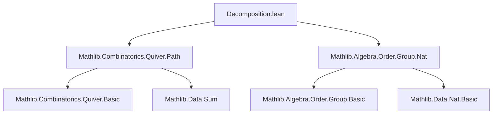
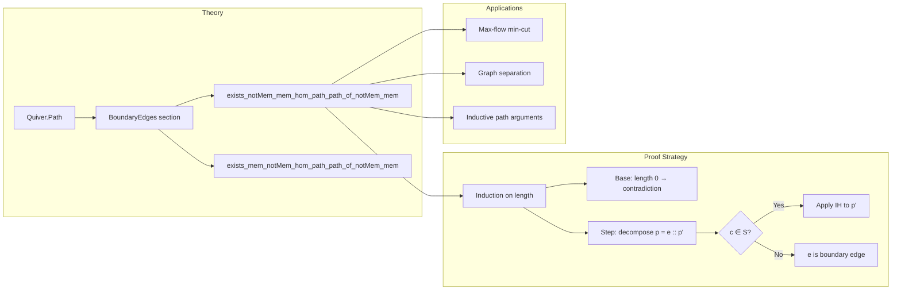

**Technical Brief: `Decomposition.lean`**

---

### 1. **Key Definitions & Theorems**

| Name | Type | Purpose |
|------|------|---------|
| `Path` | `Quiver V` → `Path a b` | Homogeneous paths in a quiver (directed graph) from `a` to `b`. |
| `comp` | `Path a u → Path v b → u = v → Path a b` | Composition of paths (implicit via `toPath` and `comp`). |
| `toPath` | `e : u ⟶ v → Path u v` | Embedding a single edge into a length-1 path. |
| `length` | `Path a b → ℕ` | Length (number of edges) of a path. |
| `exists_notMem_mem_hom_path_path_of_notMem_mem` | `Path a b → Set V → a ∉ S → b ∈ S → ∃ᵉ …` | **Main decomposition lemma**: Any path from outside `S` to inside `S` must contain a *first* boundary edge crossing from `Sᶜ` to `S`. |
| `exists_mem_notMem_hom_path_path_of_notMem_mem` | `Path a b → Set V → a ∈ S → b ∉ S → ∃ᵉ …` | Dual version: path from inside `S` to outside must contain a *last* boundary edge crossing from `S` to `Sᶜ`. |

Both theorems assert the existence of a *decomposition* of the path `p` as:
$$
p = p_1 \cdot (e \cdot p_2)
$$
where $e : u \to v$ is the *first* (resp. *last*) edge crossing the boundary $\partial S = \{(u,v) \mid u \in S, v \notin S \text{ or } u \notin S, v \in S\}$.

---

### 2. **Naming Conventions**

- **Prefixes**:
  - `exists_…_hom_path_path_of_…`: Indicates existence of a decomposition *along a hom* (i.e., path), with conditions on endpoints relative to a set `S`.
  - `notMem_mem`, `mem_notMem`: Encodes endpoint membership status in `S`.
- **Suffixes**:
  - `_of_notMem_mem`: Conditions on endpoints: start ∉ S, end ∈ S.
  - `_of_notMem_mem` (reversed): start ∈ S, end ∉ S.

- **Variables**:
  - `p`, `p₁`, `p₂`, `p'`: Paths.
  - `e`, `e_uv`: Edges.
  - `a`, `b`, `c`, `u`, `v`: Vertices.
  - `S`: A subset of vertices (`Set V`).

---

### 3. **Tactic Stack**

- `induction … with | zero | succ …`: Structural induction on path length.
- `obtain rfl := eq_of_length_zero p h_len`: Use `length = 0 ⇒ path is nil`.
- `simp [h_len]`, `simp_all`: Simplify using hypotheses and definitions.
- `by_cases hc_in_S : c ∈ S`: Case split on membership of the head of the first edge.
- `refine ⟨…, ?_⟩`: Construct existential witness and leave goal for subproof.
- `simp [hp', comp_toPath_eq_cons]`: Simplify path equality using `comp_toPath_eq_cons`.
- `classical`: Enable classical logic (for complement reasoning).
- `simpa` / `simp only [...] at …`: Rewriting in hypotheses.

---

### 4. **Proof Logic**

- **Inductive structure** on `p.length`:
  - **Base case (`length = 0`)**: Path is `nil`, so `a = b`. Contradiction since `a ∉ S`, `b ∈ S`.
  - **Inductive step (`length > 0`)**:
    - Decompose `p = c :: p'` (i.e., `p = e.toPath.comp p'`).
    - Check if intermediate vertex `c ∈ S`.
      - If `c ∈ S`: Apply IH to `p'` (from `a ∉ S` to `c ∈ S`), then compose with `e`.
      - If `c ∉ S`: Then `e : a → c` is the boundary edge itself (since `a ∉ S`, `c ∉ S`, but `b ∈ S` ⇒ `e` must be the *last* edge before entering `S`, but actually in this case `e` is the *first* crossing: `a ∉ S`, `c ∈ S`? Wait — correction: in the *first* theorem, `a ∉ S`, `b ∈ S`. So if `c ∈ S`, we recurse on `p'`. If `c ∉ S`, then `e : a → c` stays outside, and the crossing must be later — but the proof chooses `⟨c, hc_in_S, b, hb_in_S, e, p', nil⟩` only when `c ∈ S`. Actually, in the `¬ hc_in_S` branch, the proof uses `⟨c, hc_in_S, b, hb_in_S, e, p', nil⟩` — but `hc_in_S` is the negation, so it's `c ∉ S`. Wait — typo? Let's re-check:

        ```lean
        by_cases hc_in_S : c ∈ S
        · ... -- c ∈ S case
        · refine ⟨c, hc_in_S, b, hb_in_S, e, p', Path.nil, ?_⟩
        ```

        Here `hc_in_S` is the *negated* case (i.e., `c ∉ S`). So the witness is:
        - `u := c ∉ S`
        - `v := b ∈ S`
        - `e : c → b` (the first edge)
        - `p₁ := p' : Path a c`
        - `p₂ := nil : Path b b`

        So `p = p' ⋅ (e ⋅ nil) = p' ⋅ e`, i.e., the *first* edge `e` crosses from `c ∉ S` to `b ∈ S`. This is correct.

- **Dual theorem** uses complement set `Sᶜ` and double negation elimination.

---

### 5. **Imports**

| Module | Purpose |
|--------|---------|
| `Mathlib.Algebra.Order.Group.Nat` | For `length`, `nat`-indexed reasoning, order properties of `ℕ`. |
| `Mathlib.Combinatorics.Quiver.Path` | Core path theory: `Path`, `comp`, `toPath`, `length`, `nil`, `cons`, etc. |

---

### 6. **Mermaid Diagrams**

#### **Dependency Graph**


#### **Overview of File Structure**


---

### 7. **Summary**

This file formalizes a foundational *boundary-crossing decomposition* for paths in quivers. It is essential for inductive arguments where one needs to isolate the first or last edge crossing a vertex subset — a common pattern in graph theory, network flows, and verification of graph algorithms. The proofs are clean, leveraging structural induction and case analysis on vertex membership, with minimal reliance on external lemmas beyond basic path algebra.
