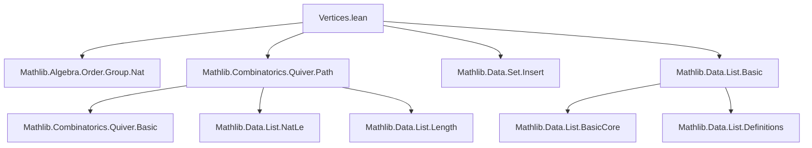
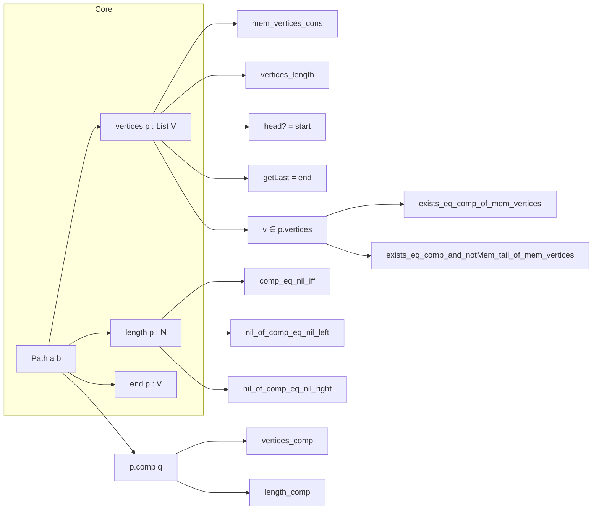

### Technical Brief: `Vertices.lean` — Path Vertices in Lean 4

---

#### **1. Key Definitions & Theorems**

| Name | Type / Signature | Purpose |
|------|------------------|---------|
| `end` | `{a b : V} → Path a b → V` | Returns the end vertex of a path (`p.end = b`). |
| `vertices` | `{a b : V} → Path a b → List V` | Returns the list of vertices along a path, including start and end. |
| `mem_vertices_cons` | `x ∈ (p.cons e).vertices ↔ x ∈ p.vertices ∨ x = c` | Membership characterization for extended paths. |
| `vertices_length` | `p.vertices.length = p.length + 1` | Relates path length to vertex list length. |
| `start_mem_vertices` | `a ∈ p.vertices` | Start vertex is always in the vertex list. |
| `end_mem_vertices` | `b ∈ p.vertices` | End vertex is always in the vertex list. |
| `vertices_comp` | `(p.comp q).vertices = p.vertices.dropLast ++ q.vertices` | Vertex list of composition is concatenation of prefix (minus last) and suffix. |
| `nil_of_comp_eq_nil_left/right` | `p.comp q = nil → p.length = 0` / `q.length = 0` | Characterizes nil compositions via lengths. |
| `comp_eq_nil_iff` | `p.comp q = nil ↔ p.length = 0 ∧ q.length = 0` | Full characterization of nil compositions. |
| `exists_eq_comp_of_le_length` | `n ≤ p.length ⇒ ∃ p₁, p₂, p = p₁.comp p₂ ∧ p₁.length = n` | Decomposition at arbitrary prefix length. |
| `exists_eq_comp_and_length_eq_of_lt_length` | `n < p.vertices.length ⇒ ∃ p₁, p₂, p = p₁.comp p₂ ∧ p₁.length = n ∧ v = p.vertices[n]` | Decomposition at vertex position. |
| `exists_eq_comp_of_mem_vertices` | `v ∈ p.vertices ⇒ ∃ p₁, p₂, p = p₁.comp p₂` | Decomposition at any occurring vertex. |
| `exists_eq_comp_and_notMem_tail_of_mem_vertices` | `v ∈ p.vertices ⇒ ∃ p₁, p₂, p = p₁.comp p₂ ∧ v ∉ p₂.vertices.tail` | Decomposition at *last* occurrence of `v`. |

---

#### **2. Naming Conventions**

- **Prefixes**:
  - `end_`, `vertices_`, `mem_vertices_`, `length_`, `start_`, `getElem_`, `dropLast_`, `comp_`, `nil_of_`, `exists_eq_comp_`
- **Suffixes**:
  - `_nil`, `_cons`, `_head?`, `_head_eq`, `_getElem_zero`, `_getLast`, `_comp`, `_eq_nil`, `_of_le_length`, `_of_lt_length`, `_of_mem_vertices`, `_notMem_tail`
- **Pattern**: `action_subject_condition?` (e.g., `vertices_comp`, `exists_eq_comp_of_mem_vertices`)

---

#### **3. Tactic Stack**

Frequently used tactics:
- `simp` / `simp only` / `simp_rw` — for simplification using definitional equalities and lemmas.
- `induction` — structural induction on paths.
- `cases` — case analysis on paths or hypotheses.
- `exact`, `refine`, `intro`, `apply`, `have`, `obtain`, `subst`, `by_cases`, `grind` (custom or `grind`-like automation).
- `tauto`, `ring`, `linarith` — for arithmetic reasoning (e.g., `Nat.le_of_lt_succ`, `Nat.eq_zero_of_add_eq_zero_*`).

No heavy automation like `aesop` or `omega` is used — proofs are mostly manual but structured.

---

#### **4. Proof Logic**

- **Induction**: Almost all proofs about `vertices` or `length` use *path induction* (`induction p with | nil | cons`).
- **Case analysis**: On membership (`mem_vertices_cons`), on `n ≤ p.length` or `n < p.vertices.length`, or on `v ∈ p.vertices`.
- **Arithmetic reasoning**: Often reduces to `Nat` lemmas (e.g., `length_comp`, `length_cons`, `add_eq_zero`).
- **Decomposition lemmas**:
  - First prove existence of decomposition at *length* level (`exists_eq_comp_of_le_length`).
  - Lift to *vertex index* level (`exists_eq_comp_and_length_eq_of_lt_length`) using `vertices_length`.
  - Then lift to *vertex membership* (`exists_eq_comp_of_mem_vertices`) via `getElem`.
  - Finally, refine to *last occurrence* (`exists_eq_comp_and_notMem_tail_of_mem_vertices`) via careful case analysis on whether `v` is the new end or already in prefix.

---

#### **5. Imports**

| Module | Purpose |
|--------|---------|
| `Mathlib.Algebra.Order.Group.Nat` | For `Nat` arithmetic lemmas (e.g., `eq_zero_of_add_eq_zero_*`, `le_of_lt_succ`). |
| `Mathlib.Combinatorics.Quiver.Path` | Core path theory: `Path`, `cons`, `comp`, `length`, `toPath`, etc. |
| `Mathlib.Data.Set.Insert` | For set operations (used in `verticesSet_nil`). |
| `Mathlib.Data.List.Basic` | List operations: `concat`, `dropLast`, `getLast`, `getElem`, `tail`, `head?`, `mem`, `append`, `length`. |

---

#### **6. Mermaid Diagrams**

##### **Dependency Graph (Module-Level)**

##### **Overview of Theoretical Flow**

---

#### **7. Summary**

This module formalizes the *vertex structure* of paths in a quiver, providing foundational lemmas for reasoning about:
- membership of start/end vertices,
- decomposition of paths at arbitrary positions or last occurrences of a vertex,
- interaction between path composition and vertex lists.

It is a *supporting theory* for higher-level path reasoning (e.g., simple paths, cycles, connectivity), with a clean separation between syntactic (`Path`) and semantic (`List V`) views.

All definitions and lemmas are `@[simp]`-friendly where appropriate, and proofs are constructive and elementary — no choice or classical reasoning used.

--- 

Let me know if you'd like a formalized summary in `leanpkg.toml` format or a dependency graph for the *proof terms* (e.g., `vertices_comp` → `vertices_length`, etc.).
