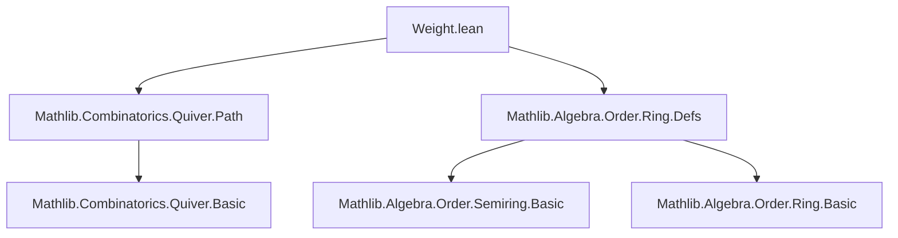
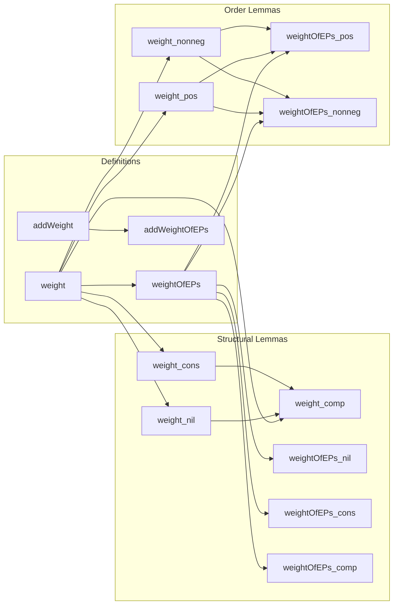

### Technical Brief: Path Weights in a Quiver (Weight.lean)

---

#### **1. Key Definitions & Theorems**

| Name | Type / Signature | Purpose |
|------|------------------|---------|
| `weight` | `∀ {i j : V}, (i ⟶ j) → R → Path i j → R` | Computes the multiplicative weight of a path as the product of edge weights over a monoid `R`. |
| `addWeight` | `∀ {i j : V}, (i ⟶ j) → R → Path i j → R` | Additive counterpart of `weight`, using `+` and `0` over an additive monoid. |
| `weightOfEPs` | `(V → V → R) → Path i j → R` | Specialization of `weight` where edge weight depends only on source and target vertices. |
| `weight_nil` | `weight w (nil : Path a a) = 1` | Base case: empty path has weight `1`. |
| `weight_cons` | `weight w (p.cons e) = weight w p * w e` | Recursive step: weight of extended path is product of prior weight and new edge weight. |
| `weight_comp` | `weight w (p.comp q) = weight w p * weight w q` | Multiplicativity of weight under path composition. |
| `weightOfEPs_nil`, `weightOfEPs_cons`, `weightOfEPs_comp` | Analogues of above for endpoint-dependent weights. | Convenience lemmas for `weightOfEPs`. |
| `weight_pos` | `(∀ e, 0 < w e) → 0 < weight w p` | Positivity of path weight under strictly positive edge weights. |
| `weight_nonneg` | `(∀ e, 0 ≤ w e) → 0 ≤ weight w p` | Non-negativity of path weight under non-negative edge weights. |
| `weightOfEPs_pos`, `weightOfEPs_nonneg` | Analogues of above for endpoint-dependent weights. | Positivity/non-negativity for `weightOfEPs`. |

---

#### **2. Naming Conventions**

- **Prefixes**:
  - `weight_`: core definitions/lemmas about multiplicative path weight.
  - `addWeight_`: additive analogues.
  - `weightOfEPs_`: endpoint-dependent version of weight.
- **Suffixes**:
  - `_nil`, `_cons`, `_comp`: indicate structural cases (nil path, cons step, composition).
- **Attributes**:
  - `[to_additive]`: used to generate additive versions automatically.
  - `[simp]`: for lemmas used in simplification (e.g., `weight_nil`, `weight_cons`).

---

#### **3. Tactic Stack**

- **Core tactics**:
  - `simp` (with `weight`, `addWeight`, `weightOfEPs` definitions)
  - `induction` (on paths, using `Path.nil` and `Path.cons`)
  - `have` + `simpa` (to combine hypotheses and simplify)
  - `mul_pos`, `mul_nonneg`, `mul_assoc` (order/monoid algebra)
- **Pattern**:
  ```lean
  induction p with
  | nil => simp
  | cons p e ih => simp [ih, ...]
  ```

---

#### **4. Proof Logic**

- **Inductive structure on paths**:
  - Base case (`nil`): trivial (weight = 1 or 0).
  - Inductive step (`cons`): reduce to hypothesis + single edge weight.
- **Composition lemmas** (`weight_comp`, `weightOfEPs_comp`):
  - Induction on second path `q`.
  - Use associativity of multiplication (`mul_assoc`) to align products.
- **Positivity/non-negativity**:
  - Induction on path.
  - Apply `mul_pos` / `mul_nonneg` using hypothesis `hw` on each edge.

---

#### **5. Imports**

| Module | Purpose |
|--------|---------|
| `Mathlib.Combinatorics.Quiver.Path` | Defines quivers and paths (inductive type `Path`). |
| `Mathlib.Algebra.Order.Ring.Defs` | Provides ordered ring structures (`LinearOrder`, `IsStrictOrderedRing`, `Semiring`). |

---

#### **8. Dependency & Theory Overview**

##### **Mermaid Diagram: Module Dependencies**



##### **Mermaid Diagram: Theoretical Flow**



##### **Summary**

This module formalizes **multiplicative path weights** over quivers, leveraging:
- Inductive structure of paths (`Path.nil`, `Path.cons`, `Path.comp`)
- Monoid structure for multiplicative weight (`1`, `*`)
- Ordered semiring structure for positivity/non-negativity results.

It follows a clean **duality** between multiplicative and additive weights, and between general edge-weight functions and endpoint-dependent ones, with `to_additive` used to automate additive analogues.

--- 

Let me know if you'd like a formalized dependency graph for the entire `Mathlib` or a comparison with related files (e.g., `Path.lean`, `WeightedGraph.lean`).
