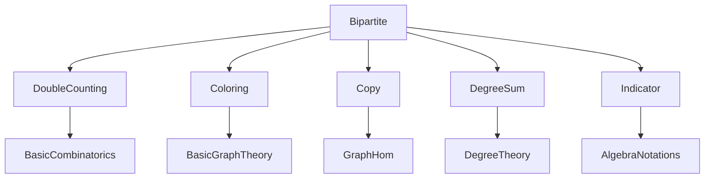

### Technical Brief: Bipartite Graphs in Lean 4 (Mathlib)

---

#### **1. Key Definitions & Theorems**

| Name | Type / Signature | Purpose |
|------|------------------|---------|
| `SimpleGraph.IsBipartiteWith G s t` | `Prop` | States that `G` is bipartite with bipartition `(s, t)`: `s ∩ t = ∅`, and every edge goes between `s` and `t`. |
| `SimpleGraph.IsBipartite G` | `Prop` | Abbreviation for `G.Colorable 2`. |
| `SimpleGraph.isBipartite_iff_exists_isBipartiteWith` | `G.IsBipartite ↔ ∃ s t, G.IsBipartiteWith s t` | Equivalence between 2-colorability and existence of a bipartition. |
| `SimpleGraph.isBipartiteWith_sum_degrees_eq` | `∑ v ∈ s, G.degree v = ∑ w ∈ t, G.degree w` | Double-counting: sum of degrees on both sides of a bipartition are equal. |
| `SimpleGraph.isBipartiteWith_sum_degrees_eq_card_edges` | `∑ v ∈ s, G.degree v = #G.edgeFinset` | Sum of degrees on one side equals total number of edges. |
| `SimpleGraph.isBipartiteWith_sum_degrees_eq_card_edges'` | `∑ v ∈ t, G.degree v = #G.edgeFinset` | Same as above, but for the other side (via symmetry). |
| `SimpleGraph.completeBipartiteGraph_isContained_iff` | `completeBipartiteGraph α β ⊑ G ↔ ∃ left right, ... ∧ G.IsCompleteBetween left right` | Characterizes containment of a complete bipartite graph via complete bipartite subgraphs. |
| `SimpleGraph.between s t G` | `SimpleGraph V` | Subgraph of `G` containing only edges between `s` and `t`. |
| `SimpleGraph.between_isBipartiteWith` | `Disjoint s t → (G.between s t).IsBipartiteWith s t` | Shows `G.between s t` is bipartite when `s`, `t` are disjoint. |

---

#### **2. Naming Conventions**

- **Prefixes**:
  - `isBipartiteWith_`: properties of `IsBipartiteWith`.
  - `neighborFinset_`, `neighborSet_`: neighbor-related lemmas.
  - `degree_`, `degree_le_`: degree bounds.
  - `between_`: properties of `between` subgraph.
- **Suffixes**:
  - `_symm`: symmetry lemmas (e.g., `isBipartiteWith_comm`).
  - `_subset`, `_disjoint`, `_le`: subset/disjointness/degree bounds.
  - `_union`, `_compl`: set-theoretic manipulations involving unions/complements.
- **Structure fields**:
  - `disjoint`, `mem_of_adj`: core components of `IsBipartiteWith`.

---

#### **3. Tactic Stack**

Frequently used tactics in this file:

| Tactic | Usage |
|--------|-------|
| `rw` / `simp_rw` | Rewriting definitions (e.g., `neighborFinset`, `degree`, `edgeFinset`). |
| `aesop` | Automated reasoning for propositional logic, especially in `IsBipartite.exists_isBipartiteWith`. |
| `tauto` | Handling propositional tautologies (e.g., symmetry of `between`). |
| `exact`, `apply`, `intro` | Standard proof construction. |
| `cases` / `rcases` | Decomposing disjunctions/conjunctions (e.g., `mem_of_adj` output). |
| `conv` | Equational reasoning (e.g., in `isBipartiteWith_sum_degrees_eq`). |
| `simp` + `at` | Simplifying hypotheses (e.g., `simp at hvw`). |
| `card_le_card`, `card_union_of_disjoint`, `sum_subset` | Cardinality/sum manipulation. |
| `ext` | Extensionality for sets/finsets. |

---

#### **4. Proof Logic**

- **Structure of proofs**:
  - Most proofs follow a pattern of:
    1. Unfolding definitions (`rw [IsBipartiteWith]`, `rw [neighborFinset]`, etc.).
    2. Applying `mem_of_adj` or `disjoint` to get membership conditions.
    3. Using `setext`, `ext`, or `tauto` to reduce to propositional logic.
    4. Leveraging `Finset`/`Fintype` machinery (e.g., `card_neighborFinset_eq_degree`).
- **Double-counting arguments**:
  - Use `sum_card_bipartiteAbove_eq_sum_card_bipartiteBelow` (from `DoubleCounting.lean`) to equate sums over bipartite relations.
  - Convert between `neighborSet` and `neighborFinset` via `card_neighborFinset_eq_degree`.
- **Colorability ↔ bipartition**:
  - `IsBipartite.exists_isBipartiteWith`: From a 2-coloring, define `s = {v | c v = 0}`, `t = {v | c v = 1}`.
  - `IsBipartiteWith.isBipartite`: Construct a 2-coloring using indicator function `s.indicator 1`.

---

#### **5. Imports & Dependencies**

| Module | Role |
|--------|------|
| `Mathlib.Algebra.Notation.Indicator` | For `s.indicator 1` in 2-coloring construction. |
| `Mathlib.Combinatorics.Enumerative.DoubleCounting` | Provides `sum_card_bipartiteAbove_eq_sum_card_bipartiteBelow`, key for degree-sum proofs. |
| `Mathlib.Combinatorics.SimpleGraph.Coloring` | Defines `Colorable`, used in `IsBipartite`. |
| `Mathlib.Combinatorics.SimpleGraph.Copy` | For `Copy`, used in `completeBipartiteGraph_isContained_iff`. |
| `Mathlib.Combinatorics.SimpleGraph.DegreeSum` | Provides `sum_degrees_eq_twice_card_edges`, used in bipartite degree-sum lemmas. |

---

#### **6. Mermaid Diagrams**

##### **Dependency Graph (Module-Level)**



##### **Overview of File Structure**

```mermaid
graph TD
  A[Bipartite.lean] --> B[IsBipartiteWith]
  A --> C[IsBipartite]
  A --> D[Copy]
  A --> E[Between]

  B --> B1[Structure definition]
  B --> B2[Basic properties (symm, mem_of_mem_adj)]
  B --> B3[Neighbor set/finset lemmas]
  B --> B4[Degree-sum theorems]

  C --> C1[Definition: Colorable 2]
  C --> C2[Equivalence with IsBipartiteWith]

  D --> D1[Embedding complete bipartite graphs]
  D --> D2[Containment iff condition]

  E --> E1[Definition of between]
  E --> E2[Bipartiteness of between]
  E --> E3[Degree bounds via between]
```

---

#### **7. TODO & Future Work**

- **Odd cycle characterization**:
  ```lean
  G.IsBipartite ↔ ∀ n, (cycleGraph (2*n+1)).Free G
  ```
  This is a classic graph-theoretic characterization: a graph is bipartite iff it has no odd cycles.

---

#### **8. Implementation Notes**

- **Support vs. universe**:
  - `s ∪ t` covers only the *support* of `G` (vertices incident to edges), not necessarily all vertices.
  - This is intentional: allows bipartitions of sparse graphs without requiring extra vertices.
- **Decidability assumptions**:
  - Many lemmas require `[DecidableRel G.Adj]`, `[DecidableEq V]`, or `[Fintype V]` to manipulate finsets and cardinals.
- **Symmetry handling**:
  - `IsBipartiteWith.symm` and `isBipartiteWith_comm` allow easy switching of left/right sides.

--- 

This file is a canonical example of formalizing combinatorial reasoning in Lean, combining graph-theoretic intuition with rigorous set/finset manipulation and double-counting arguments.
