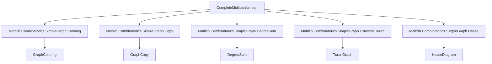

### Technical Brief: `CompleteMultipartite.lean`

---

#### **1. Key Definitions & Theorems**

| Name | Type / Signature | Purpose |
|------|------------------|---------|
| `IsCompleteMultipartite` | `SimpleGraph α → Prop` | Predicate: non-adjacency is transitive. |
| `IsCompleteMultipartite.setoid` | `G.IsCompleteMultipartite → Setoid α` | Constructs a setoid from non-adjacency equivalence classes. |
| `IsCompleteMultipartite.iso` | `G.IsCompleteMultipartite → G ≃g completeMultipartiteGraph (fun c ↦ {x // c.r x})` | Isomorphism between `G` and a `completeMultipartiteGraph` over its non-adjacency quotient. |
| `isCompleteMultipartite_iff` | `G.IsCompleteMultipartite ↔ ∃ ι V, G ≃g completeMultipartiteGraph V` | Characterization: `G` is complete multipartite iff it's isomorphic to some `completeMultipartiteGraph`. |
| `IsCompleteMultipartite.colorable_of_cliqueFree` | `G.IsCompleteMultipartite → G.CliqueFree n → G.Colorable (n - 1)` | If `G` is complete multipartite and has no `n`-clique, then `G` is `(n-1)`-colorable. |
| `IsPathGraph3Compl` | `α → α → α → Prop` | Structure: three vertices where only one edge (`w₁–w₂`) exists among them — a minimal obstruction to being complete multipartite. |
| `not_isCompleteMultipartite_iff_exists_isPathGraph3Compl` | `¬ G.IsCompleteMultipartite ↔ ∃ v w₁ w₂, G.IsPathGraph3Compl v w₁ w₂` | Obstruction characterization: `G` is *not* complete multipartite iff it contains an induced complement of `P₃`. |
| `IsPathGraph3Compl.pathGraph3ComplEmbedding` | `G.IsPathGraph3Compl v w₁ w₂ → (pathGraph 3)ᶜ ↪g G` | Embedding of the complement of a 3-vertex path into `G`, witnessing non-complete-multipartiteness. |
| `completeEquipartiteGraph` | `ℕ → ℕ → SimpleGraph (Fin r × Fin t)` | Complete equipartite graph $K_r(t)$: vertices are pairs `(i, x)` with `i ∈ Fin r`, `x ∈ Fin t`; adjacency iff first components differ. |
| `completeEquipartiteGraph.completeMultipartiteGraph` | `completeEquipartiteGraph r t ≃g completeMultipartiteGraph (const (Fin r) (Fin t))` | Isomorphism to a dependent-product-based `completeMultipartiteGraph`. |
| `completeEquipartiteGraph.turanGraph` | `completeEquipartiteGraph r t ≃g turanGraph (r * t) r` | Isomorphism to Turán graph $T(r t, r)$. |
| `completeEquipartiteGraph.isCompleteMultipartite` | `(completeEquipartiteGraph r t).IsCompleteMultipartite` | Every complete equipartite graph is complete multipartite. |
| `isContained_completeEquipartiteGraph_of_colorable` | `G.Coloring (Fin n) → (∀ c, |colorClass c| ≤ t) → G ⊑ completeEquipartiteGraph n t` | Every `n`-colorable graph embeds into a complete equipartite graph with `n` parts of size ≥ max color class size. |

---

#### **2. Naming Conventions**

- **Predicates**: `is_`, `Is_`, `CompleteMultipartite`, `Equipartite`, `PathGraph3Compl`
- **Constructors / Witnesses**:
  - `setoid`, `iso`, `pathGraph3ComplEmbedding`, `turanGraph`, `completeMultipartiteGraph`
- **Properties / Theorems**:
  - `isCompleteMultipartite_iff`, `colorable_of_cliqueFree`, `not_isCompleteMultipartite_iff_exists_isPathGraph3Compl`
- **Graph operations**:
  - `comap`, `neighborSet`, `neighborFinset`, `degree`, `card_edgeFinset`
- **Structural lemmas**:
  - `adj`, `not_adj_fst`, `not_adj_snd`, `ne_fst`, `ne_snd`, `fst_ne_snd`, `symm`

Prefixes like `is_`, `complete`, `neighbor`, `degree`, `card`, `pathGraph3Compl` are heavily used.

---

#### **3. Tactic Stack**

Frequent tactics used in proofs:

| Tactic | Usage |
|--------|-------|
| `simp` / `simp_rw` | Simplifying definitions (e.g., `adj`, `setoid`, `quotient`, `comap`, `compl_adj`) |
| `aesop` | Automated reasoning for simple graph embeddings, inequalities, and injectivity |
| `rw` / `rwa` | Rewriting using lemmas or assumptions (especially `adj_comm`, `ne_eq`, `Fin.ext_iff`) |
| `intro` / `cases` / `obtain` | Standard proof decomposition, especially for quantifiers and existential witnesses |
| `contrapose!` | Turning negated goals into positive ones (e.g., for obstructions) |
| `push_neg` | Pushing negations inward (e.g., in `Transitive` negation) |
| `conv` + `rhs` | Rewriting subexpressions in complex expressions (e.g., arithmetic in `turanGraph`) |
| `apply` / `exact` | Applying known lemmas or hypotheses directly |
| `induction` | Structural induction (e.g., on edges in `completeEquipartiteGraph_eq_bot_iff`) |
| `ext` + `simp` | Extensionality proofs for sets/functions (e.g., `neighborSet`, `edgeFinset`) |

---

#### **4. Proof Logic**

- **Characterization proofs** (e.g., `isCompleteMultipartite_iff`, `not_isCompleteMultipartite_iff_exists_isPathGraph3Compl`) follow a standard pattern:
  - Forward direction: construct quotient setoid, define iso, verify properties.
  - Reverse direction: pull back structure via isomorphism/embedding.

- **Obstruction-based reasoning**:
  - Non-transitivity of non-adjacency ⇒ existence of `v, w₁, w₂` with `¬v~w₁`, `¬v~w₂`, `w₁~w₂`.
  - These three vertices form `IsPathGraph3Compl`, which embeds `(pathGraph 3)ᶜ`.

- **Embedding arguments**:
  - Use `comap` to define `completeEquipartiteGraph` as `comap Prod.fst ⊤`.
  - Prove adjacency equivalence via `rfl` or `simp`.
  - For Turán isomorphism, use arithmetic lemmas (`Nat.mul_add_mod_self_right`, `Nat.div_add_mod'`, etc.).

- **Colorability arguments**:
  - Use `isContained_completeEquipartiteGraph_of_colorable` to reduce extremal coloring problems to Turán-type extremal graphs.

- **Inductive/Arithmetic proofs**:
  - Edge count: sum degrees, use `sum_const`, arithmetic simplifications.
  - Degree: compute neighbor set size via `card_product`, `card_compl`, `card_univ`.

---

#### **5. Imports & Scope**

**Primary Dependencies**:
```lean
Mathlib.Combinatorics.SimpleGraph.Coloring
Mathlib.Combinatorics.SimpleGraph.Copy
Mathlib.Combinatorics.SimpleGraph.DegreeSum
Mathlib.Combinatorics.SimpleGraph.Extremal.Turan
Mathlib.Combinatorics.SimpleGraph.Hasse
```

**Scope**:
- Focuses on **extremal graph theory**, especially characterizations of Turán-type extremal graphs.
- Builds on `completeMultipartiteGraph`, `turanGraph`, and graph coloring.
- Connects structural properties (non-adjacency transitivity), obstructions (`P₃^c`), and extremal colorability.

---

#### **6. Mermaid Diagrams**

##### **Dependency Graph (Module-Level)**



##### **Conceptual Overview of Theory Flow**

```mermaid
flowchart LR
  subgraph Definitions
    A[IsCompleteMultipartite] --> B[Setoid from non-adjacency]
    B --> C[Quotient → parts]
    C --> D[completeMultipartiteGraph]
    D --> E[IsCompleteMultipartite.iso]
  end

  subgraph Obstructions
    F[¬Transitive ¬Adj] --> G[∃ IsPathGraph3Compl]
    G --> H[(P₃)ᶜ ↪ G]
  end

  subgraph Equipartite Graphs
    I[completeEquipartiteGraph r t] --> J[comap Prod.fst ⊤]
    J --> K[Adj iff first components differ]
    K --> L[completeMultipartiteGraph ≃g]
    K --> M[turanGraph ≃g]
  end

  subgraph Applications
    N[Colorability] --> O[isContained in completeEquipartiteGraph]
    P[CliqueFree + CompleteMultipartite] --> Q[Colorable (n−1)]
  end

  A --> E
  G --> H
  I --> L & M
  N --> O
  P --> Q
```

##### **Proof Strategy Flow (Key Lemma)**

```mermaid
flowchart LR
  A[¬IsCompleteMultipartite G] 
    --> B[¬Transitive (¬G.Adj)]
    --> C[∃ v,w₁,w₂: ¬v~w₁, ¬v~w₂, w₁~w₂]
    --> D[IsPathGraph3Compl v w₁ w₂]
    --> E[(P₃)ᶜ ↪ G]
  
  E --> F[¬IsCompleteMultipartite G]  %% closure of loop
```

---

#### **7. Summary**

This module formalizes the equivalence between:
- **Structural property**: non-adjacency transitivity (`IsCompleteMultipartite`), and
- **Representability**: being isomorphic to a `completeMultipartiteGraph`.

It introduces:
- A minimal obstruction (`IsPathGraph3Compl`) to being complete multipartite,
- A convenient non-dependent product-based definition of **complete equipartite graphs** (`completeEquipartiteGraph r t`),
- And connects these to Turán graphs and graph coloring.

The theory is foundational for extremal graph theory, especially in proofs like:
> *A maximally $K_{r+1}$-free graph is $r$-colorable iff it is complete multipartite.*

This file is part of a larger effort to formalize Turán-type extremal results in Lean.
