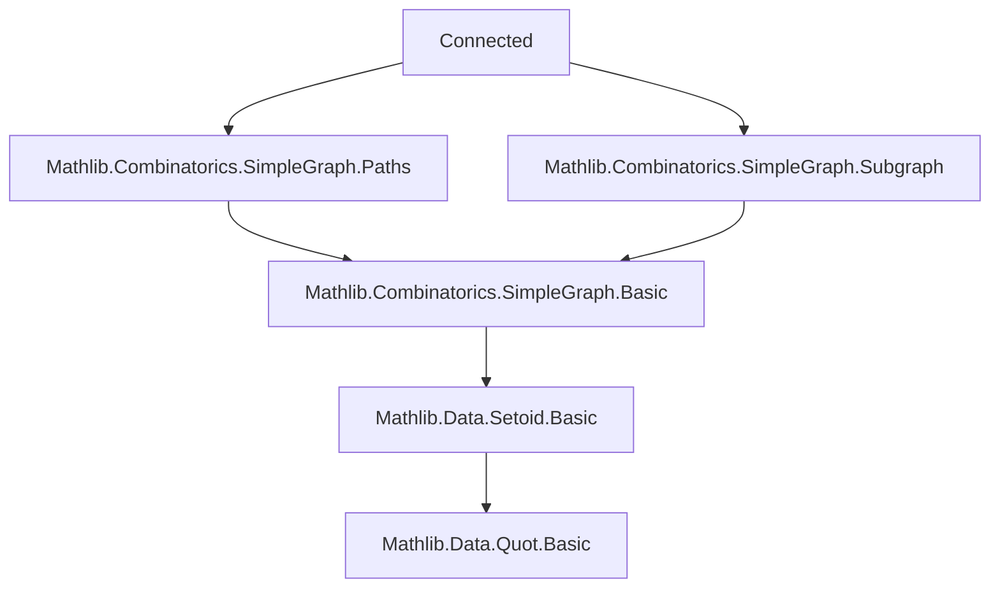
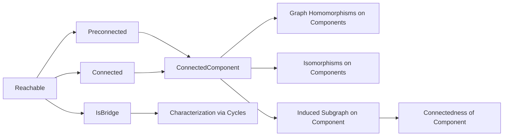

Here is the **technical metadata** extracted from `Connected.lean`, formatted as requested:

---

### 1. KEY DEFINITIONS & THEOREMS

| Name | Type / Signature | Purpose |
|------|------------------|---------|
| `Reachable` | `V → V → Prop` | Binary relation: `u` and `v` are reachable iff there exists a walk between them. |
| `Preconnected` | `Prop` | Graph is preconnected if all pairs of vertices are reachable. |
| `Connected` | `Prop` | Graph is connected if it's preconnected and nonempty. |
| `ConnectedComponent` | `Type u` | Quotient of vertices by `Reachable` relation; represents connected components. |
| `connectedComponentMk` | `V → G.ConnectedComponent` | Maps a vertex to its component. |
| `IsBridge` | `Sym2 V → Prop` | Edge `e` is a bridge iff removing it disconnects its endpoints. |
| `reachable_iff_reflTransGen` | `G.Reachable u v ↔ Relation.ReflTransGen G.Adj u v` | Connects reachability to reflexive-transitive closure of adjacency. |
| `isBridge_iff_mem_and_forall_cycle_notMem` | `G.IsBridge e ↔ e ∈ G.edgeSet ∧ ∀ c : G.Cycle, e ∉ c.edges` | Bridge iff not contained in any cycle (main theorem). |
| `connectedComponentEquiv` | `G ≃g G' → G.ConnectedComponent ≃ G'.ConnectedComponent` | Graph isomorphism induces bijection on components. |
| `homOfConnectedComponents` | `(c : G.ConnectedComponent) → c.toSimpleGraph →g H → G →g H` | Glues homomorphisms from components into a global homomorphism. |

---

### 2. NAMING CONVENTIONS

- **Predicates**: `isBridge`, `preconnected`, `connected`, `reachable` — no prefix/suffix pattern beyond standard Lean style.
- **Component-related**: `connectedComponentMk`, `supp`, `toSimpleGraph`, `toSimpleGraph_hom`.
- **Homomorphism-induced maps**: `map`, `lift`, `recOn`, `ind`, `ind₂`.
- **Equivalence-related**: `reachableSetoid`, `reachable_is_equivalence`.
- **Subgraph/induced**: `induce`, `fromEdgeSet`, `delete_edges` (used in `IsBridge`).
- **Set-like operations**: `mem_supp_iff`, `supp_injective`, `biUnion_supp_eq_supp`.

Prefixes like `reachable_`, `connectedComponent_`, `preconnected_`, `Iso.` are used consistently.

---

### 3. TACTIC STACK

Frequently used tactics in proofs:
- `aesop` — for automated reasoning over equivalence relations and monotonicity.
- `simp` / `simp_rw` — especially with `mem_supp_iff`, `ConnectedComponent.eq`, `reachable_comm`.
- `induction` / `ind` — for `Walk`, `ConnectedComponent`, and `Preconnected`.
- `rfl`, `congr_arg`, `ext`, `funext` — for extensionality and definitional equalities.
- `exact`, `apply`, `convert` — for constructing proofs and matching goals.
- `cases` — especially on `Walk` or `Nonempty`.
- `rw [← ...]` — for rewriting using equivalences like `reachable_comm`.
- `tauto` — in `reachable_fromEdgeSet_eq_reflTransGen_toRel`.

---

### 4. PROOF LOGIC

- **Inductive structure**: Proofs about `Walk`, `Path`, `Reachable` often proceed by induction on walks.
- **Equivalence relation reasoning**: `Reachable` is shown to be an equivalence via `refl`, `symm`, `trans`, then used to define `Setoid` and `Quotient`.
- **Quotient elimination**: `ConnectedComponent.ind`, `recOn`, `lift` used to define functions on components.
- **Monotonicity & preservation**: Many lemmas show `Reachable`, `Preconnected`, `Connected` are preserved under graph homomorphisms, monotone extensions, or isomorphisms.
- **Component decomposition**: Proofs about global properties (e.g., `Preconnected`) reduce to component-wise reasoning via `iUnion_connectedComponentSupp`, `pairwise_disjoint_supp_connectedComponent`.
- **Bridge characterization**: Proof of `isBridge_iff_mem_and_forall_cycle_notMem` uses cycle/walk decomposition and edge deletion equivalence.

---

### 5. IMPORTS

- `Mathlib.Combinatorics.SimpleGraph.Paths` — defines walks, paths, cycles, adjacency, degree, support.
- `Mathlib.Combinatorics.SimpleGraph.Subgraph` — defines subgraphs, induced subgraphs, edge deletion.

These imports define foundational graph-theoretic notions used throughout.

---

### 6. MERMAID DIAGRAMS

#### Dependency Graph (Module-Level)

#### Overview of File Structure

---

Let me know if you'd like the **bridge edge proof sketch** or **component homomorphism universal property** formalized further.
