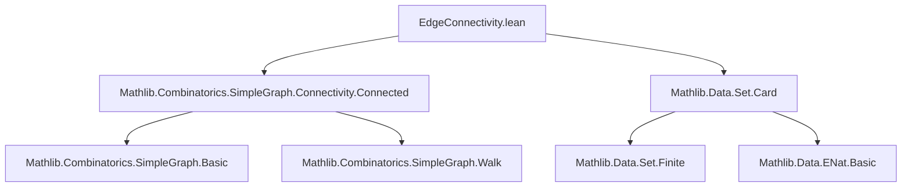
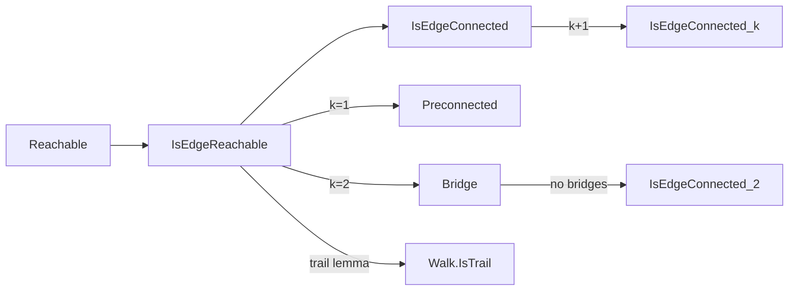

### Technical Brief: `EdgeConnectivity.lean`

---

#### **1. Key Definitions & Theorems**

| Name | Type / Signature | Purpose |
|------|------------------|---------|
| `IsEdgeReachable` | `G.IsEdgeReachable k u v : Prop` | Two vertices `u`, `v` are *k-edge-reachable* if they remain connected after removing any set of fewer than `k` edges. |
| `IsEdgeConnected` | `G.IsEdgeConnected k : Prop` | Graph `G` is *k-edge-connected* if all pairs of vertices are `k`-edge-reachable. |
| `isEdgeReachable_comm` | `G.IsEdgeReachable k u v ↔ G.IsEdgeReachable k v u` | Symmetry of `k`-edge-reachability. |
| `isEdgeReachable_one` | `G.IsEdgeReachable 1 u v ↔ G.Reachable u v` | 1-edge-reachability coincides with ordinary reachability. |
| `isEdgeConnected_one` | `G.IsEdgeConnected 1 ↔ G.Preconnected` | 1-edge-connectedness is equivalent to preconnectedness. |
| `isEdgeReachable_add_one` | `G.IsEdgeReachable (k+1) u v ↔ ∀ e, (G.deleteEdges {e}).IsEdgeReachable k u v` | Characterization of `(k+1)`-edge-reachability via single-edge deletions (for `k ≠ 0`). |
| `isEdgeConnected_add_one` | `G.IsEdgeConnected (k+1) ↔ ∀ e, (G.deleteEdges {e}).IsEdgeConnected k` | Analogous characterization for `k+1`-edge-connectedness. |
| `isBridge_iff_adj_and_not_isEdgeConnected_two` | `G.IsBridge s(u,v) ↔ G.Adj u v ∧ ¬G.IsEdgeReachable 2 u v` | Bridge characterization via non-2-edge-reachability of its endpoints. |
| `isEdgeReachable_two` | `G.IsEdgeReachable 2 u v ↔ ∀ e, (G.deleteEdges {e}).Reachable u v` | 2-edge-reachability = connectivity after any single-edge deletion. |
| `isEdgeConnected_two` | `G.IsEdgeConnected 2 ↔ ∀ e, (G.deleteEdges {e}).Preconnected` | 2-edge-connectedness = no bridges (i.e., all single-edge deletions preserve preconnectedness). |
| `Walk.IsTrail.not_mem_edges_of_not_isEdgeReachable_two` | `x ∉ w.support` under trail + 2-edge-reachability of endpoints + non-2-edge-reachability to `x` | A trail cannot pass through a vertex not 2-edge-reachable from its endpoints. |

---

#### **2. Naming Conventions**

- **Prefixes**:
  - `isEdgeReachable_`, `isEdgeConnected_`: for lemmas about `IsEdgeReachable`/`IsEdgeConnected`.
  - `isBridge_`: for bridge-related lemmas.
- **Suffixes**:
  - `_refl`, `_symm`, `_trans`: standard relational properties.
  - `_mono`, `_anti`: monotonicity/antitonicity w.r.t. graph inclusion or `k`.
  - `_add_one`: structural decomposition for incrementing `k`.
  - `_comm`: commutativity/symmetry.
- **Variable naming**:
  - `s : Set (Sym2 V)` for edge sets.
  - `e : Sym2 V` for a single edge.
  - `u v w x y z : V` for vertices.

---

#### **3. Tactic Stack**

Frequently used tactics in proofs:
- `simp` / `simp_rw`: simplification using definitional equivalences and lemmas.
- `intro`, `intro h`, `intro e`: introduction of hypotheses/variables.
- `exact`, `apply`, `refine`: proof construction.
- `grw`: guarded rewriting (used for `ENat` arithmetic).
- `by_cases!`: case analysis on boolean conditions (e.g., `s.encard ≠ 1`).
- `obtain ⟨...⟩`: destructuring existential or sum types.
- `rw [← ...]`, `rwa [...]`: rewriting with reversed or applied hypotheses.
- `set_tac` (via `Set.insert_eq`, `Set.union_comm`, etc.): set-theoretic reasoning.
- `aesop`: for routine first-order reasoning (implied by context, though not explicit here).

---

#### **4. Proof Logic**

- **Inductive/structural reasoning on `k`**:
  - Base cases (`k = 0`, `k = 1`) handled via `simp`.
  - Inductive step (`k ↦ k+1`) via `isEdgeReachable_add_one`, reducing to single-edge deletion.
- **Case analysis on edge sets**:
  - `s.eq_empty_or_nonempty`, `Set.encard_eq_one`, `Set.encard_diff_singleton_add_one`.
- **Logical equivalences**:
  - Bidirectional proofs via `⟨fun h ↦ ?, fun h ↦ ?⟩`.
- **Contrapositive reasoning**:
  - E.g., `¬G.IsEdgeReachable 2 u v` used to derive bridge properties.
- **Trail properties**:
  - Use of `disjoint_edges_takeUntil_dropUntil`, `mem_edges_of_not_reachable_deleteEdges`.

---

#### **5. Imports & Dependencies**

- **Core imports**:
  ```lean
  Mathlib.Combinatorics.SimpleGraph.Connectivity.Connected
  Mathlib.Data.Set.Card
  ```
- **Implicit dependencies** (via `SimpleGraph` and `Set`):
  - `Mathlib.Combinatorics.SimpleGraph.Basic`
  - `Mathlib.Combinatorics.SimpleGraph.Walk`
  - `Mathlib.Data.ENat.Basic`, `Mathlib.Data.Set.Finite`, `Mathlib.Data.Sym2.Basic`

---

#### **6. Mermaid Diagrams**

##### **Dependency Graph (Module-Level)**



##### **Conceptual Overview (Theory Flow)**



---

#### **7. Summary**

This module formalizes **edge connectivity** in simple graphs, building on standard connectivity notions. It introduces:
- A parameterized reachability relation (`k`-edge-reachability),
- A global graph property (`k`-edge-connectedness),
- Key equivalences for small `k` (especially `k = 1`, `2`),
- A bridge characterization via non-2-edge-reachability,
- Structural lemmas for inductive reasoning on `k`,
- A structural property of trails in 2-edge-connected contexts.

The formalization is clean, modular, and leverages Lean’s typeclass system and `simp`-based automation for smooth reasoning.
