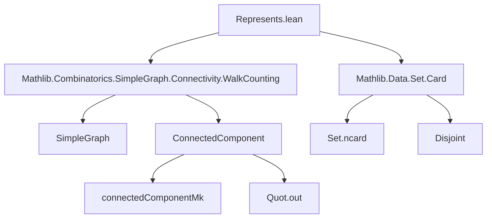

**Technical Brief: `Represents.lean`**

---

### 1. **Key Definitions & Theorems**

| Name | Type / Signature | Purpose |
|------|------------------|---------|
| `Represents` | `def Represents (s : Set V) (C : Set G.ConnectedComponent) : Prop` | Defines that a set `s` of vertices *represents* a set `C` of connected components iff the map `connectedComponentMk` restricts to a bijection from `s` onto `C`. |
| `image_out` | `lemma image_out (C : Set G.ConnectedComponent) : Represents (Quot.out '' C) C` | Shows that the image of a set of components under `Quot.out` (a choice of representative per component) represents that set. |
| `existsUnique_rep` | `lemma existsUnique_rep (hrep : Represents s C) (h : c ∈ C) : ∃! x, x ∈ s ∩ c.supp` | Guarantees a *unique* vertex in `s` belonging to component `c` when `c ∈ C`. |
| `exists_inter_eq_singleton` | `lemma exists_inter_eq_singleton (hrep : Represents s C) (h : c ∈ C) : ∃ x, s ∩ c.supp = {x}` | Consequence: intersection is a singleton. |
| `disjoint_supp_of_notMem` | `lemma disjoint_supp_of_notMem (hrep : Represents s C) (h : c ∉ C) : Disjoint s c.supp` | If a component is *not* in `C`, then `s` is disjoint from its support. |
| `ncard_inter` | `lemma ncard_inter (hrep : Represents s C) (h : c ∈ C) : (s ∩ c.supp).ncard = 1` | Cardinality of intersection is 1 for represented components. |
| `ncard_eq` | `lemma ncard_eq (hrep : Represents s C) : s.ncard = C.ncard` | Size of representing set equals number of represented components. |
| `ncard_sdiff_of_mem` / `ncard_sdiff_of_notMem` | `lemma ncard_sdiff_of_mem / ncard_sdiff_of_notMem` | Compute cardinalities of component support minus representing set, depending on membership in `C`. |
| `even_ncard_supp_sdiff_rep` | `lemma even_ncard_supp_sdiff_rep` | For `K` a component and `s` representing the *odd* components, the number of vertices in `K` not in `s` is even. Used in parity arguments (e.g., Eulerian trails). |

---

### 2. **Naming Conventions**

- **Prefixes**:
  - `Represents.`: Namespace for lemmas about the `Represents` predicate.
  - `ncard_`: Cardinality-related lemmas (`ncard_inter`, `ncard_eq`, `ncard_sdiff_*`).
  - `disjoint_`, `existsUnique_`, `exists_inter_`: Descriptive action + object.
- **Suffixes**:
  - `_of_mem` / `_of_notMem`: Distinguish cases based on membership in `C`.
  - `_eq`, `_inter`, `_sdiff`: Specify structural operation (equality, intersection, set difference).
- **General pattern**: `verb_object_condition` (e.g., `existsUnique_rep`, `disjoint_supp_of_notMem`).

---

### 3. **Tactic Stack**

Frequent tactics used in proofs:
- `simp_all`, `simp only`, `simp`: Simplification using definitions (`connectedComponentMk`, `mem_supp_iff`, etc.).
- `aesop`: Automated reasoning for first-order logic + set theory.
- `rw`: Rewrite using equalities (e.g., `hrep.image_eq`, `hrep.injOn.ncard_image`).
- `obtain ⟨x, hx⟩`: Destruct existential/uniqueness hypotheses.
- `by_cases`: Split on decidables (e.g., `Even K.supp.ncard`).
- `exact`, `simpa`, `lia`: Finalize proofs or solve arithmetic goals.

---

### 4. **Proof Logic**

- **Structure**: Most proofs follow a *constructive-deconstructive* pattern:
  1. **Construct** a witness using `existsUnique_rep` or `Quot.out`.
  2. **Verify** bijection properties (injectivity, surjectivity) via `Set.BijOn.mk`.
  3. **Reduce** set-theoretic statements (e.g., `s ∩ c.supp = {x}`) using `simp` and membership lemmas.
  4. **Cardinality arguments** rely on:
     - `Set.ncard_image_of_injective`, `Set.ncard_diff`, `Set.ncard_singleton`.
     - Arithmetic lemmas like `Nat.even_sub`, `Nat.not_even_iff_odd`.
- **Induction**: Not used here — proofs are mostly *case analysis* on membership (`c ∈ C` vs `c ∉ C`) and direct manipulation of bijections.

---

### 5. **Imports**

- `Mathlib.Combinatorics.SimpleGraph.Connectivity.WalkCounting`: Provides `connectedComponentMk`, `ConnectedComponent`, and related graph connectivity infrastructure.
- `Mathlib.Data.Set.Card`: Supplies `ncard`, `Disjoint`, set difference/intersection arithmetic.

> **Scope**: This module formalizes *choice functions* for connected components in simple graphs, focusing on cardinality and bijection properties — foundational for parity-based graph theorems (e.g., Eulerian path conditions).

---

### 6. **Mermaid Diagrams**

#### **Dependency Graph**


#### **Overview of Theory Flow**
```mermaid
flowchart LR
  A[SimpleGraph V] --> B[ConnectedComponent G]
  B --> C[Represents s C]
  C --> D[BijOn connectedComponentMk s C]
  D --> E[Unique representative per component]
  D --> F[Cardinality equalities]
  F --> G[Parity lemmas (e.g., even_ncard_supp_sdiff_rep)]
  G --> H[Applications: Euler tours, matching, etc.]
```

--- 

This module serves as a *combinatorial choice interface* for connected components, enabling precise reasoning about vertex representatives and their counts — a key stepping stone for global graph properties.
