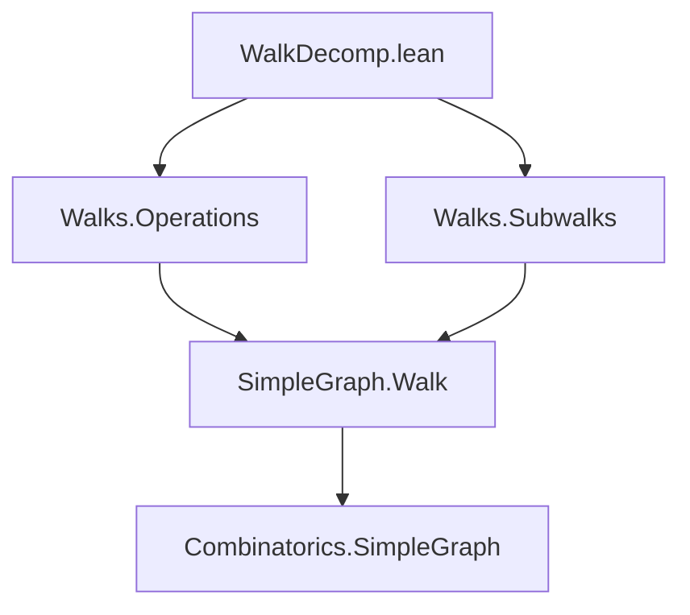
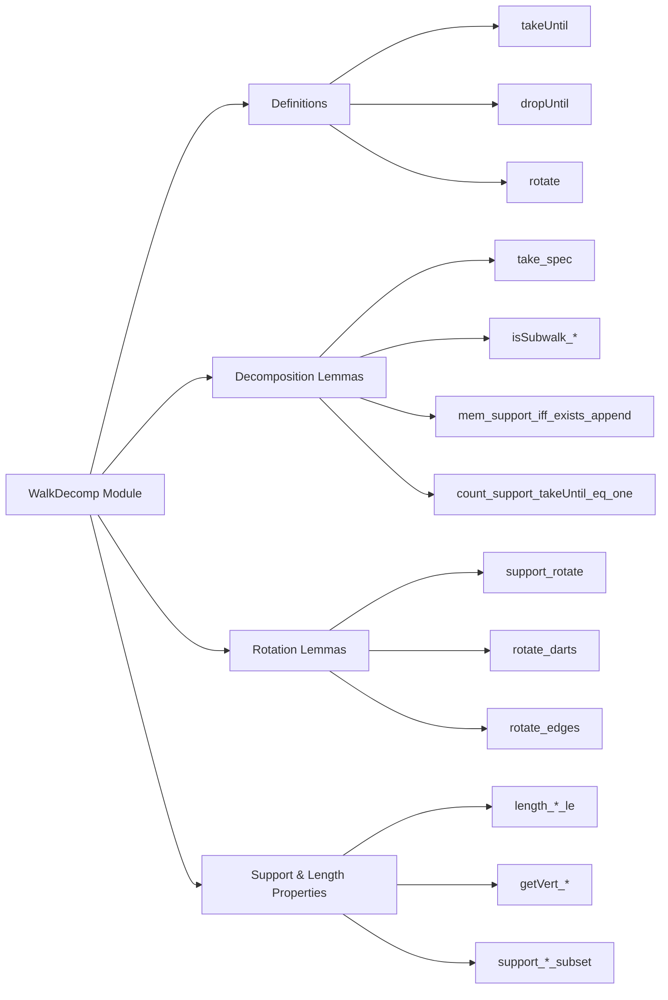

### Technical Brief: `WalkDecomp.lean`

---

#### **1. Key Definitions & Theorems**

| Name | Type / Signature | Purpose |
|------|------------------|---------|
| `takeUntil` | `∀ (p : G.Walk v w) (u : V), u ∈ p.support → G.Walk v u` | Extracts the prefix of a walk up to and including a given vertex `u` in its support. |
| `dropUntil` | `∀ (p : G.Walk v w) (u : V), u ∈ p.support → G.Walk u w` | Extracts the suffix of a walk from (and including) a given vertex `u` to the end. |
| `rotate` | `(c : G.Walk v v) → u ∈ c.support → G.Walk u u` | Rotates a loop walk so that it starts and ends at a specified vertex `u` in its support. |
| `take_spec` | `(p.takeUntil u h).append (p.dropUntil u h) = p` | Fundamental decomposition: `takeUntil` + `dropUntil` reconstructs the original walk. |
| `count_support_takeUntil_eq_one` | `(p.takeUntil u h).support.count u = 1` | Ensures the target vertex appears exactly once in the prefix. |
| `mem_support_iff_exists_append` | `w ∈ p.support ↔ ∃ q r, p = q.append r` | Characterizes membership in support via factorization through `append`. |
| `isSubwalk_takeUntil` / `isSubwalk_dropUntil` | `(p.takeUntil w h).IsSubwalk p` / `(p.dropUntil w h).IsSubwalk p` | Both components are subwalks of the original. |
| `rotate_darts` / `rotate_edges` | `(c.rotate h).darts ~r c.darts` / `(c.rotate h).edges ~r c.edges` | Rotation preserves dart/edge multiset up to rotation (`~r`). |
| `mem_support_rotate_iff` | `w ∈ (c.rotate h).support ↔ w ∈ c.support` | Support is preserved under rotation. |
| `getVert_takeUntil` | `(p.takeUntil w h).getVert n = p.getVert n` (for `n ≤ length`) | Vertices in the prefix match those in the original walk. |
| `getVert_le_length_takeUntil_eq_iff` | `p.getVert n = u ↔ n = length (p.takeUntil u h)` | Characterizes the final vertex of `takeUntil`. |

---

#### **2. Naming Conventions**

- **Prefixes**:
  - `takeUntil_`, `dropUntil_`, `rotate_`: indicate operations on walks relative to a vertex.
  - `isSubwalk_`: properties about subwalk relations.
  - `support_`, `darts_`, `edges_`: refer to structural components.
- **Suffixes**:
  - `_subset`: subset relations on sets (e.g., `support_takeUntil_subset`).
  - `_le`, `_lt`: length inequalities.
  - `_iff`: biconditional characterizations.
  - `_eq_iff`: equivalence of conditions involving equality.
- **Helper patterns**:
  - `copy`, `append`, `getVert`, `length`, `tail`, `dropLast`: reused from `Walks.Operations` and `Walks.Subwalks`.

---

#### **3. Tactic Stack**

Frequently used tactics:
- `simp` / `simp!` / `simp only`: simplification with lemmas and `@[simp]` theorems.
- `induction p`: structural induction on walks.
- `cases h`: case analysis on membership or equality hypotheses.
- `subst_vars`, `subst h'`: substitution after `if`-splitting or equality.
- `grind`: custom tactic (likely from Mathlib’s `Tactic.Grind`) for automated reasoning with equalities and congruences.
- `congr_arg`, `congr_arg₂`: for applying function congruence.
- `rw [← ...]`: rewriting using reverse equalities.
- `lia`: linear integer arithmetic for inequalities.
- `exact`, `assumption`, `intro`, `intro h`, `rfl`: basic proof scripting.

---

#### **4. Proof Logic**

- **Inductive structure**: Proofs over `p : G.Walk v w` proceed by induction on `p`, leveraging its inductive definition (`nil`, `cons`).
- **Case splitting**: On equality `v = u` (e.g., in `takeUntil`, `dropUntil`) and membership (`h : u ∈ p.support`).
- **Decomposition strategy**: Many proofs rely on `take_spec`, which rewrites `p` as an append, enabling reasoning about prefixes/suffixes.
- **Support reasoning**: Membership in support is often reduced via `mem_support_iff_exists_append`, `mem_support_append_iff`, or `count_support_takeUntil_eq_one`.
- **Rotation properties**: Proven by unfolding `rotate`, then applying `isRotated` lemmas (`isRotated_append`, `tail_support_append`, etc.).
- **Uniqueness arguments**: E.g., `getVert_lt_length_takeUntil_ne` uses `count_support_takeUntil_eq_one` to show `u` cannot appear before the end of `takeUntil`.

---

#### **5. Imports**

- `Mathlib.Combinatorics.SimpleGraph.Walks.Operations`: defines basic walk operations (`append`, `copy`, `length`, `getVert`, `darts`, `edges`, `tail`, etc.).
- `Mathlib.Combinatorics.SimpleGraph.Walks.Subwalks`: defines `IsSubwalk`, subwalk relations, and related lemmas.

These imports provide foundational definitions and lemmas used throughout `WalkDecomp`.

---

#### **6. Mermaid Diagrams**

##### **Dependency Graph**

##### **Overview of File Structure**

---

#### **7. Theory Context**

This module formalizes **walk decomposition** in simple graphs — a foundational tool for reasoning about paths, cycles, and connectivity. It enables:
- Localizing walks around vertices (`takeUntil`, `dropUntil`).
- Rotating cycles to start at arbitrary points (`rotate`).
- Proving structural properties (e.g., uniqueness of first occurrence, subwalk inclusion, edge multiplicities ≤ 1 in prefixes).

It builds on prior work in `Walks.Operations` and `Walks.Subwalks`, and is likely used in higher-level results about Eulerian trails, shortest paths, or graph connectivity.

--- 

Let me know if you'd like a formalized dependency graph for the entire `Mathlib.Combinatorics.SimpleGraph.Walks` hierarchy.
