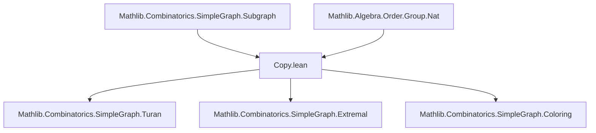
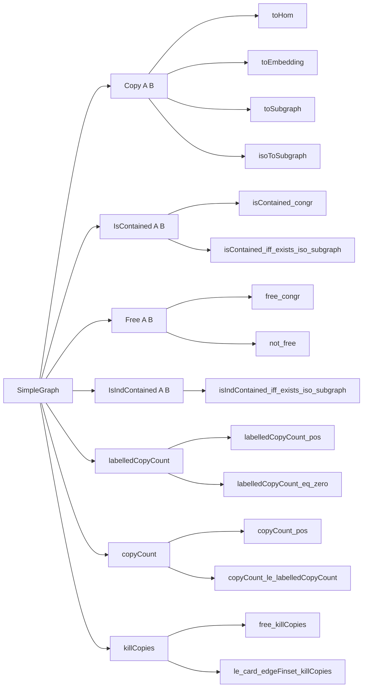

**Technical Brief: `Copy.lean` — Graph Containment in Lean 4 / Mathlib**

---

### 1. KEY DEFINITIONS & THEOREMS

| Name | Type / Declaration | Purpose |
|------|---------------------|---------|
| `Copy A B` | `structure` | Type of *injective* graph homomorphisms $A \to B$; models unlabelled (non-induced) copies of $A$ in $B$. |
| `Hom.toCopy f h` | `abbrev` | Constructs a `Copy` from an injective homomorphism. |
| `Embedding.toCopy f` | `abbrev` | Constructs a `Copy` from a graph embedding (automatically injective). |
| `Iso.toCopy f` | `abbrev` | Constructs a `Copy` from a graph isomorphism. |
| `Copy.id G` | `def` | Identity copy of $G$ in itself. |
| `Copy.comp g f` | `def` | Composition of copies (i.e., composition of injective homs). |
| `Copy.ofLE h` | `def` | Copy from subgraph $G_1 \le G_2$ via identity embedding. |
| `Copy.induce G s` | `def` | Copy from induced subgraph $\operatorname{induce}(G, s) \hookrightarrow G$. |
| `Copy.bot f` | `def` | Copy of empty graph $\bot$ via embedding $f : \alpha \hookrightarrow \beta$. |
| `Copy.mapEdgeSet f` | `def` | Induced embedding on edge sets. |
| `Copy.mapNeighborSet f a` | `def` | Induced embedding on neighbor sets. |
| `Copy.toEmbedding f` | `def` | Underlying vertex embedding. |
| `Copy.isoSubgraphMap f A'` | `noncomputable def` | Isomorphism $A' \cong f(A')$ for subgraph $A' \le G$. |
| `Copy.toSubgraph f` | `abbrev` | Subgraph of $B$ isomorphic to $A$ via $f$. |
| `Copy.isoToSubgraph f` | `noncomputable def` | Isomorphism $A \cong \operatorname{toSubgraph}(f)$. |
| `IsContained A B`, `A ⊑ B` | `abbrev` | $B$ *contains* $A$: $\exists f : A \to B$ injective hom. |
| `Free A B`, `A.Free B` | `abbrev` | $B$ is *$A$-free*: $\neg(A \sqsubseteq B)$. |
| `IsIndContained G H`, `G ⊴ H` | `def` | $H$ *inducingly contains* $G$: $\exists$ graph embedding $G \hookrightarrow H$. |
| `labelledCopyCount G H` | `noncomputable def` | Number of *labelled* copies (i.e., embeddings $H \hookrightarrow G$). |
| `copyCount G H` | `noncomputable def` | Number of *unlabelled* copies (i.e., subgraphs of $G$ isomorphic to $H$). |
| `killCopies G H` | `noncomputable def` | Subgraph of $G$ obtained by deleting one edge from each copy of $H$ (if $H \ne \bot$). |
| `free_killCopies` | `lemma` | $H$-free after killing all $H$-copies: $H \not\sqsubseteq G.\texttt{killCopies}\ H$. |
| `le_card_edgeFinset_killCopies` | `lemma` | Edge count bound: $|E(G)| - \#H\text{-copies in }G \le |E(G.\texttt{killCopies}\ H)|$. |

---

### 2. NAMING CONVENTIONS

| Pattern | Meaning | Examples |
|--------|---------|----------|
| `is_...` | Predicate / relation | `IsContained`, `IsIndContained`, `Free` |
| `...Copy` | Type of copies | `Copy`, `toCopy`, `isoToSubgraph`, `killCopies` |
| `...Count` | Cardinality of copies | `copyCount`, `labelledCopyCount` |
| `...to...` | Conversion / coercion | `toHom`, `toEmbedding`, `toSubgraph`, `coeCopy` |
| `of_...` | Inclusion from structure | `ofLE`, `of_isEmpty` |
| `induce`, `bot`, `id`, `comp` | Canonical constructions | `induce`, `bot`, `id`, `comp` |
| `...Equiv`, `...Iso` | Equivalence / isomorphism | `Iso.toCopy`, `isoSubgraphMap`, `isoToSubgraph` |
| `kill...` | Graph modification to eliminate copies | `killCopies` |

---

### 3. TACTIC STACK

| Tactic | Usage Frequency | Purpose |
|--------|------------------|---------|
| `simp` / `simp_rw` | Very High | Simplification of `coe`, `apply`, `map`, `comp`, `iso`, `Subgraph` operations. |
| `ext` | High | Extensionality for functions, embeddings, homs, subgraphs. |
| `rw` | High | Rewriting using lemmas (e.g., `coe_comp`, `ofLE_comp`, `killCopies_eq_left`). |
| `exact` / `intro` / `intro f` | High | Standard proof structure. |
| `convert` | Medium | When target differs by definitional equality or propositional truncation. |
| `cases` / `obtain` | Medium | Case analysis on `Nonempty`, `Subtype`, `eq_or_ne`, `ne`, `IsEmpty`. |
| `have` / `set ... with` | Medium | Intermediate lemmas, e.g., defining $e$ in `free_killCopies`. |
| `apply` / `refine` | Medium | Applying lemmas with holes (e.g., `refine ⟨_, _⟩`). |
| `aesop` / `tauto` | Low | Rarely used; mostly manual reasoning. |
| `congr` | Low | Congruence for equality of structures. |
| `convert ... using n` | Low | For propositional truncation or hidden structure. |
| `convert ...; simp` | Medium | Common pattern for definitional simplification. |

---

### 4. PROOF LOGIC

**General proof strategy**:

1. **Structural decomposition**: Proofs often proceed by:
   - Unfolding definitions (`Copy`, `IsContained`, `Free`, `killCopies`, `copyCount`).
   - Using `ext` to reduce to pointwise equality.
   - Leveraging `Subtype.ext`, `DFunLike.ext`, `Subgraph.ext`.

2. **Case analysis**:
   - On whether $H = \bot$ (e.g., `killCopies`, `free_killCopies`, `copyCount_bot`).
   - On `IsEmpty α`, `Fintype α`, `Subsingleton (α → β)`.

3. **Equivalence chaining**:
   - Use `isContained_congr`, `free_congr`, `isIndContained_iff_exists_iso_subgraph` to reduce to isomorphic graphs.

4. **Counting arguments**:
   - Use `copyCount_eq_card_image_copyToSubgraph`, `card_image_le`, `Fintype.card_congr`, `card_subtype`.
   - Often involve `Finset.image`, `Set.range`, `subtype_univ`.

5. **Edge deletion arguments**:
   - In `free_killCopies`, construct a witness edge $e$ in each copy, then show it gets removed.
   - Use `aux` lemma to guarantee nonempty edge set for $H \ne \bot$.

6. **Induction is rare** — most proofs are direct or rely on existing lemmas about embeddings, subgraphs, and finiteness.

---

### 5. IMPORTS & DEPENDENCIES

| Module | Purpose |
|--------|---------|
| `Mathlib.Algebra.Order.Group.Nat` | For `Fintype.card`, `Nat` arithmetic, ordering. |
| `Mathlib.Combinatorics.SimpleGraph.Subgraph` | Core graph theory: `Subgraph`, `Hom`, `Embedding`, `Iso`, `induce`, `map`, `deleteEdges`, `edgeSet`, `neighborSet`. |

**Key external dependencies**:
- `Fintype`, `Finset`, `Subtype`, `Equiv.Set`, `Relation.map`, `Sym2`, `Set.image`, `Set.iUnion`, `Set.sdiff`, `Set.toFinset`.

---

### 6. MERMAID DIAGRAMS

#### Dependency Graph (Top-Level)

#### Overview of `Copy.lean`

---

### 7. SUMMARY

This file formalizes the foundational theory of **graph containment** in simple graphs, distinguishing between:
- **Unlabelled containment** (`Copy`, `IsContained`, `Free`, `copyCount`, `killCopies`)
- **Induced containment** (`IsIndContained`, via `Embedding`)

It introduces:
- A subtype-based representation of injective homomorphisms (`Copy`)
- A clean interface for reasoning about subgraphs isomorphic to a given graph
- Counting functions for labelled/unlabelled copies
- A constructive method (`killCopies`) to eliminate copies by edge deletion

The formalization is highly modular, leveraging Mathlib’s existing graph theory infrastructure (`Subgraph`, `Hom`, `Embedding`, `Iso`) and standard set/fintype arithmetic.

It serves as a foundational module for extremal graph theory (e.g., Turán-type results), model theory (induced subgraphs), and algorithmic graph theory (copy counting, forbidden subgraphs).
