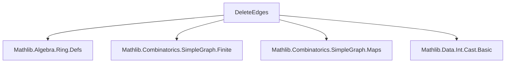
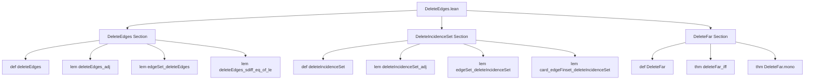

### Technical Brief: `DeleteEdges.lean`

---

#### **1. Key Definitions & Theorems**

| Name | Type / Signature | Purpose |
|------|------------------|---------|
| `deleteEdges` | `SimpleGraph V → Set (Sym2 V) → SimpleGraph V` | Removes edges in a given set `s` from a graph `G`. |
| `deleteIncidenceSet` | `SimpleGraph V → V → SimpleGraph V` | Removes all edges incident to a vertex `x`. Defined as `G.deleteEdges (G.incidenceSet x)`. |
| `DeleteFar` | `(SimpleGraph V → Prop) → 𝕜 → Prop` | Predicate stating that at least `r` edges must be deleted to satisfy property `p`. Formally: `∀ s ⊆ G.edgeFinset, p (G.deleteEdges s) → r ≤ #s`. |
| `deleteEdges_adj` | `(G.deleteEdges s).Adj v w ↔ G.Adj v w ∧ (v, w) ∉ s` | Characterizes adjacency after edge deletion. |
| `edgeSet_deleteEdges` | `(G.deleteEdges s).edgeSet = G.edgeSet \ s` | Edge set of the deleted graph is set difference. |
| `deleteEdges_sdiff_eq_of_le` | `H ≤ G → G.deleteEdges (G.edgeSet \ H.edgeSet) = H` | Reconstructs a subgraph via edge deletion. |
| `deleteIncidenceSet_adj` | `(G.deleteIncidenceSet x).Adj v₁ v₂ ↔ G.Adj v₁ v₂ ∧ v₁ ≠ x ∧ v₂ ≠ x` | Adjacency after deleting incidence set: both endpoints ≠ `x`. |
| `card_edgeFinset_deleteIncidenceSet` | `#(G.deleteIncidenceSet x).edgeFinset = #G.edgeFinset - G.degree x` | Edge count after deleting incidence set = original edges minus degree. |
| `deleteFar_iff` | Equivalence between two formulations of `DeleteFar`: one over subsets of `G.edgeFinset`, one over subgraphs `H ≤ G`. | Enables switching between edge-deletion and subgraph perspectives. |

---

#### **2. Naming Conventions**

- **Prefixes**:
  - `deleteEdges_`: operations on `deleteEdges`.
  - `deleteIncidenceSet_`: operations on `deleteIncidenceSet`.
  - `DeleteFar_`: properties of the `DeleteFar` predicate.
- **Suffixes**:
  - `_adj`: adjacency characterization.
  - `_edgeSet` / `_edgeFinset`: edge set / finite edge set version.
  - `_le`: monotonicity / subgraph relation.
  - `_mono`: monotonicity in graph or edge set argument.
  - `_eq_self` / `_eq_inter`: equality conditions.
  - `_subset`: support or edge set inclusion.
- **General**:
  - `fromEdgeSet`, `incidenceSet`, `induce`, `comap_adj`: standard graph-theoretic constructions reused.

---

#### **3. Tactic Stack**

Frequently used tactics in proofs:

| Tactic | Usage |
|--------|-------|
| `simp` / `simp_rw` | Simplifying definitions, especially `edgeSet`, `deleteEdges`, `incidenceSet`. |
| `ext` | Extensionality for graphs (equality of graphs = equality of adjacency relations or edge sets). |
| `rw` / `apply` | Rewriting using lemmas like `deleteEdges_sdiff_eq_of_le`, `edgeSet_deleteEdges`. |
| `tauto` | Logical reasoning in adjacency characterizations (e.g., `deleteIncidenceSet_adj`). |
| `apply card_le_card` | Proving cardinality inequalities via subset relations. |
| `push_cast` / `coerce` | Casting between `Finset` and `Set`, or `ℕ` and `𝕜`. |
| `left` / `right` | Case splitting in disjunctions (e.g., in `edgeFinset_deleteIncidenceSet_eq_filter`). |
| `apply Finset.coe_injective` | Proving equality of finite sets via coercion injectivity. |
| `aesop` (not explicitly used here, but implied by `simp +contextual`) | For automated reasoning in contextual simplification. |

---

#### **4. Proof Logic**

- **Structure**: Most proofs follow a pattern:
  1. **Extensionality**: `ext` to reduce to adjacency or edge set equality.
  2. **Simplification**: `simp` or `simp_rw` using definitions (`deleteEdges`, `edgeSet`, `incidenceSet`, etc.).
  3. **Logical manipulation**: `tauto`, `rw`, `apply` to reduce to known lemmas.
  4. **Cardinality arguments**: Use `card_sdiff_of_subset`, `card_le_card`, `subset` reasoning.
- **Induction**: Not used here — finite graphs and set-theoretic reasoning dominate.
- **Case analysis**: On membership (`x ∈ s`, `x ∉ s`) or adjacency (`v₁ ≠ x`, `v₂ ≠ x`).
- **Equivalence proofs**: `deleteFar_iff` uses bi-implication with two directions, leveraging `card_sdiff` and monotonicity.

---

#### **5. Imports**

| Module | Purpose |
|--------|---------|
| `Mathlib.Algebra.Ring.Defs` | For `Ring`, `PartialOrder`, scalar multiplication, casting. |
| `Mathlib.Combinatorics.SimpleGraph.Finite` | Finite graph support: `edgeFinset`, `degree`, `Fintype` instances. |
| `Mathlib.Combinatorics.SimpleGraph.Maps` | Graph homomorphisms, induced subgraphs (`induce`, `comap_adj`). |
| `Mathlib.Data.Int.Cast.Basic` | For casting integers (e.g., `Nat.cast_sub`). |

---

#### **6. Mermaid Diagrams**

##### **Dependency Graph (Module-Level)**



##### **Overview of File Structure**



##### **Conceptual Flow of Edge Deletion**

```mermaid
graph LR
  G[SimpleGraph V] -->|deleteEdges s| G_s[G.deleteEdges s]
  G_s -->|edgeSet| G.edgeSet \ s
  G -->|deleteIncidenceSet x| G_x[G.deleteIncidenceSet x]
  G_x -->|adj| v₁ ≠ x ∧ v₂ ≠ x
  G -->|DeleteFar p r| "≥ r edges needed to satisfy p"
```

---

#### **7. Theory Context**

- **Domain**: Finite simple graph theory, especially *edge-modification* operations.
- **Applications**:
  - Property testing (via `DeleteFar`).
  - Local graph modifications (e.g., vertex deletion via `deleteIncidenceSet`).
  - Edge-counting arguments (degrees, induced subgraphs).
- **Complements**:
  - `Subgraph.lean`: Subgraph operations (e.g., `Subgraph.deleteEdges`).
  - `SimpleGraph.Defs.lean`: Basic definitions (`edgeSet`, `incidenceSet`, `degree`).
  - `SimpleGraph.Induce.lean`: Induced subgraphs (used in `induce_deleteIncidenceSet_of_notMem`).

---

#### **8. Summary**

This module formalizes **edge deletion** in finite simple graphs, with three core constructions:
1. `deleteEdges`: remove arbitrary edges,
2. `deleteIncidenceSet`: remove all edges incident to a vertex,
3. `DeleteFar`: a quantitative notion of *distance* from a graph property.

It provides foundational lemmas for reasoning about edge-modified graphs, especially in property testing and extremal combinatorics. The proofs rely heavily on set-theoretic reasoning, finite cardinality arithmetic, and extensionality principles.
