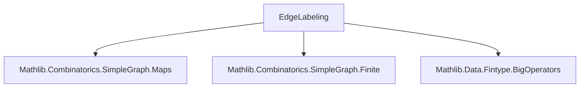
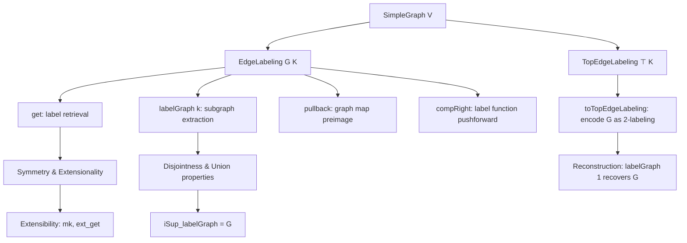

### Technical Brief: `EdgeLabeling.lean`

---

#### **1. Key Definitions & Theorems**

| Name | Type / Signature | Purpose |
|------|------------------|---------|
| `EdgeLabeling G K` | `G.edgeSet → K` | Assigns a label from `K` to each edge of graph `G`. |
| `TopEdgeLabeling V K` | `EdgeLabeling ⊤ K` | Edge labelings of the complete graph on `V`. |
| `get C x y h` | `C ⟨s(x, y), h⟩ : K` | Retrieves the label of edge `x ~ y` under labeling `C`. |
| `compRight C f` | `f ∘ C` | Composes labeling with a function on labels. |
| `pullback C f` | `C ∘ f.mapEdgeSet` | Pulls back labeling along a graph homomorphism/embedding. |
| `mk f f_symm` | `EdgeLabeling G K` | Constructs labeling from symmetric function on adjacent vertices. |
| `labelGraph C k` | `SimpleGraph V` | Subgraph of `G` containing only edges labeled `k`. |
| `card_topEdgeLabeling` | `card (TopEdgeLabeling V K) = |K|^(|V| choose 2)` | Counts total edge labelings of complete graph. |
| `iSup_labelGraph` | `⨆ k, C.labelGraph k = G` | Union of all label-subgraphs recovers original graph. |
| `pairwise_disjoint_labelGraph` | `Pairwise (Disjoint ∘ labelGraph)` | Label-subgraphs for distinct labels are edge-disjoint. |
| `toTopEdgeLabeling G` | `TopEdgeLabeling V (Fin 2)` | Encodes `G` as a 2-labeling (1 = edge, 0 = non-edge). |
| `TopEdgeLabeling.labelGraph_toTopEdgeLabeling` | `(C.labelGraph 1).toTopEdgeLabeling = C` | Reconstruction: 2-labeling recoverable from its 1-edge subgraph. |

---

#### **2. Naming Conventions**

- **Prefixes**:
  - `get_`: accessor for edge labels.
  - `compRight_`: right-composition with label function.
  - `pullback_`: pullback along graph maps.
  - `labelGraph_`: properties of label-induced subgraphs.
  - `toTopEdgeLabeling_`: conversion to complete-graph labeling.

- **Suffixes**:
  - `_apply`: simplification lemmas for function application.
  - `_get`: lemmas involving `get`.
  - `_adj`: adjacency characterizations.
  - `_le`, `_disjoint`, `_iSup`: order/disjointness/unions.

- **General**:
  - `mk`, `ext_get`, `ext`: standard Lean naming for constructors and extensionality.

---

#### **3. Tactic Stack**

Frequently used tactics in proofs:
- `simp` / `simp only`: for unfolding definitions and simplifying goals.
- `grind`: custom tactic (likely from Mathlib’s `grind` module) for automated simplification + decidability solving.
- `rw`: rewriting using lemmas.
- `ext`: extensionality (e.g., for graphs, functions).
- `funext`: function extensionality.
- `induction` / `induction e using Sym2.inductionOn`: structural induction on symmetric pairs.
- `refine`, `exact`, `apply`: proof construction.
- `decidable_of_iff'`: to derive decidability from equivalence.

---

#### **4. Proof Logic**

- **Inductive structure**: Proofs often rely on `Sym2` induction (edges as unordered pairs).
- **Extensionality**: Graph/function equality via `ext` + `ext_get`.
- **Decidability handling**: Many instances (`DecidableRel`, `DecidableEq`) used to enable `grind`.
- **Set-theoretic reasoning**: Edge sets, unions (`iSup`), disjointness, and membership manipulations.
- **Symmetry exploitation**: `get_comm` and symmetry of `s(x, y)` used to reduce cases.
- **Equational reasoning**: Many proofs are straightforward simplifications (`rfl`, `simp`) after unfolding definitions.

---

#### **5. Imports & Dependencies**

| Import | Purpose |
|--------|---------|
| `Mathlib.Combinatorics.SimpleGraph.Maps` | Graph homomorphisms, embeddings, edge maps. |
| `Mathlib.Combinatorics.SimpleGraph.Finite` | Finiteness and finiteness-related instances (e.g., `edgeFinset`). |
| `Mathlib.Data.Fintype.BigOperators` | For `card` and big operator lemmas (e.g., `card_fun`, `card_edgeFinset_top_eq_card_choose_two`). |

---

#### **6. Theory Overview & Dependencies**

##### **Mermaid Diagram: Module Dependencies**

##### **Mermaid Diagram: Core Theory Flow**

##### **Key Theoretical Insights**
- Edge labelings are *functions on edges*, i.e., `G.edgeSet → K`.
- The complete graph `⊤` enables global labelings without adjacency checks.
- `labelGraph` partitions `G` into disjoint subgraphs indexed by labels.
- The 2-labeling encoding (`toTopEdgeLabeling`) gives a bijection between graphs and `Fin 2`-labelings of `⊤`.
- Pullbacks allow restriction of labelings along embeddings — essential for subgraph reasoning.

---

#### **7. Notable Lemmas & Their Roles**

| Lemma | Role |
|-------|------|
| `ext_get` | Enables equality of labelings by pointwise equality on edges. |
| `labelGraph_adj` | Connects adjacency in `labelGraph k` to existence of edge with label `k`. |
| `pairwise_disjoint_labelGraph` | Ensures no edge appears in two label-subgraphs. |
| `iSup_labelGraph` | Ensures every edge appears in *some* label-subgraph. |
| `TopEdgeLabeling.labelGraph_toTopEdgeLabeling` | Shows `labelGraph 1` is invertible for `Fin 2`-labelings. |
| `card_topEdgeLabeling` | Counts labelings: foundational for probabilistic/combinatorial arguments. |

---

#### **8. Use Cases & Applications**

- **Edge-coloring theory**: Though `EdgeLabeling` allows same labels on incident edges, `labelGraph` enables defining proper colorings via subgraph properties (e.g., matching = label-subgraph with max degree 1).
- **Ramsey theory**: Representing graphs as 2-labelings of `⊤` facilitates combinatorial arguments over complete graphs.
- **Decomposition**: `pairwise_disjoint_labelGraph` + `iSup_labelGraph` formalize edge-partitioning.
- **Pullback semantics**: Enables reasoning about induced subgraphs and label restrictions.

--- 

Let me know if you'd like a formalized summary in Lean syntax or a dependency graph for the *entire* `Mathlib.Combinatorics.SimpleGraph` hierarchy.
