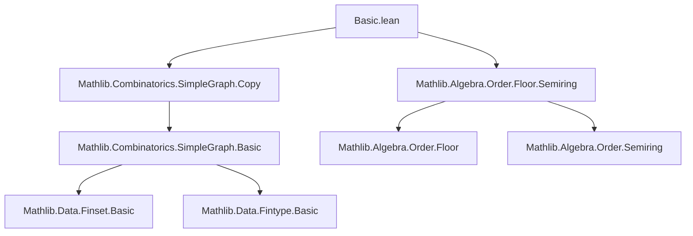
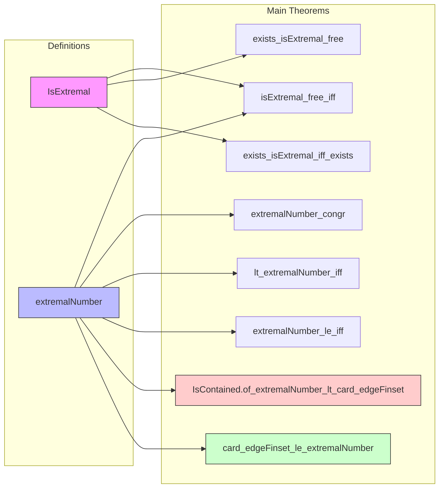

**Technical Brief: `Basic.lean` — Extremal Graph Theory in Lean 4**

---

### 1. **Key Definitions & Theorems**

| Name | Type / Signature | Purpose |
|------|------------------|---------|
| `SimpleGraph.IsExtremal` | `G.IsExtremal p ↔ p G ∧ ∀ G', p G' → #G'.edgeFinset ≤ #G.edgeFinset` | Predicate stating `G` maximizes edge count among graphs satisfying property `p`. |
| `SimpleGraph.exists_isExtremal_iff_exists` | `∃ G, DecidableRel G.Adj ∧ G.IsExtremal p ↔ ∃ G, p G` | Equivalence between existence of *any* `p`-satisfying graph and existence of an extremal one. |
| `SimpleGraph.exists_isExtremal_free` | `H ≠ ⊥ → ∃ G, DecidableRel G.Adj ∧ G.IsExtremal H.Free` | Guarantees existence of extremal $H$-free graphs when $H$ is non-empty. |
| `SimpleGraph.IsExtremal.le_iff_eq` | `G.IsExtremal p → p H → G ≤ H ↔ G = H` | For extremal `G`, inclusion implies equality. |
| `SimpleGraph.extremalNumber` | `extremalNumber n H := sup { G : SimpleGraph (Fin n) | H.Free G } (#·.edgeFinset)` | Maximum number of edges in an $H$-free graph on $n$ vertices. |
| `SimpleGraph.card_edgeFinset_le_extremalNumber` | `H.Free G → #G.edgeFinset ≤ extremalNumber (card V) H` | Edge bound for $H$-free graphs. |
| `SimpleGraph.IsContained.of_extremalNumber_lt_card_edgeFinset` | `extremalNumber (card V) H < #G.edgeFinset → H ⊑ G` | If a graph exceeds the extremal number, it must contain $H$. |
| `SimpleGraph.extremalNumber_le_iff` | `extremalNumber (card V) H ≤ m ↔ ∀ G, H.Free G → #G.edgeFinset ≤ m` | Characterization of extremal number via universal bound. |
| `SimpleGraph.lt_extremalNumber_iff` | `m < extremalNumber (card V) H ↔ ∃ G, H.Free G ∧ m < #G.edgeFinset` | Dual characterization via existence of large $H$-free graphs. |
| `SimpleGraph.IsContained.extremalNumber_le` | `H' ⊑ H → extremalNumber n H' ≤ extremalNumber n H` | Monotonicity of extremal number under graph containment. |
| `SimpleGraph.extremalNumber_congr` | `n₁ = n₂ → H₁ ≃g H₂ → extremalNumber n₁ H₁ = extremalNumber n₂ H₂` | Invariance under isomorphism and equal vertex counts. |
| `SimpleGraph.isExtremal_free_iff` | `G.IsExtremal H.Free ↔ H.Free G ∧ #G.edgeFinset = extremalNumber (card V) H` | Characterization of extremal $H$-free graphs. |
| `SimpleGraph.card_edgeFinset_deleteIncidenceSet_le_extremalNumber` | `H.Free G → #(G.deleteIncidenceSet v).edgeFinset ≤ extremalNumber (card V - 1) H` | Edge bound after deleting a vertex’s incident edges. |

---

### 2. **Naming Conventions**

- **Predicates**: `isExtremal`, `free`, `contained` (`IsContained`, `IsExtremal`)
- **Properties**: `Free`, `IsExtremal`
- **Operations**: `extremalNumber`, `deleteIncidenceSet`, `map`, `induce`, `congr`
- **Equivalences**: `congr`, `le_iff_eq`, `le_iff`, `iff` suffixes
- **Quantifiers**: `exists_isExtremal`, `lt_extremalNumber_iff`, `extremalNumber_le_iff`
- **Helper lemmas**: `prop`, `of_*`, `card_*`, `delete_*`, `induce_*`

Prefixes like `is_`, `extremalNumber_`, `card_*`, `of_*`, `delete_*` indicate purpose (e.g., `of_*` for implications from extremal bounds).

---

### 3. **Tactic Stack**

Frequently used tactics in proofs:

- `simp_rw` — for rewriting with definitional equalities and simplifying `mem_filter`, `sup`, etc.
- `convert` — to align goals modulo definitional equality (especially with `edgeFinset`, `card`, `map`)
- `rw [le_antisymm_iff]`, `and_intros`, `eq_of_subset_of_card_le` — for equality proofs via antisymmetry and cardinality
- `contrapose!`, `push_neg` — for contrapositive reasoning (common in extremal arguments)
- `exact`, `apply`, `use` — basic proof construction
- `convert @le_sup _ _ _ _ ...` — to lift bounds via supremum properties
- `on_goal 1 => ...; all_goals` — for multi-goal symmetry handling (e.g., `e` vs `e.symm`)
- `aesop` not used (no automation beyond basic simplification)
- `ring`, `linarith` not present — arithmetic handled via `Nat` lemmas and `floor`/`ceil` conversions

---

### 4. **Proof Logic**

- **Inductive/structural reasoning** is minimal; proofs rely on:
  - **Supremum properties** (`Finset.sup_le_iff`, `Finset.lt_sup_iff`)
  - **Cardinality arguments** (`#·.edgeFinset`, `edgeFinset_inj`, `card_edgeFinset_eq`)
  - **Graph isomorphism invariance** (`map`, `congr`, `Iso.card_edgeFinset_eq`)
  - **Contrapositive reasoning** for containment implications
  - **Equivalence of quantifiers** via `↔`-introduction and `simp_rw`
- **Common pattern**:
  1. Reduce to extremal number definition via `extremalNumber_of_fintypeCard_eq`
  2. Apply `sup`-based lemmas (`le_sup_iff`, `lt_sup_iff`)
  3. Use graph constructions (`map`, `induce`, `deleteIncidenceSet`) to relate graphs on different vertex sets
  4. Conclude via `eq_of_le_of_ge` or `le_antisymm`

---

### 5. **Imports & Dependencies**

| Import | Role |
|--------|------|
| `Mathlib.Algebra.Order.Floor.Semiring` | Provides `FloorSemiring`, `⌊m⌋₊`, `floor_lt`, `le_floor` for real/semiring arithmetic |
| `Mathlib.Combinatorics.SimpleGraph.Copy` | Enables graph copying, induced subgraphs, and `Copy.induce` for vertex-restricted graphs |

**Key abstractions used**:
- `SimpleGraph`, `edgeFinset`, `Free`, `⊑` (graph containment)
- `Fintype`, `Fin n`, `Fintype.equivFinOfCardEq`
- `DecidableRel`, `DecidableEq`
- `Iso`, `map`, `congr`

---

### 6. **Mermaid Diagrams**

#### **Dependency Graph (Module-Level)**

#### **Overview of File Structure**

#### **Theoretical Context**

- **Extremal graph theory** studies extremal properties (e.g., max edges without containing a subgraph).
- This file formalizes:
  - **Extremal graphs**: graphs achieving the maximum edge count under a constraint (`p`).
  - **Extremal numbers**: extremal edge counts for $H$-free graphs.
- Builds on:
  - **Graph theory foundations** (`SimpleGraph`, `Free`, `⊑`)
  - **Order-theoretic suprema** (`sup`, `Finset`)
  - **Finite type arithmetic** (`Fintype.card`, `Fin n`)

---

### 7. **Notable Design Choices**

- **Noncomputability**: `extremalNumber` is `noncomputable def`, as it uses `sup` over a class of graphs (no canonical witness).
- **Classical logic**: `open Classical` used for existence proofs (e.g., `exists_isExtremal_iff_exists`).
- **Decidability assumptions**: `DecidableRel G.Adj` and `DecidableEq V` used to enable `Finset` constructions and `card`.
- **Vertex-agnostic**: `extremalNumber n H` abstracts over vertex types via `Fintype.card`.

---

### 8. **Future Work (Implied)**

- Prove concrete extremal numbers (e.g., Turán’s theorem: $\mathrm{ex}(n, K_r) = \left(1 - \frac{1}{r-1}\right)\frac{n^2}{2}$).
- Formalize extremal constructions (e.g., Turán graphs).
- Extend to weighted or directed graphs.

--- 

Let me know if you'd like a **proof sketch** of a specific theorem (e.g., `extremalNumber_congr`) or a **Lean tactic trace** for a lemma.
