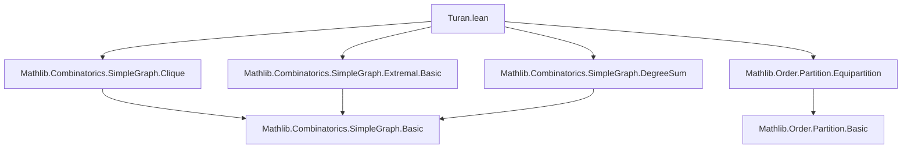
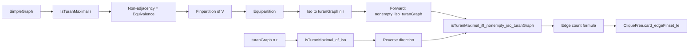

### Technical Brief: Turán’s Theorem in Lean 4 (`Turan.lean`)

---

#### **1. Key Definitions & Theorems**

| Name | Type / Signature | Purpose |
|------|------------------|---------|
| `IsTuranMaximal r` | `G.IsTuranMaximal r : Prop` | `G` has the maximum number of edges among all `(r+1)`-cliquefree graphs on the same vertex set. Formally: `G.IsExtremal (CliqueFree · (r + 1))`. |
| `turanGraph n r` | `SimpleGraph (Fin n)` | The canonical Turán graph: vertices are `Fin n`, edges connect vertices whose residues mod `r` differ. |
| `setoid` | `Setoid V` | Equivalence relation of non-adjacency in a Turán-maximal graph. |
| `finpartition` | `Finpartition (univ : Finset V)` | Partition of vertices into equivalence classes under `setoid`. |
| `equivalence_not_adj` | `Equivalence (¬G.Adj · ·)` | Non-adjacency is reflexive, symmetric, transitive in Turán-maximal graphs (Zykov symmetrisation core). |
| `nonempty_iso_turanGraph` | `Nonempty (G ≃g turanGraph (card V) r)` | Forward direction of Turán’s theorem: any Turán-maximal graph is isomorphic to `turanGraph`. |
| `isTuranMaximal_of_iso` | `(G ≃g turanGraph n r) → 0 < r → G.IsTuranMaximal r` | Reverse direction: any graph isomorphic to `turanGraph n r` (with `r > 0`) is Turán-maximal. |
| `isTuranMaximal_iff_nonempty_iso_turanGraph` | `G.IsTuranMaximal r ↔ Nonempty (G ≃g turanGraph (card V) r)` | Full statement of Turán’s theorem (up to isomorphism, uniqueness). |
| `card_edgeFinset_turanGraph` | Exact edge count formula for `turanGraph n r`. | Closed-form:  
$$
\frac{(n^2 - (n \bmod r)^2)(r - 1)}{2r} + \binom{n \bmod r}{2}
$$ |
| `CliqueFree.card_edgeFinset_le` | Upper bound on edges in any `(r+1)`-cliquefree graph. | General extremal bound: edges ≤ edges in `turanGraph`. |

---

#### **2. Naming Conventions**

- **Prefixes**:
  - `is_`: Property definitions (`isTuranMaximal`, `isEquipartition`, `isExtremal`).
  - `turanGraph`: Canonical Turán graph.
  - `nonempty_iso_`: Existence of isomorphism.
- **Suffixes**:
  - `_of_`: Implication direction (`of_iso`, `of_not_adj`).
  - `_iff_`: Biconditional statements (`isTuranMaximal_iff_nonempty_iso_turanGraph`).
  - `_eq_`: Equality lemmas (`degree_eq_of_not_adj`, `card_parts_eq`).
- **Other**:
  - `replaceVertex`: Local graph modification used in symmetrisation.
  - `degree_eq_card_sub_part_card`: Relates degree to partition size.

---

#### **3. Tactic Stack**

Frequently used tactics in proofs:
- `simp` / `simp_rw`: Simplification with lemmas like `turanGraph_adj`, `not_adj_iff_part_eq`.
- `rw`: Rewriting using equivalences, isomorphism properties, modular arithmetic.
- `rcases` / `obtain`: Case analysis on disjunctions, existentials, and inequalities.
- `by_contra!`: Contrapositive reasoning (common in extremal arguments).
- `aesop` / `grind` / `lia`: Automated reasoning for arithmetic, inequalities, and linear arithmetic.
- `convert`: Transfer goals via equalities (e.g., edge counts under isomorphism).
- `congr` / `congr'`: Congruence closure for equality proofs.
- `exact` / `apply`: Direct proof steps, especially after `rw` or `simp`.

---

#### **4. Proof Logic**

**Zykov Symmetrisation (Forward Direction)**:
1. **Non-adjacency is equivalence**:
   - Reflexivity: trivial.
   - Symmetry: from `adj_comm`.
   - Transitivity: via degree equality and extremality (if `s` not adj `t`, `t` not adj `u`, then `s` not adj `u`, else replacing `s` with `t` then `u` increases edges).
2. **Partition into equivalence classes** (`finpartition`):
   - Parts = equivalence classes of non-adjacency.
   - Equipartition: parts differ in size by at most 1 (else swapping vertices increases edges).
3. **Construct isomorphism to `turanGraph`**:
   - Use equipartition → part-preserving equivalence.
   - Map parts to residues mod `r`.
   - Show adjacency corresponds to differing residues.

**Reverse Direction**:
1. Existence of Turán-maximal graph (`exists_isTuranMaximal`).
2. Any Turán-maximal graph is isomorphic to `turanGraph`.
3. Isomorphism preserves extremality (`isTuranMaximal_of_iso`).

**Edge Count**:
- Inductive or algebraic derivation using modular arithmetic and summation identities.
- Key lemma: `sum_ne_add_mod_eq_sub_one` counts neighbors per vertex.

---

#### **5. Imports & Dependencies**

```lean
public import Mathlib.Combinatorics.SimpleGraph.Clique
public import Mathlib.Combinatorics.SimpleGraph.Extremal.Basic
public import Mathlib.Combinatorics.SimpleGraph.DegreeSum
public import Mathlib.Order.Partition.Equipartition
```

- **Graph Theory**: `Clique`, `Extremal`, `DegreeSum` provide foundational definitions (clique-free, extremal graphs, degree sum formula).
- **Partitions**: `Equipartition` supports the partition-based structure of Turán graphs.

---

#### **6. Mermaid Diagrams**

##### **Dependency Graph (Module-Level)**



##### **Overview of Theoretical Flow**



---

#### **7. Summary**

This file formalizes **Turán’s theorem** in extremal graph theory: the extremal `(r+1)`-cliquefree graph is the complete `r`-partite graph with equal parts — the Turán graph. The proof uses **Zykov symmetrisation**, establishing that non-adjacency is an equivalence relation in a maximal graph, leading to a canonical multipartite structure. The formalization leverages Lean’s combinatorics library (`Mathlib.Combinatorics.SimpleGraph.*`) and order-theoretic tools (`Mathlib.Order.Partition.*`) to reason about partitions, degrees, and extremality.

The result includes:
- A full equivalence between Turán-maximality and isomorphism to `turanGraph`.
- Exact and asymptotic edge counts.
- Applications to extremal numbers (`extremalNumber_top`).

This is a foundational result in extremal combinatorics, and its formalization demonstrates Lean’s capability to handle sophisticated combinatorial reasoning.
