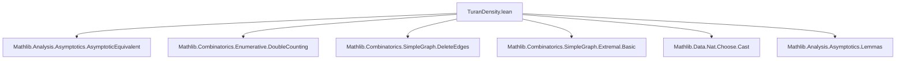
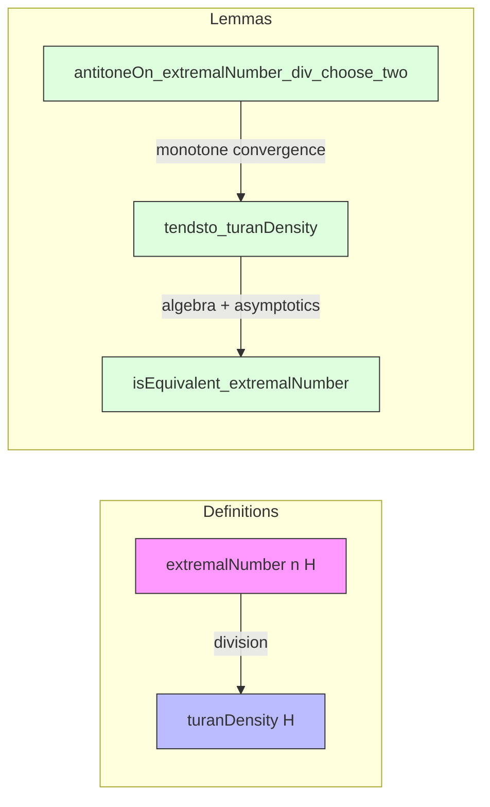

### Technical Brief: `TuranDensity.lean`

---

#### **1. Key Definitions & Theorems**

| Name | Type / Signature | Purpose |
|------|------------------|---------|
| `turanDensity` | `SimpleGraph W → ℝ` | Defines the Turán density of a graph $ H $ as the limit of $ \frac{\mathrm{ex}(n, H)}{\binom{n}{2}} $ as $ n \to \infty $. |
| `tendsto_turanDensity` | `∀ H, Tendsto (fun n ↦ extremalNumber n H / n.choose 2) atTop (𝓝 (turanDensity H))` | Proves that the Turán density is well-defined (i.e., the limit exists). |
| `isEquivalent_extremalNumber` | `∀ H, turanDensity H ≠ 0 → extremalNumber n H ~[atTop] turanDensity H * n.choose 2` | Shows asymptotic equivalence between the extremal number and its leading term when the Turán density is nonzero. |
| `antitoneOn_extremalNumber_div_choose_two` | `∀ H, AntitoneOn (fun n ↦ extremalNumber n H / n.choose 2) (Set.Ici 2)` | Key lemma: the sequence $ \frac{\mathrm{ex}(n, H)}{\binom{n}{2}} $ is antitone for $ n \ge 2 $, enabling convergence via monotone convergence theorem for filters. |

---

#### **2. Naming Conventions**

- **Prefixes**:
  - `turan_`: for Turán-density-related definitions (`turanDensity`).
  - `extremalNumber`: standard notation for extremal graph theory function $ \mathrm{ex}(n, H) $.
  - `isEquivalent_`: for asymptotic equivalence statements (`isEquivalent_extremalNumber`).
- **Suffixes**:
  - `_div_choose_two`: indicates division by $ \binom{n}{2} $.
  - `_turanDensity`: for properties of the Turán density itself.
- **General pattern**: `verb_noun_property`, e.g., `tendsto_turanDensity`, `isEquivalent_extremalNumber`.

---

#### **3. Tactic Stack**

- **Core tactics**:
  - `conv_lhs`, `conv_rhs`: for localized rewriting in complex expressions.
  - `rw`, `simp_rw`: heavy use for algebraic simplifications and rewriting definitions.
  - `apply`, `intro`, `exact`: standard natural-deduction style.
  - ` positivity`: used repeatedly to discharge nonnegativity goals.
  - `simp [Nat.choose_eq_zero_iff, hn]`: for handling binomial coefficient vanishing.
  - `eventually_atTop`, `set_univ`, `card_toFinset_mem_edgeFinset`: combinatorial simplifications.
  - `card_nsmul_le_card_nsmul'`: used in double-counting arguments.
  - `antitone_add_nat_iff_antitoneOn_nat_Ici`: bridge between sequences and filter-based monotonicity.

---

#### **4. Proof Logic**

- **Structure of `tendsto_turanDensity`**:
  1. Reduce to showing convergence of the shifted sequence $ f(n+2) $.
  2. Use monotone convergence for filters: show the sequence is antitone on $ n \ge 2 $ (`antitoneOn_extremalNumber_div_choose_two`).
  3. Conclude convergence to the infimum of the shifted sequence.
- **Structure of `isEquivalent_extremalNumber`**:
  1. Use the convergence of $ f(n) = \frac{\mathrm{ex}(n, H)}{\binom{n}{2}} $ to $ \pi(H) $.
  2. Multiply both sides by $ \pi(H) $ and simplify using algebraic lemmas.
  3. Apply `isEquivalent_iff_tendsto_one`, requiring that $ \pi(H) \cdot \binom{n}{2} \ne 0 $ eventually — verified using `eventually_atTop`.
- **Key idea in `antitoneOn_extremalNumber_div_choose_two`**:
  - Reduce inequality $ \frac{\mathrm{ex}(n+1, H)}{\binom{n+1}{2}} \le \frac{\mathrm{ex}(n, H)}{\binom{n}{2}} $ to a double-counting inequality over vertex-edge incidences where $ v \notin e $.
  - Apply `card_nsmul_le_card_nsmul'` with predicate $ v \notin e $, bounding both sides via extremal number properties.

---

#### **5. Imports & Dependencies**

| Module | Role |
|--------|------|
| `Mathlib.Analysis.Asymptotics.AsymptoticEquivalent` | Provides `~[atTop]`, asymptotic equivalence, and related lemmas. |
| `Mathlib.Combinatorics.Enumerative.DoubleCounting` | Supplies `card_nsmul_le_card_nsmul'`, used in double-counting proofs. |
| `Mathlib.Combinatorics.SimpleGraph.DeleteEdges` | Provides `edgeFinset_deleteIncidenceSet_eq_filter`, used in vertex-degree counting. |
| `Mathlib.Combinatorics.SimpleGraph.Extremal.Basic` | Defines `extremalNumber`, bipartite graphs, and basic extremal graph theory. |
| `Mathlib.Data.Nat.Choose.Cast` | Handles casting binomial coefficients to $ \mathbb{R} $, e.g., `Nat.cast_choose_two`. |
| `Mathlib.Analysis.Asymptotics.Lemmas` | Additional asymptotic lemmas (e.g., `Tendsto.const_mul`, `eventually_atTop`). |

---

#### **6. Mermaid Diagrams**

##### **Dependency Graph (Module-Level)**

##### **Overview of Theoretical Flow**

---

#### **7. Summary**

This file formalizes the foundational theory of **Turán density** in Lean 4, leveraging:
- **Asymptotic analysis** (via `Asymptotics`),
- **Extremal combinatorics** (via `SimpleGraph.Extremal.Basic`),
- **Double-counting arguments** (via `DoubleCounting`).

The key insight is that the normalized extremal number sequence is antitone (hence convergent), and the limit defines the Turán density. When nonzero, the extremal number is asymptotically equivalent to $ \pi(H) \cdot \binom{n}{2} $, a cornerstone result in extremal graph theory.

--- 

Let me know if you'd like a formalization roadmap for extending this to Turán’s theorem or hypergraph generalizations.
