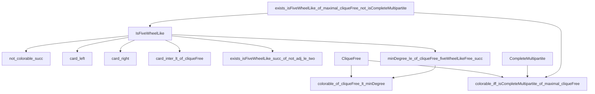

### Technical Brief: `FiveWheelLike.lean`

---

#### **1. Key Definitions & Theorems**

| Name | Type / Signature | Purpose |
|------|------------------|---------|
| `IsFiveWheelLike` | `SimpleGraph α → ℕ → ℕ → α → α → α → Finset α → Finset α → Prop` | Predicate asserting that vertices `v, w₁, w₂` and `r`-sets `s, t` form a *five-wheel-like* subgraph: `{v,w₁,w₂}` induces a single edge `w₁w₂`, all four sets `s∪{v}`, `t∪{v}`, `s∪{w₁}`, `t∪{w₂}` are `(r+1)`-cliques, and `#(s ∩ t) = k`. |
| `FiveWheelLikeFree` | `SimpleGraph α → ℕ → ℕ → Prop` | Predicate stating that `G` contains no `IsFiveWheelLike r k` subgraph. |
| `exists_isFiveWheelLike_of_maximal_cliqueFree_not_isCompleteMultipartite` | `Maximal (CliqueFree (r+2)) G → ¬ G.IsCompleteMultipartite → ∃ v w₁ w₂ s t, G.IsFiveWheelLike r #(s ∩ t) v w₁ w₂ s t` | Shows that any maximally `K_{r+2}`-free non-complete-multipartite graph contains a five-wheel-like structure. |
| `not_colorable_succ` | `G.IsFiveWheelLike r k v w₁ w₂ s t → ¬ G.Colorable (r + 1)` | Any graph with a `W_{r,k}` structure is *not* `(r+1)`-colorable. |
| `card_left`, `card_right` | `s.card = r`, `t.card = r` | Derived facts: `s` and `t` must be size `r`. |
| `card_inter_lt_of_cliqueFree` | `G.CliqueFree (r+2) → k < r` | In a `K_{r+2}`-free graph, the intersection size `k = # (s ∩ t)` must be strictly less than `r`. |
| `exists_isFiveWheelLike_succ_of_not_adj_le_two` | Under `K_{r+2}`-freeness, if a vertex `x` is adjacent to all but ≤2 vertices of the wheel and to all of `s ∩ t`, then we can construct a `W_{r,k+1}`. | Key step in incremental construction of larger wheels. |
| `minDegree_le_of_cliqueFree_fiveWheelLikeFree_succ` | `G.FiveWheelLikeFree r (k+1) → G.minDegree ≤ (2r + k)·n / (2r + k + 3)` | Upper bound on minimum degree for graphs avoiding `W_{r,k+1}`. |
| `colorable_iff_isCompleteMultipartite_of_maximal_cliqueFree` | `Maximal (CliqueFree (r+1)) G → G.Colorable r ↔ G.IsCompleteMultipartite` | Main structural result: maximally `K_{r+1}`-free graphs are `r`-colorable iff complete multipartite. |
| `colorable_of_cliqueFree_lt_minDegree` (**Andrásfai–Erdős–Sós**) | `G.CliqueFree (r+1) ∧ ((3r−4)n/(3r−1) < G.minDegree) → G.Colorable r` | Proves high minimum degree forces colorability in clique-free graphs. |

---

#### **2. Naming Conventions**

- **Prefixes**:
  - `is_`: e.g., `isNClique`, `isPathGraph3Compl`, `isFiveWheelLike` — predicates.
  - `card_`: e.g., `card_left`, `card_right`, `card_inter` — cardinality-related facts.
  - `not_`: e.g., `notMem_left`, `not_colorable_succ` — negations or impossibility results.
  - `fst_`, `snd_`: e.g., `fst_notMem`, `snd_notMem` — indexing into ordered structures.

- **Suffixes**:
  - `_left`, `_right`, `_fst`, `_snd`: distinguish between left/right or first/second components.
  - `_succ`: indicates successor case (e.g., `exists_isFiveWheelLike_succ_...`).
  - `_free`: e.g., `FiveWheelLikeFree`, `CliqueFree` — avoidance properties.

- **Mathematical notation**:
  - `Wᵣ,ₖ` used informally for `IsFiveWheelLike r k ...`.
  - `#X` for cardinality (`Fintype.card X`).
  - `G.degree`, `G.minDegree`, `G.Colorable`, `G.CliqueFree`, `G.IsCompleteMultipartite` — standard graph-theoretic notions.

---

#### **3. Tactic Stack**

Frequent tactics used in proofs:

| Tactic | Usage |
|--------|-------|
| `grind` | Custom automation for simplifying membership, disjointness, and set equalities (e.g., `mem_insert`, `erase_insert`, `inter_comm`). |
| `aesop` | For simple propositional reasoning and basic order/colorability facts. |
| `simp_rw` | Rewriting with simplification, especially for set operations and `Finset` lemmas. |
| `cases` / `obtain` | Destructuring existential or conjunction hypotheses. |
| `contrapose!` | Turning implications into contrapositive form for contradiction proofs. |
| `gcongr` | For monotonicity in inequalities involving sums and cardinals. |
| `lia` / `nlinarith` | Linear/non-linear arithmetic over naturals (e.g., bounding degrees). |
| `rw [inter_comm]`, `rw [insert_comm]`, `rw [erase_inter]` | Set-theoretic rewrites. |
| `by_cases` | Splitting on equality or membership to handle edge cases. |

---

#### **4. Proof Logic**

The logical flow across major results follows this pattern:

1. **Structural decomposition**:
   - Start with a maximally `K_{r+2}`-free graph `G`.
   - If `G` is not complete multipartite, extract a `W_{r,k}` structure via `exists_isFiveWheelLike_of_maximal_cliqueFree_not_isCompleteMultipartite`.

2. **Colorability obstruction**:
   - Show any `W_{r,k}` prevents `(r+1)`-colorability (`not_colorable_succ`).
   - Combine with maximality to get `G` is `r`-colorable ⇔ complete multipartite.

3. **Incremental growth**:
   - If `G` avoids `W_{r,k+1}` but contains `W_{r,k}`, and a vertex `x` is “almost” adjacent to the wheel, then `G` contains `W_{r,k+1}` (`exists_isFiveWheelLike_succ_of_not_adj_le_two`).
   - This is used to derive degree bounds (`minDegree_le_of_cliqueFree_fiveWheelLikeFree_succ`).

4. **Andrásfai–Erdős–Sós theorem**:
   - Assume `G` is `K_{r+1}`-free with high min-degree.
   - Extend to a maximal `K_{r+3}`-free supergraph `H`.
   - If `H` were not `(r+2)`-colorable, it would contain `W_{r+1,k}` but not `W_{r+1,k+1}`.
   - Contradiction via degree bound: min-degree exceeds the bound for `W_{r+1,k+1}`-free graphs.

Induction is used implicitly in the `match r with` in `colorable_of_cliqueFree_lt_minDegree`, and in `exists_max_isFiveWheelLike_of_maximal_cliqueFree_not_isCompleteMultipartite` via `Nat.findGreatest`.

---

#### **5. Imports**

| Module | Purpose |
|--------|---------|
| `Mathlib.Algebra.BigOperators.Ring.Finset` | Summation over finite sets, distributivity, etc. |
| `Mathlib.Algebra.Order.BigOperators.Group.Finset` | Ordered group-valued sums, monotonicity. |
| `Mathlib.Combinatorics.SimpleGraph.CompleteMultipartite` | Definitions and basic properties of complete multipartite graphs. |
| `Mathlib.Tactic.Linarith` | Linear arithmetic solver for ordered additive commutative groups. |

---

#### **6. Mermaid Diagrams**

##### **Dependency Graph (Top-Level Theorems)**



##### **Overview of File Structure**

```mermaid
flowchart LR
  subgraph Definitions
    D1[IsFiveWheelLike]
    D2[FiveWheelLikeFree]
  end

  subgraph Basic Properties
    P1[card_left/right]
    P2[card_inter_lt_of_cliqueFree]
    P3[symm]
    P4[fst_notMem_right/snd_notMem_left]
  end

  subgraph Colorability Obstruction
    C1[not_colorable_succ]
    C2[colorable_iff_isCompleteMultipartite_of_maximal_cliqueFree]
  end

  subgraph Degree Bounds
    B1[exists_isFiveWheelLike_succ_of_not_adj_le_two]
    B2[minDegree_le_of_cliqueFree_fiveWheelLikeFree_succ]
  end

  subgraph Andrásfai–Erdős–Sós
    A1[colorable_of_cliqueFree_lt_minDegree]
  end

  D1 --> P1
  D1 --> P2
  D1 --> P3
  D1 --> P4
  D1 --> B1
  D1 --> C1
  D1 --> B2

  H[exists_isFiveWheelLike...] --> D1
  H --> C2

  B2 --> A1
```

---

#### **7. Summary**

This file formalizes the *five-wheel-like* structures introduced by Brandt to analyze extremal graphs with bounded clique number. It establishes:

- A structural characterization: maximally `K_{r+1}`-free graphs are `r`-colorable iff complete multipartite.
- A degree-based sufficient condition for colorability (Andrásfai–Erdős–Sós theorem).
- A tight connection between forbidden substructures (`W_{r,k}`), chromatic number, and extremal degree conditions.

The formalization is highly structured, with careful attention to set-theoretic details (e.g., disjointness, cardinalities), and leverages Lean’s `Finset` and `SimpleGraph` libraries extensively. The `grind` tactic (custom to this file) plays a central role in automating routine but error-prone set manipulations.

--- 

Let me know if you'd like a formalized dependency graph (e.g., `.lean` imports tree), or a visualization of the `W_{r,k}` structure.
