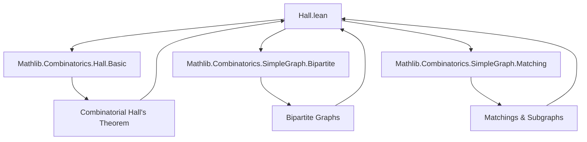

### Technical Brief: `Hall.lean` — Hall’s Marriage Theorem for Bipartite Graphs

---

#### **1. Key Definitions & Theorems**

| Name | Type / Signature | Purpose |
|------|------------------|---------|
| `hall_subgraph` | `{p : Set V} → (f : p → V) → (∀ x, f x ∉ p) → (∀ x, G.Adj x (f x)) → Subgraph G` | Constructs a subgraph from a function `f` mapping each vertex in partition `p` to a unique neighbor outside `p`. Used to encode matchings as subgraphs. |
| `exists_isMatching_of_forall_ncard_le` | `(G.IsBipartiteWith p₁ p₂) → (∀ s ⊆ p₁, s.ncard ≤ |⋃ x ∈ s, G.neighborSet x|) → ∃ M, p₁ ⊆ M.verts ∧ M.IsMatching` | Hall’s theorem for a *partial* matching covering `p₁`, assuming Hall’s condition only on `p₁`. |
| `union_eq_univ_of_forall_ncard_le` | `(G.IsBipartiteWith p₁ p₂) → (∀ s, |s| ≤ |⋃ x ∈ s, G.neighborSet x|) → p₁ ∪ p₂ = univ` | Shows that global Hall condition implies the bipartition spans the entire vertex set. |
| `exists_bijective_of_forall_ncard_le` | `(G.IsBipartiteWith p₁ p₂) → (∀ s, |s| ≤ |⋃ x ∈ s, G.neighborSet x|) → ∃ h : p₁ → p₂, Bijective h ∧ ∀ a, G.Adj a (h a)` | Derives a bijection between partitions under global Hall condition, with adjacency preserved. |
| `exists_isPerfectMatching_of_forall_ncard_le` | `(G.IsBipartiteWith p₁ p₂) → (∀ s, |s| ≤ |⋃ x ∈ s, G.neighborSet x|) → ∃ M, M.IsPerfectMatching` | Full Hall’s marriage theorem: existence of a *perfect* matching under global Hall condition. |

---

#### **2. Naming Conventions**

- **Prefixes**:
  - `hall_`: for helper constructions related to Hall’s theorem (e.g., `hall_subgraph`).
  - `isBipartiteWith_`: for bipartite graph properties (e.g., `isBipartiteWith_neighborSet_subset`).
- **Suffixes**:
  - `_of_forall_ncard_le`: indicates the theorem assumes Hall’s inequality `|s| ≤ |N(s)|`.
  - `_ncard`: used for cardinality-based statements (`ncard`, `biUnion_card`, etc.).
- **Function names**:
  - `f`, `f'`, `g'`: generic functions used in injective/surjective constructions.
  - `b`: bijective function from `p₁ → p₂`.

---

#### **3. Tactic Stack**

Frequently used tactics in this file:

| Tactic | Role |
|--------|------|
| `grind` | Automated simplification + decision procedure for set membership, equality, and decidability (e.g., `DecidablePred`). |
| `simp` / `simp_all` | Simplification using definitional equalities and lemmas (e.g., `Set.mem_union`, `Subtype.exists`). |
| `rcases` / `obtain` | Destructuring existential/universal hypotheses (e.g., `⟨f, hf₁, hf₂⟩`). |
| `rw` | Rewriting using equalities (e.g., `Set.ncard_coe_finset`, `neighborFinset_def`). |
| `have` / `exact` / `apply` | Intermediate lemma introduction and proof completion. |
| `classical` | Enables classical choice (e.g., for constructing functions via choice principles). |
| `refine` | Partial proof construction with holes (e.g., `refine ⟨fun v ↦ b v, ?_, ?_⟩`). |
| `aesop` (implied via `grind`) | For automated reasoning in decidable settings. |

---

#### **4. Proof Logic**

- **Induction**: Not used directly; proofs rely on *set-theoretic* and *choice-based* arguments.
- **Core Strategy**:
  1. **Translate Hall’s combinatorial condition** (`∀ s ⊆ p₁, |s| ≤ |N(s)|`) into a statement about injective functions via `Finset.all_card_le_biUnion_card_iff_exists_injective`.
  2. **Lift function `f`** (injective on `p₁`) to a graph homomorphism via `hall_subgraph`.
  3. **Verify matching properties** using bipartiteness (`disjoint`, `neighborSet_subset`) and adjacency constraints.
  4. For perfect matchings:
     - Use global Hall condition to ensure `p₁ ∪ p₂ = univ`.
     - Construct bijection `b : p₁ → p₂` via Schroeder–Bernstein (or direct bijectivity).
     - Encode `b` as a spanning subgraph with edges `{x, b(x)}`.

- **Key Logical Flow**:
  ```
  Hall condition ⇒ injective f ⇒ f maps into opposite partition ⇒ f defines matching ⇒ hall_subgraph is matching/perfect matching.
  ```

---

#### **5. Imports & Dependencies**

| Module | Role |
|--------|------|
| `Mathlib.Combinatorics.Hall.Basic` | Provides combinatorial Hall’s theorem: `Finset.all_card_le_biUnion_card_iff_exists_injective`. |
| `Mathlib.Combinatorics.SimpleGraph.Bipartite` | Defines bipartite graphs (`IsBipartiteWith`), partitions, and basic properties. |
| `Mathlib.Combinatorics.SimpleGraph.Matching` | Defines matchings (`IsMatching`), perfect matchings (`IsPerfectMatching`), and subgraph operations. |

---

#### **6. Mermaid Diagrams**

##### **Dependency Graph**


##### **Overview of Hall.lean**
```mermaid
flowchart LR
  A[Combinatorial Hall] --> B[Injective f on p₁]
  B --> C[hall_subgraph f]
  C --> D[Matching on p₁]
  C --> E[Perfect Matching (global case)]

  F[Bipartite Graph] -->|IsBipartiteWith p₁ p₂| C
  G[Global Hall Condition] -->|union_eq_univ| E
  H[Bijection p₁ ↔ p₂] -->|exists_bijective_of_forall_ncard_le| E
```

---

#### **7. Theory Scope**

This file bridges **combinatorial set theory** (Hall’s marriage theorem for families of sets) and **graph theory** (matchings in bipartite graphs). It formalizes two canonical forms of Hall’s theorem:

- **Partial matching**: covering one side of a bipartition.
- **Perfect matching**: covering both sides, requiring global Hall condition.

It leverages Lean’s `Set.ncard`, `neighborSet`, and `Subgraph` infrastructure to encode matchings as subgraphs, and uses classical choice to construct the required functions.

--- 

Let me know if you'd like a formalized dependency graph for the entire `Mathlib.Combinatorics` module hierarchy or a proof sketch in natural deduction style.
