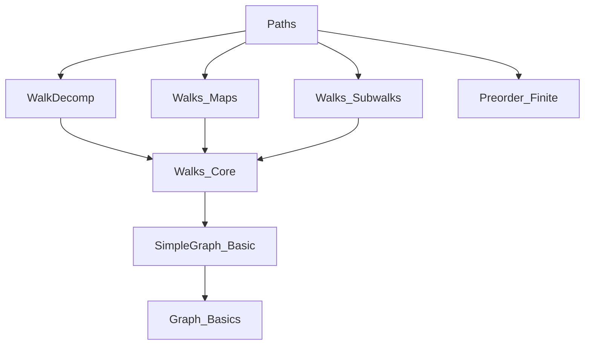
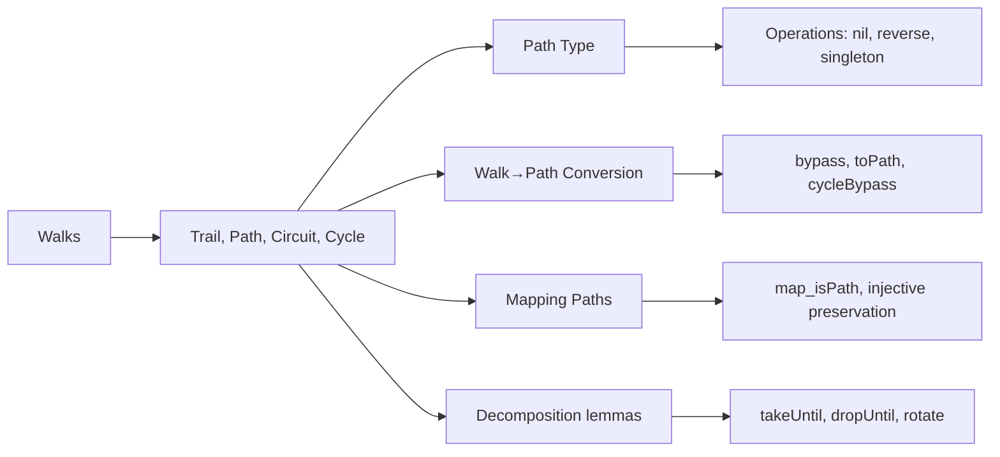

Here is the structured technical metadata extracted from `Paths.lean`:

---

### **1. Key Definitions & Theorems**

| Name | Type / Signature | Purpose |
|------|------------------|---------|
| `IsTrail` | `Walk u v → Prop` | A walk with no repeated edges (`edges.Nodup`). |
| `IsPath` | `Walk u v → Prop` | A walk with no repeated vertices (`support.Nodup`); implies `IsTrail`. |
| `IsCircuit` | `Walk u u → Prop` | A nonempty trail starting and ending at the same vertex (`p ≠ nil`). |
| `IsCycle` | `Walk u u → Prop` | A circuit where only the start/end vertex repeats (`support.tail.Nodup`). |
| `Path u v` | `Type u` | Dependent type of walks `p : Walk u v` such that `p.IsPath`. |
| `Path.nil` | `Path u u` | Length-0 path at a vertex. |
| `Path.singleton` | `Adj u v → Path u v` | Length-1 path between adjacent vertices. |
| `Path.reverse` | `Path u v → Path v u` | Reverse of a path. |
| `bypass` | `Walk u v → Walk u v` | Eliminates repeated vertices from a walk to produce a path. |
| `toPath` | `Walk u v → Path u v` | Converts any walk to a path via `bypass`. |
| `cycleBypass` | `Walk v v → Walk v v` | Variant of `bypass` for closed walks (avoids collapsing to `nil`). |
| `map_isPath_of_injective` | `Injective f → p.IsPath → (p.map f).IsPath` | Paths are preserved under injective graph homomorphisms. |
| `cons_isPath_iff` | `(cons h p).IsPath ↔ p.IsPath ∧ u ∉ p.support` | Characterizes when extending a path by one edge yields a path. |
| `cons_isCycle_iff` | `(cons h p).IsCycle ↔ p.IsPath ∧ s(u,v) ∉ p.edges` | Characterizes when closing a path with an edge yields a cycle. |
| `isPath_def` | `p.IsPath ↔ p.support.Nodup` | Definitional equivalence for paths. |
| `isCycle_def` | `p.IsCycle ↔ p.IsTrail ∧ p ≠ nil ∧ p.support.tail.Nodup` | Definitional equivalence for cycles. |
| `IsPath.getVert_injOn` | `p.IsPath → InjOn p.getVert {i | i ≤ p.length}` | Vertices along a path are injectively indexed. |
| `IsCycle.getVert_injOn` | `p.IsCycle → InjOn p.getVert {i | 1 ≤ i ∧ i ≤ p.length}` | Vertices in a cycle (excluding the repeated start) are injectively indexed. |
| `exists_isPath_forall_isPath_length_le_length` | `∃ p : Path u v, ∀ p', p'.length ≤ p.length` | Maximal-length path exists in finite graphs. |

---

### **2. Naming Conventions**

- **Prefixes**:
  - `isTrail_`, `isPath_`, `isCircuit_`, `isCycle_`: predicates for properties of walks.
  - `cons_`, `reverse_`, `append_`, `dropUntil_`, `takeUntil_`, `rotate_`, `bypass_`, `cycleBypass_`: operations on walks.
  - `map_`: induced maps on walks/paths under graph homomorphisms.
- **Suffixes**:
  - `_def`: definitional characterizations (e.g., `isPath_def`, `isCycle_def`).
  - `_iff`: biconditional lemmas (e.g., `cons_isPath_iff`, `map_isPath_iff_of_injective`).
  - `_copy`: behavior under walk copying (e.g., `isPath_copy`, `isTrail_copy`).
  - `_of_`: derived properties (e.g., `isTrail_of_isSubwalk`, `isPath_of_isSubwalk`).
  - `_le`, `_lt`, `_eq`: inequality/equality lemmas (e.g., `length_bypass_le`, `three_le_length`).
- **Aliases**:
  - `toIsTrail`, `toIsCircuit`, `toIsCycle`: deprecated projections.

---

### **3. Tactic Stack**

Frequently used tactics:
- `simp` / `simp only` / `simp_rw`: simplification with definitional lemmas.
- `rw`: rewriting using equivalences (`↔`) or equalities.
- `induction`: structural induction on walks.
- `aesop`: automated reasoning for simple goals (e.g., `IsPath.of_adj`).
- `grind`: custom tactic (likely from Mathlib’s `Grind` module) for grinding through equalities/inequalities.
- `lia`: linear integer arithmetic solver.
- `convert`: for approximate unification (e.g., in `reverse_isTrail_iff`).
- `cases`: case analysis on walks or hypotheses.
- `intro` / `intro h`: hypothesis introduction.
- `exact`, `refine`, `apply`: proof construction.
- `gcongr`: for congruence reasoning on set/sequence inclusions.

---

### **4. Proof Logic**

- **Inductive structure**: Proofs over `Walk` are typically by induction on the walk (nil or `cons`).
- **Case splitting**: On membership (`u ∈ p.support`), equality (`v = w`), or nilpotency (`p.Nil`).
- **Equivalence chaining**: Many lemmas use `↔`-based reasoning (`isPath_def`, `isCycle_def`) to reduce to list properties (`Nodup`, `count`, `mem`).
- **List-theoretic reasoning**: Core reasoning about `support`, `edges`, `tail`, `append`, `take`, `drop`, `rotate`, `count`, `nodup`, `disjoint`.
- **Injectivity arguments**: For paths/cycles, injectivity of `getVert` over appropriate index ranges is central.
- **Subwalk closure**: Properties like `IsTrail`, `IsPath` are closed under subwalks, prefixes, suffixes, reverses, and maps under injective homomorphisms.

---

### **5. Imports**

- `Mathlib.Combinatorics.SimpleGraph.Connectivity.WalkDecomp`: walk decomposition tools (`takeUntil`, `dropUntil`, `rotate`).
- `Mathlib.Combinatorics.SimpleGraph.Walks.Maps`: mapping walks under graph homomorphisms.
- `Mathlib.Combinatorics.SimpleGraph.Walks.Subwalks`: subwalk relations and properties.
- `Mathlib.Order.Preorder.Finite`: finite preorder machinery (used for maximal element arguments).

---

### **6. Mermaid Diagrams**

#### **Dependency Graph (Module-Level)**

#### **Overview of File Structure**

---

Let me know if you'd like a formalized dependency graph (e.g., for `leanpkg` or `doc-gen`) or a summary of the theory pipeline (e.g., how `bypass` → `toPath` → `Path` type forms a quotient-like normalization).
