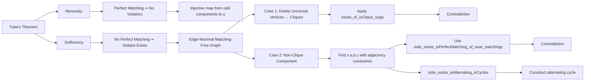

### Technical Brief: `Tutte.lean` — Formalization of Tutte’s Theorem in Lean 4

---

#### **1. Key Definitions & Theorems**

| Name | Type / Signature | Purpose |
|------|------------------|---------|
| `IsTutteViolator G u` | `Prop` | A set `u : Set V` is a *Tutte violator* if the number of odd components in `G.deleteVerts u` strictly exceeds `u.ncard`. Certifies *non-existence* of a perfect matching. |
| `tutte` | `∃ M, M.IsPerfectMatching ↔ ∀ u, ¬G.IsTutteViolator u` | **Main theorem**: Tutte’s theorem — existence of a perfect matching ⇔ no Tutte violators exist. |
| `not_isTutteViolator_of_isPerfectMatching` | `M.IsPerfectMatching → ∀ u, ¬G.IsTutteViolator u` | *Necessity* part: perfect matching ⇒ no violators. |
| `exists_isTutteViolator` | `¬∃ M, M.IsPerfectMatching → Even (Nat.card V) → ∃ u, G.IsTutteViolator u` | *Sufficiency* part: no perfect matching ⇒ existence of a violator (for even-sized graphs). |
| `Subgraph.IsPerfectMatching.exists_of_isClique_supp` | `Even (Nat.card V) → ¬IsTutteViolator G.universalVerts → (∀ K, IsClique K.supp) → ∃ M, M.IsPerfectMatching` | Key structural lemma: if deleting universal vertices yields cliques and no violator, then perfect matching exists. |
| `tutte_exists_isAlternating_isCycles` | `∃ G', G'.IsAlternating M.spanningCoe ∧ G'.IsCycles ∧ ¬G'.Adj x b ∧ G'.Adj a c ∧ G' ≤ G ⊔ edge a c` | Technical lemma constructing an alternating cycle used in the symmetric-difference argument. |
| `tutte_exists_isPerfectMatching_of_near_matchings` | `∃ M, M.IsPerfectMatching` | Core combinatorial lemma: gluing two near-matchings (on `G ⊔ edge x b` and `G ⊔ edge a c`) yields a perfect matching on `G`, under adjacency/non-adjacency constraints. |

---

#### **2. Naming Conventions**

- **Predicate prefixes**:
  - `IsTutteViolator`: property of a set `u`.
  - `IsPerfectMatching`, `IsMatching`, `IsClique`, `IsAlternating`, `IsCycles`: standard graph-theoretic properties.
- **Helper lemmas**:
  - `exists_*`: existential constructions (e.g., `exists_isTutteViolator`, `exists_of_isClique_supp`).
  - `*_mono`: monotonicity lemmas (e.g., `IsTutteViolator.mono`).
  - `*_sup`, `*_inf`, `*_sdiff`: operations on subgraphs (supremum, infimum, symmetric difference).
- **Subgraph operations**:
  - `deleteVerts`, `deleteUniversalVerts`, `universalVerts`, `connectedComponentMk`, `spanningCoe`, `induce`, `comap`.
- **Set-theoretic notation**:
  - `ncard`, `oddComponents`, `verts`, `support`, `compl`, `sdiff`, `image`, `preimage`.

---

#### **3. Tactic Stack**

| Tactic | Frequency | Role |
|--------|-----------|------|
| `aesop` | High | Automated reasoning for set/graph inclusions, disjointness, and simple algebraic simplifications. |
| `simp` / `simp_rw` | Very High | Simplification using definitional equalities, especially for `Subgraph`, `ConnectedComponent`, `deleteVerts`, `universalVerts`. |
| `rw` | High | Rewriting using lemmas like `adj_comm`, `edge_adj`, `symmDiff_def`, `sup_le_iff`. |
| `exact`, `refine`, `obtain`, `choose` | High | Proof construction and existential elimination. |
| `push_neg`, `contrapose!`, `by_contra!` | Medium | Logical manipulations (negation, contradiction). |
| `induction`, `cases` | Medium | Structural induction/cases on `V`, `M`, `K`, `p`, etc. |
| `lift` / `convert` | Low | Typeclass lifting or equality conversion (e.g., `Fintype.ofFinite`). |
| `interval_cases` | Rare | Not used here. |

---

#### **4. Proof Logic**

The proof of **Tutte’s theorem** follows a classical structure:

1. **Necessity** (`not_isTutteViolator_of_isPerfectMatching`):
   - Given a perfect matching `M`, for any `u`, construct an injective map from odd components of `G \ u` to `u`.
   - Uses `ConnectedComponent.odd_matches_node_outside` to associate each odd component with a unique vertex in `u`.

2. **Sufficiency** (`exists_isTutteViolator`):
   - Assume no perfect matching exists and `|V|` is even.
   - Reduce to *edge-maximal* matching-free graph `Gmax`.
   - Consider universal vertices `U = Gmax.universalVerts`.
   - If deleting `U` yields cliques, apply `exists_of_isClique_supp` to get a contradiction.
   - Otherwise, find two non-adjacent vertices `x, a` in a non-clique component, and construct vertices `b, c` with adjacency constraints.
   - Use `tutte_exists_isPerfectMatching_of_near_matchings` to build a perfect matching from two larger matchings, contradicting maximality.

3. **Key technical tools**:
   - **Symmetric difference of matchings** yields disjoint cycles (`symmDiff_isCycles`).
   - **Alternating paths/cycles** constructed via `tutte_exists_isAlternating_isCycles`.
   - **Decomposition via universal vertices** and component-wise matching.

---

#### **5. Imports & Dependencies**

| Module | Role |
|--------|------|
| `Mathlib.Combinatorics.SimpleGraph.Matching` | Core matching theory: `IsMatching`, `IsPerfectMatching`, `IsAlternating`. |
| `Mathlib.Combinatorics.SimpleGraph.Metric` | Distance, paths, connectivity, `Reachable`, `dist`. |
| `Mathlib.Combinatorics.SimpleGraph.Operations` | Graph operations: `deleteVerts`, `deleteUniversalVerts`, `universalVerts`, `induce`, `comap`, `sup`. |
| `Mathlib.Combinatorics.SimpleGraph.UniversalVerts` | Theory of universal vertices and their deletion. |
| `Mathlib.Data.Fintype.Card` | Cardinal arithmetic for finite types (`ncard`, `even`, `odd`). |

---

#### **6. Mermaid Diagrams**

##### **Dependency Graph (Module-Level)**

##### **Theoretical Overview (Proof Structure)**

---

#### **7. Summary**

This file formalizes **Tutte’s theorem** in Lean 4, a cornerstone of matching theory. It bridges combinatorial structure (odd components after vertex deletion) with existence of perfect matchings. The proof leverages:
- Structural decomposition via *universal vertices*,
- Symmetric differences of matchings,
- Alternating path/cycle constructions,
- Classical logic (via `by_contra!`, `contrapose!`).

The formalization is highly modular, with clear separation between:
- *Global structure* (`universalVerts`, `deleteUniversalVerts`),
- *Local matching glueing* (`tutte_exists_isPerfectMatching_of_near_matchings`),
- *Cardinality arguments* (`ncard`, `oddComponents`, `even`, `odd`).

It exemplifies modern Lean 4 proof engineering: expressive, reusable, and grounded in `Mathlib`’s rich graph theory library.
