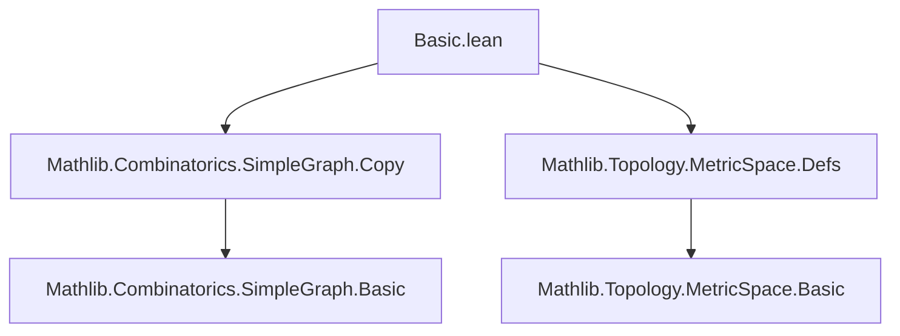

**Technical Brief: `Basic.lean` — Unit-Distance Graph Embeddings in Lean 4**

---

### 1. KEY DEFINITIONS & THEOREMS

| Name | Type / Structure | Purpose |
|------|------------------|---------|
| `UnitDistEmbedding` | `structure` | Represents a vertex embedding `p : V ↪ E` into a metric space `E` such that adjacent vertices are at distance 1. |
| `UnitDistEmbedding.unit_dist` | `∀ {u v}, G.Adj u v → dist (p u) (p v) = 1` | Enforces the unit-distance condition on edges. |
| `UnitDistEmbedding.bot` | `p : V ↪ E → (⊥ : SimpleGraph V).UnitDistEmbedding E` | Constructs a unit-distance embedding for the empty graph (no edges). |
| `UnitDistEmbedding.subsingleton` | `[Subsingleton V] → x : E → G.UnitDistEmbedding E` | Constructs a unit-distance embedding when the vertex type is subsingleton (i.e., at most one vertex). |
| `UnitDistEmbedding.copy` | `f : H.Copy G → H.UnitDistEmbedding E` | Transfers a unit-distance embedding along a `Copy` embedding (i.e., an induced subgraph embedding). |
| `UnitDistEmbedding.embed` | `f : H ↪g G → H.UnitDistEmbedding E` | Special case of `copy` for graph embeddings (`↪g`). |
| `UnitDistEmbedding.iso` | `e : G ≃g H → H.UnitDistEmbedding E` | Transfers a unit-distance embedding across a graph isomorphism. |

> **Note**: No theorems are proven in this file — only definitions and constructors are given.

---

### 2. NAMING CONVENTIONS

- **Prefixes**:
  - `bot`: for the bottom/empty graph case.
  - `subsingleton`: reflects the type-class constraint used.
  - `copy`, `embed`, `iso`: reflect the morphism type used for transfer.
- **Suffixes**:
  - `unit_dist`: used for the property that adjacent vertices are at distance 1.
- **Structure fields**:
  - `p`: the underlying injective map.
  - `unit_dist`: the proof of the unit-distance condition.

---

### 3. TACTIC STACK

The file uses only basic tactics in proofs (mostly in `by`-blocks):

| Tactic | Occurrences | Purpose |
|--------|-------------|---------|
| `simp` | 3 | Simplifies goals using definitional equalities and `Subsingleton` facts. |
| `aesop` | 0 | Not used. |
| `ring` | 0 | Not used. |
| `rw`, `rfl`, `exact` | 0 | Not used explicitly. |
| `have`, `simp at` | 1 | In `subsingleton`, to derive contradiction or equality from subsingleton property. |

> **Dominant tactic**: `simp` — used to discharge trivial equalities and simplify goals involving `dist`, `Subsingleton`, and empty graphs.

---

### 4. PROOF LOGIC

- **Structure of proofs**:
  - All proofs are *short*, *goal-directed*, and *definitionally justified*.
  - `bot`: `simp` discharges `unit_dist` because the empty graph has no edges.
  - `subsingleton`: uses `Subsingleton.elim u v` to show any two vertices are equal, then `simp` to reduce `ha : G.Adj u v` to `False`, which is eliminated.
  - `copy`, `embed`, `iso`: proofs are immediate by definition — `unit_dist` follows from composition and the original `unit_dist` proof.

- **Logical flow**:
  - Definitions are *constructive* and *functorial*.
  - Transfer lemmas (`copy`, `embed`, `iso`) are *instances of precomposition* with graph morphisms.

---

### 5. IMPORTS

| Module | Purpose |
|--------|---------|
| `Mathlib.Combinatorics.SimpleGraph.Copy` | Provides `Copy`, `toEmbedding`, `toHom`, and graph embedding infrastructure. |
| `Mathlib.Topology.MetricSpace.Defs` | Provides `MetricSpace`, `dist`, and basic metric space definitions. |

> **Scope**: This module sits at the intersection of *combinatorics* (simple graphs) and *metric geometry* (distance constraints), forming the foundation for Euclidean graph embedding problems.

---

### 6. DEPENDENCY & THEORY OVERVIEW

#### Mermaid Diagram: Module Dependencies

#### Mermaid Diagram: Theory Flow (Conceptual)

#### Overview

- This module defines the *semantic* notion of a unit-distance embedding: a vertex injection into a metric space preserving unit distances on edges.
- It supports *functorial transfer* along:
  - **Graph embeddings** (`embed`)
  - **Graph isomorphisms** (`iso`)
  - **Copy embeddings** (`copy`) — a more general induced subgraph embedding.
- Designed for extensibility: future work may define:
  - `UnitDistGraph` (the graph of unit distances in a metric space),
  - `chromatic_number_le_of_unit_dist_embedding`,
  - embeddings into `ℝⁿ`, `𝕊ⁿ`, etc.

---

### 7. MISSING ELEMENTS (for future work)

- No theorems about *existence* or *non-existence* of unit-distance embeddings.
- No connection to known graphs (e.g., unit-distance graphs like the Moser spindle).
- No metric-specific lemmas (e.g., triangle inequality used to constrain embeddings).

---

**End of Brief**
