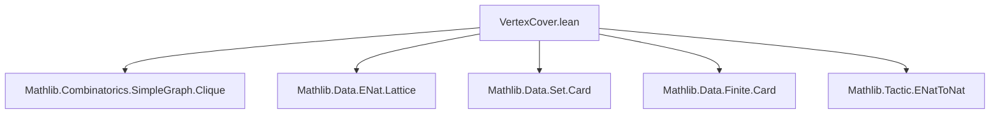
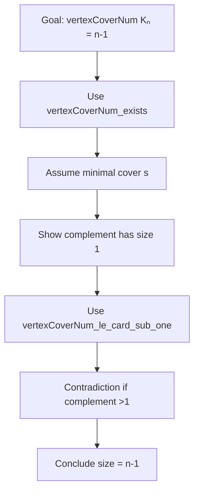

**Technical Brief: `VertexCover.lean`**

---

### 1. **Key Definitions & Theorems**

| Name | Type / Signature | Purpose |
|------|------------------|---------|
| `IsVertexCover` | `SimpleGraph.IsVertexCover (G : SimpleGraph V) (c : Set V) : Prop` | Predicate stating that set `c` intersects every edge of `G`. Formally: `∀ ⦃v w : V⦄, G.Adj v w → v ∈ c ∨ w ∈ c`. |
| `vertexCoverNum` | `SimpleGraph.vertexCoverNum (G : SimpleGraph V) : ℕ∞` | Minimal cardinality of a vertex cover of `G`, defined as the infimum over encardinalities of all vertex covers. |
| `isVertexCover_empty` | `IsVertexCover G ∅ ↔ G = ⊥` | Empty set is a vertex cover iff graph is empty. |
| `isVertexCover_univ` | `IsVertexCover G .univ` | Universal set is always a vertex cover. |
| `isIndepSet_compl_iff_isVertexCover` | `G.IsIndepSet cᶜ ↔ IsVertexCover G c` | Complement of a vertex cover is an independent set, and vice versa. |
| `vertexCoverNum_bot` | `vertexCoverNum ⊥ = 0` | Vertex cover number of empty graph is 0. |
| `vertexCoverNum_eq_zero` | `vertexCoverNum G = 0 ↔ G = ⊥` | Characterization of graphs with zero vertex cover number. |
| `vertexCoverNum_top` | `vertexCoverNum (completeGraph V) = ENat.card V - 1` | Vertex cover number of complete graph is one less than number of vertices (for nontrivial `V`). |
| `vertexCoverNum_mono` | `G ≤ G' → vertexCoverNum G ≤ vertexCoverNum G'` | Monotonicity of vertex cover number under edge inclusion. |
| `vertexCoverNum_congr` | `G ≃g H → vertexCoverNum G = vertexCoverNum H` | Invariance under graph isomorphism. |
| `vertexCoverNum_le_encard_edgeSet` | `vertexCoverNum G ≤ G.edgeSet.encard` | Vertex cover number bounded above by number of edges. |

---

### 2. **Naming Conventions**

- **Predicates**: `isVertexCover_*`, `isIndepSet_*`, `isContained_*`, `vertexCoverNum_*`
- **Relational properties**: `*_mono`, `*_congr`, `*_le_*`, `*_lt_*`
- **Set-theoretic operations**: `*_preimage`, `*_image`, `*_compl`, `*_subset`
- **Graph-theoretic operations**: `*_bot`, `*_top`, `*_of_subsingleton`, `*_finite`, `*_edgeSet`
- **Quantifier-style lemmas**: `*_exists`, `*_le_iff`, `*_ne_top`, `*_lt_card`

Prefixes like `isVertexCover_`, `vertexCoverNum_`, and `isIndepSet_` dominate.

---

### 3. **Tactic Stack**

Frequently used tactics in proofs:

- `simp` / `simp_all` — for simplifying definitions and using `@[simp]` lemmas.
- `grind` — custom tactic (likely from Mathlib’s `grind` library) for automated reasoning with relations and set operations.
- `enat_to_nat` — converts `ℕ∞`-valued goals to `ℕ` when finite.
- `nontriviality`, `subsingleton`, `finite` — context generators for case analysis.
- `obtain`, `have`, `by_contra!` — standard proof construction.
- `rw`, `grw` — rewriting with equalities (especially `grw` for `ENat`-specific rewrites).
- `exact`, `refine`, `apply` — for constructing proofs term-by-term.
- `aesop` not explicitly used, but `grind` likely subsumes its role.

---

### 4. **Proof Logic**

- **Inductive/constructive style**: Proofs often proceed by:
  - Unfolding definitions (`IsVertexCover`, `vertexCoverNum`, etc.).
  - Using `simp` with `@[simp]` lemmas (e.g., `isVertexCover_empty`, `isIndepSet_compl_iff_isVertexCover`).
  - Leveraging set-theoretic equivalences (e.g., complement ↔ independent set).
  - Using `ENat`-specific reasoning (e.g., `ENat.forall_natCast_le_iff_le`, `tsub_eq_zero_of_le`).
  - Constructing witnesses via `vertexCoverNum_exists` or `exists_of_le_vertexCoverNum`.
  - Applying monotonicity/congruence lemmas (`vertexCoverNum_mono`, `vertexCoverNum_congr`) for structural arguments.

- **Common proof patterns**:
  - *Equivalence proofs*: Prove both directions using `refine ⟨fun h ↦ ?, fun h ↦ ?⟩`.
  - *Cardinality bounds*: Use `ENat` lemmas like `le_sub_one_of_lt`, `add_le_of_le_tsub_right_of_le`.
  - *Isomorphism invariance*: Use `preimage`/`image` under isomorphism and `RelIso` properties.

---

### 5. **Imports & Dependencies**

**Core imports**:
- `Mathlib.Combinatorics.SimpleGraph.Clique` — clique theory, adjacency, independence.
- `Mathlib.Data.ENat.Lattice` — extended naturals (`ℕ∞`) with lattice structure.
- `Mathlib.Data.Set.Card` — cardinality of sets (`encard`).
- `Mathlib.Data.Finite.Card` — finite cardinality.
- `Mathlib.Tactic.ENatToNat` — conversion from `ℕ∞` to `ℕ` when finite.

**Key abstractions used**:
- `SimpleGraph`, `Adj`, `edgeSet`, `IsIndepSet`, `IsAntichain`.
- `Set.encard`, `Set.image`, `Set.preimage`, `Set.compl`, `Set.diff`.
- `ENat` arithmetic: `tsub`, `add`, `le`, `lt`, `ne_top`, `card V`.
- `FunLike`, `HomClass`, `RelIso`, `Embedding`.

---

### 6. **Mermaid Diagrams**

#### **Dependency Graph (Module-Level)**



#### **Conceptual Overview (Theory Flow)**

```mermaid
flowchart LR
  subgraph Definitions
    D1[IsVertexCover] --> D2[vertexCoverNum]
  end

  subgraph Equivalences
    E1[Complement ↔ Independent Set] --> D1
  end

  subgraph Properties
    P1[Monotonicity] --> D2
    P2[Isomorphism Invariance] --> D2
    P3[Bounds (edges, vertices)] --> D2
  end

  subgraph Special Cases
    S1[Empty Graph] --> D2
    S2[Complete Graph] --> D2
    S3[Subsingleton] --> D2
  end

  D1 --> E1
  D2 --> P1 & P2 & P3
  D2 --> S1 & S2 & S3
```

#### **Proof Strategy Flow (Example: `vertexCoverNum_top`)**



---

### 7. **Domain-Specific AI Agent Notes**

- **Key reasoning patterns**: Equational reasoning over `ENat`, complementarity with independent sets, graph homomorphism invariance.
- **Critical lemmas for automation**: `isIndepSet_compl_iff_isVertexCover`, `vertexCoverNum_mono`, `vertexCoverNum_congr`, `vertexCoverNum_le_encard_edgeSet`.
- **Common pitfalls**: Confusing `card V` (finite) vs `ENat.card V` (possibly infinite), handling `tsub` (truncated subtraction) carefully.
- **Suggested AI focus**: Automate `simp` + `grind` + `enat_to_nat` pipelines for vertex cover bounds; recognize isomorphism-based reductions.

--- 

Let me know if you'd like a formalized tactic sketch or a proof assistant-assisted verification pipeline for this module.
