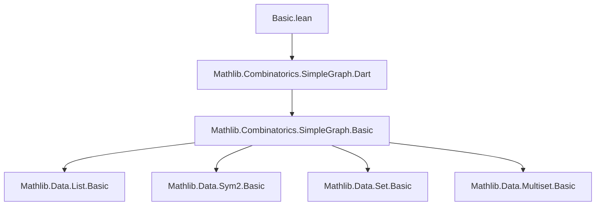
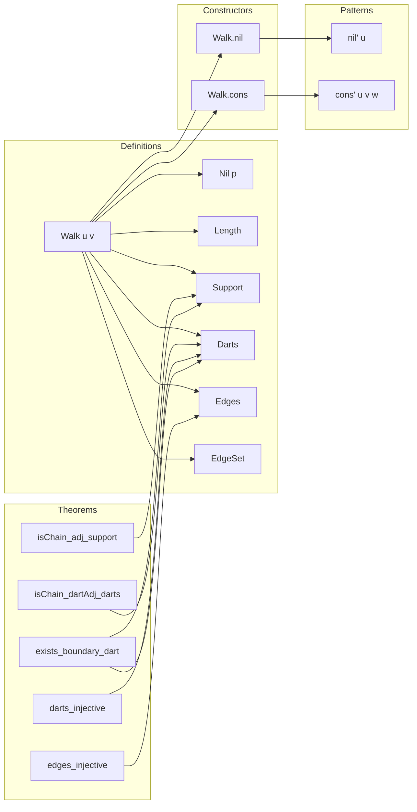

### Technical Brief: `Basic.lean` — Walks in Simple Graphs

---

#### **1. Key Definitions & Theorems**

| Name | Type / Signature | Purpose |
|------|------------------|---------|
| `Walk` | `V → V → Type u` | Inductive type of walks between vertices in a simple graph. |
| `Walk.nil` | `Walk u u` | Empty walk (length 0) at a vertex. |
| `Walk.cons` | `G.Adj u v → Walk v w → Walk u w` | Extend a walk by one edge. |
| `Walk.nil'` | `V → Walk u u` | Explicit pattern for `nil`. |
| `Walk.cons'` | `V → V → V → G.Adj u v → Walk v w → Walk u w` | Explicit pattern for `cons`. |
| `Walk.length` | `Walk u v → ℕ` | Number of edges in a walk. |
| `Walk.support` | `Walk u v → List V` | List of vertices visited in order (including start and end). |
| `Walk.darts` | `Walk u v → List G.Dart` | List of darts (directed edges) traversed. |
| `Walk.edges` | `Walk u v → List (Sym2 V)` | List of undirected edges traversed. |
| `Walk.edgeSet` | `Walk u v → Set (Sym2 V)` | Set of edges traversed (coercion of `edges`). |
| `Walk.Nil` | `Walk v w → Prop` | Predicate for empty walks (avoids endpoint defeq issues). |
| `Adj.toWalk` | `G.Adj u v → G.Walk u v` | One-edge walk from an adjacent pair. |
| `eq_of_length_eq_zero` | `p.length = 0 → u = v` | A walk of length 0 is trivial. |
| `adj_of_length_eq_one` | `p.length = 1 → G.Adj u v` | A walk of length 1 is a single edge. |
| `isChain_adj_support` | `List.IsChain G.Adj p.support` | Vertices in `support` form a chain of adjacent pairs. |
| `isChain_dartAdj_darts` | `List.IsChain G.DartAdj p.darts` | Darts in `darts` form a chain under dart adjacency. |
| `edges_injective` | `Function.Injective Walk.edges` | Walks are uniquely determined by their edge list. |
| `darts_injective` | `Function.Injective Walk.darts` | Walks are uniquely determined by their dart list. |
| `mem_darts_iff_infix_support` | `⟨⟨u', v'⟩, h⟩ ∈ p.darts ↔ [u', v'] <:+: p.support` | A dart appears in `darts` iff its endpoints appear consecutively in `support`. |
| `exists_boundary_dart` | `(u ∈ S) ∧ (v ∉ S) → ∃ d ∈ p.darts, d.fst ∈ S ∧ d.snd ∉ S` | Discrete intermediate value property for walks across sets. |

---

#### **2. Naming Conventions**

- **Prefixes**:
  - `isChain_`: predicates asserting list is a chain under a relation.
  - `mem_`: membership lemmas (e.g., `mem_support`, `mem_edgeSet`).
  - `length_`: length-related properties.
  - `support_`, `darts_`, `edges_`, `edgeSet_`: field-specific lemmas.
  - `nil_`, `cons_`: structural lemmas for constructors.

- **Suffixes**:
  - `_iff`: characterizations as biconditionals.
  - `_nil`, `_cons`: behavior on constructors.
  - `_tail`, `_dropLast`, `_head`, `_getLast`: list operations on `support`.
  - `_infix`: consecutive subsequence properties.

- **Special**:
  - `'` suffix (e.g., `nil'`, `cons'`) for *pattern* abbreviations with explicit arguments.
  - `'_` (e.g., `chain'_adj_support`) for deprecated aliases.

---

#### **3. Tactic Stack**

Frequently used tactics in proofs:

| Tactic | Usage |
|--------|-------|
| `induction` | Structural induction on walks (primary proof method). |
| `simp` / `simp [*]` | Simplify using definitional equalities and lemmas. |
| `cases` | Case analysis on `p : Walk u v`. |
| `aesop` | Automated reasoning for simple goals (e.g., `mem_support_iff_exists_mem_edges`). |
| `grind` | Custom simplifier for `getElem`-based reasoning (e.g., `fst_darts_getElem`). |
| `rfl` | Reflexivity for definitional equalities. |
| `convert` + `grind` | For equational reasoning with index-based access. |
| `exact` / `intro` / `apply` | Standard natural deduction. |
| `nofun` | To discharge `¬ ¬ p.Nil` goals via `not_nil_cons`. |

---

#### **4. Proof Logic**

- **Inductive structure**: Proofs almost always proceed by induction on the walk `p`.
- **Base case (`nil`)**: Trivial; often `rfl` or `simp`.
- **Inductive step (`cons h p`)**:
  - Use IH on `p`.
  - Unfold definitions (`support_cons`, `darts_cons`, etc.).
  - Apply list lemmas (`List.mem_cons`, `List.nodup_cons`, `List.isChain_cons`).
- **Case splits** on `u = v`, `p.Nil`, or `p.length = 0/1` are common.
- **Dependent type handling**: `Nil` predicate avoids endpoint mismatch; `notNilRec` enables recursion on nonempty walks.
- **Equational reasoning**: Heavy use of `simp` with `[grind]` attributes for `getElem`-based lemmas.

---

#### **5. Imports & Dependencies**

- **Core imports**:
  ```lean
  Mathlib.Combinatorics.SimpleGraph.Dart
  ```
- **Implicit dependencies** (via `Mathlib`):
  - `Mathlib.Data.List.Basic`
  - `Mathlib.Data.List.Nodup`
  - `Mathlib.Data.List.Infix`
  - `Mathlib.Data.Sym2.Basic`
  - `Mathlib.Data.Set.Basic`
  - `Mathlib.Data.Multiset.Basic`
  - `Mathlib.Logic.Decidable`
  - `Mathlib.Tactic.Aesop`
  - `Mathlib.Tactic.Grind`

- **Module scope**: `SimpleGraph` namespace; universe `u` for vertex type `V : Type u`.

---

#### **6. Mermaid Diagrams**

##### **Dependency Graph (Module Level)**



##### **Overview of Walk Theory in This File**



---

#### **7. Theory Context & Role**

- **Purpose**: Provides foundational definitions and lemmas for *walks* in simple graphs, serving as the basis for paths, cycles, connectivity, and more advanced graph-theoretic constructions.
- **Design choices**:
  - Uses *darts* (directed edges) to model walks, enabling precise tracking of direction.
  - `support` includes both endpoints; `darts`/`edges` are derived.
  - `Nil` predicate avoids dependent equality issues when reasoning about empty walks.
  - `edges_injective` and `darts_injective` ensure uniqueness of walks from their edge/dart sequences.
- **Relation to homotopy theory**: Clarifies that `Walk` corresponds to *paths* in homotopy theory (not graph-theoretic paths), with warnings in docstring.

--- 

Let me know if you'd like a formalization plan for extending this with *paths*, *trails*, or *cycles*, or for building a theory of connectivity.
