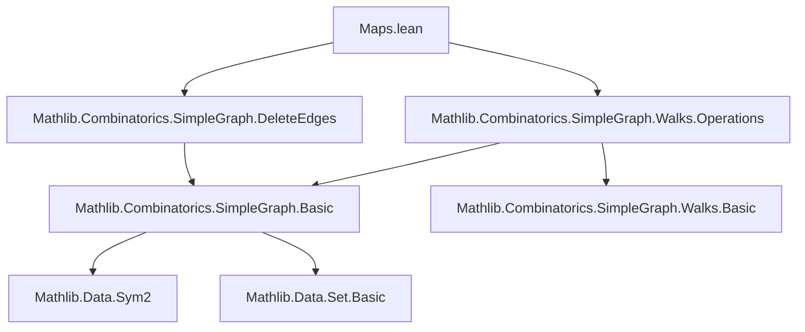

### Technical Brief: `Maps.lean` — Walk Mapping in Simple Graphs (Lean 4 / Mathlib)

---

#### **1. Key Definitions & Theorems**

| Name | Type / Signature | Purpose |
|------|------------------|---------|
| `map` | `G →g G' → G.Walk u v → G'.Walk (f u) (f v)` | Pushforward of walks along a graph homomorphism `f`. |
| `mapLe` | `G ≤ G' → G.Walk u v → G'.Walk u v` | Special case of `map` for inclusion of a subgraph into a supergraph. |
| `transfer` | `G.Walk u v → (∀ e ∈ p.edges, e ∈ H.edgeSet) → H.Walk u v` | Transfer a walk into another graph containing its edges. |
| `induce` | `G.Walk u v → (∀ x ∈ support, x ∈ s) → (G.induce s).Walk ...` | Lift a walk fully contained in vertex set `s` to the induced subgraph `G[s]`. |
| `toDeleteEdges` | `G.Walk v w → (∀ e ∈ p.edges, e ∉ s) → (G.deleteEdges s).Walk v w` | Transfer a walk avoiding edge set `s` to the graph with `s` deleted. |
| `toDeleteEdge` | `e ∉ p.edges → (G.deleteEdges {e}).Walk v w` | Special case of `toDeleteEdges` for a single edge. |

**Key Theorems (with significance):**

| Theorem | Statement | Use |
|--------|-----------|-----|
| `map_nil`, `map_cons` | `nil.map f = nil`, `cons h p.map f = cons (f.map_adj h) (p.map f)` | Definitional behavior of `map`. |
| `map_id`, `map_map` | `p.map id = p`, `(p.map f).map f' = p.map (f' ∘ f)` | Functoriality of `map`. |
| `length_map`, `support_map`, `edges_map` | Length, support, and edge list preserved under `map`. | Structural consistency. |
| `map_append`, `reverse_map` | `map` commutes with `append` and `reverse`. | Algebraic compatibility. |
| `map_injective_of_injective` | If `f` injective, then `map f` injective on walks. | Faithfulness of `map` under injectivity. |
| `transfer_self` | `p.transfer G edges_subset = p` | Identity transfer. |
| `transfer_eq_map_ofLE` | `p.transfer H hp = p.map (.ofLE GH)` when `G ≤ H`. | Relates `transfer` to `mapLe`. |
| `induce_nil`, `induce_cons` | Inductive definition of `induce`. | Constructive lifting to induced subgraph. |
| `map_induce` | `(w.induce s hw).map (induceHom.toHom) = w` | Inclusion of induced subgraph recovers original walk. |
| `map_toDeleteEdges_eq` | `map (.ofLe (deleteEdges_le s)) (p.toDeleteEdges s hp) = p` | `toDeleteEdges` is a section of the inclusion map. |

---

#### **2. Naming Conventions**

- **Prefixes**:
  - `map_`: for operations induced by graph homomorphisms (`map`, `mapLe`, `map_induce`, `map_toDeleteEdges_eq`).
  - `transfer_`: for re-embedding walks into larger or different graphs (`transfer`, `transfer_append`, `transfer_self`).
  - `induce_`: for lifting walks to induced subgraphs (`induce`, `induce_nil`, `induce_cons`).
  - `toDeleteEdges`, `toDeleteEdge`: for walks avoiding or excluding edges.

- **Suffixes**:
  - `_eq_`: for equalities involving structural operations (`edges_map`, `support_map`, `length_map`).
  - `_of_`: for specialized cases (`mapLe`, `toDeleteEdge`, `transfer_eq_map_ofLE`).

- **Adjectives**:
  - `injective`, `support`, `edgeSet`, `darts`, `getVert`: indicate structural properties preserved.

---

#### **3. Tactic Stack**

Frequent tactics used in proofs:

- `induction p`: structural induction on walks (`nil`, `cons`).
- `simp [*]`, `simp only [...]`: simplify using definitional lemmas and `@[simp]` theorems.
- `grind`: used in `map_injective_of_injective` for automated case analysis.
- `subst_vars`: for equality substitution.
- `ext`: extensionality for set equality (e.g., `edgeSet_map`).
- `contrapose!`, `simp +contextual`: for negated membership reasoning (e.g., `toDeleteEdge`).

---

#### **4. Proof Logic**

- **Inductive structure**: All proofs about walks are by induction on the walk (`nil`, `cons`).
- **Case analysis**: On walk shape (`nil` vs `cons`) and equality of endpoints.
- **Equality reasoning**: Heavy use of `rfl`, `congr_arg`, `subst_vars`, and `simp` to handle vertex/edge equality.
- **Transfer via inclusion**: Many results reduce to `map` via `ofLE` or `transfer_eq_map_ofLE`.
- **Preservation lemmas**: Prove that operations like `map`, `transfer`, `induce` preserve length, support, edges, etc., often via `induction` + `simp`.

---

#### **5. Imports & Dependencies**

**Core imports (explicit):**
```lean
import Mathlib.Combinatorics.SimpleGraph.DeleteEdges
import Mathlib.Combinatorics.SimpleGraph.Walks.Operations
```

**Implicit dependencies (via `SimpleGraph` and `Walk`):**
- `Mathlib.Combinatorics.SimpleGraph.Basic`
- `Mathlib.Combinatorics.SimpleGraph.Hom`
- `Mathlib.Combinatorics.SimpleGraph.Induce`
- `Mathlib.Data.List.Basic` (for `append`, `reverse`, `mem`, `map`)
- `Mathlib.Data.Set.Basic` (for `image`, `mem_diff`, `subset`)
- `Mathlib.Data.Sym2` (for undirected edges as symmetric pairs)

---

#### **6. Mermaid Diagrams**

##### **Dependency Graph (Module-Level)**



##### **Overview of Walk Mapping Operations**

```mermaid
graph LR
  A[Walk p in G] -->|graph hom f: G →g G'| B[p.map f in G']
  A -->|inclusion G ≤ G'| C[p.mapLe in G']
  A -->|edges ⊆ H| D[p.transfer in H]
  A -->|support ⊆ s| E[p.induce in G[s]]
  A -->|edges ∩ s = ∅| F[p.toDeleteEdges in G.deleteEdges s]
  A -->|e ∉ p.edges| G[p.toDeleteEdge in G.deleteEdges {e}]
```

##### **Lattice of Graph Inclusions & Maps**

```mermaid
graph TD
  G[G] -->|ofLE (G ≤ H)| H[H]
  G -->|deleteEdges s| D[G.deleteEdges s]
  D -->|ofLE| H
  G -->|induce s| I[G.induce s]
  I -->|induceHomOfLE (s ⊆ s')| I'[G.induce s']
  G -->|f: G →g G'| G'[G']
```

---

#### **7. Theory Context**

This module formalizes **functorial and transfer operations on walks** in the context of **simple graphs**, building on:
- `SimpleGraph.Hom` (graph homomorphisms),
- `SimpleGraph.Walks` (walks, append, reverse, support, edges),
- `SimpleGraph.DeleteEdges` and `Induce` (subgraph constructions).

It serves as a foundational layer for:
- **Graph embeddings and simulations**,
- **Path lifting in covering graphs**,
- **Local-to-global reasoning** (e.g., working in subgraphs or edge-deleted graphs),
- **Verification of path properties under graph transformations**.

The design reflects Lean’s emphasis on *definitional equality* and *explicit vertex equality*, hence the need for `copy` and equality-carrying lemmas (`map_eq_of_eq`, `map_induce_induceHomOfLE`).

--- 

Let me know if you'd like a formalized summary in `lean` docstring format or a visualization of the `induce`/`transfer` interaction lattice.
