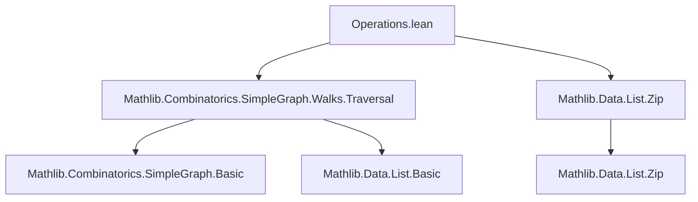
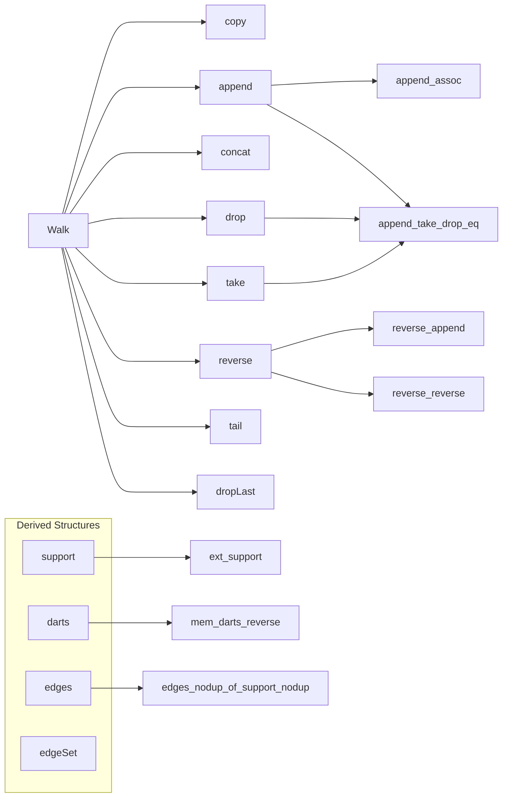
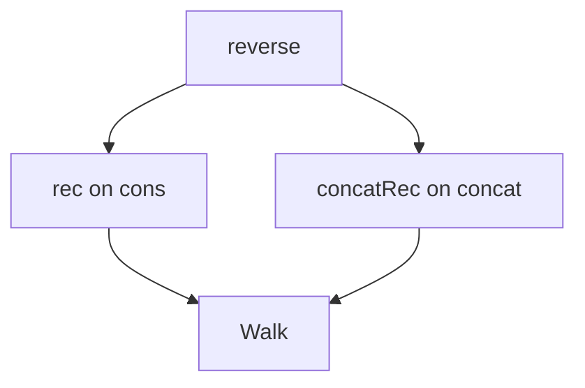

### Technical Brief: `Operations.lean` — Walk Operations in `SimpleGraph`

---

#### **1. Key Definitions & Theorems**

| Name | Type / Signature | Purpose |
|------|------------------|---------|
| `copy` | `p.copy hu hv : G.Walk u' v'` | Adjust endpoints of a walk via equalities; enables definitional flexibility. |
| `append` | `p.append q : G.Walk u w` | Concatenate two compatible walks (`p : u ↝ v`, `q : v ↝ w`). |
| `concat` | `p.concat h : G.Walk u w` | Append a single edge `h : v ~ w` to the end of `p : u ↝ v`. |
| `reverse` | `p.reverse : G.Walk v u` | Reverse a walk; inverse under `append`. |
| `drop` | `p.drop n : G.Walk (p.getVert n) v` | Remove first `n` darts (edges) from a walk. |
| `take` | `p.take n : G.Walk u (p.getVert n)` | Take first `n` darts of a walk. |
| `tail` | `p.tail : G.Walk (p.snd) v` | Remove first dart (`drop 1`). |
| `dropLast` | `p.dropLast : G.Walk u p.penultimate` | Remove last dart. |
| `reverseAux` | `p.reverseAux q` | Auxiliary for `reverse`; used in inductive proofs. |
| `concatRec` | Recursor on `concat` | Induction principle over walks built from `concat`, dual to `rec` (built on `cons`). |

**Key Theorems**:
- `append_assoc`: `append` is associative.
- `reverse_append`: `(p.append q).reverse = q.reverse.append p.reverse`.
- `reverse_reverse`: `p.reverse.reverse = p`.
- `ext_getVert`: Walks are equal if all vertex positions match.
- `ext_support`: Walks are equal if their supports (vertex lists) match.
- `append_take_drop_eq`: `p.take n ++ p.drop n = p`.
- `concat_inj`: Injectivity of `concat` under equality.

---

#### **2. Naming Conventions**

- **Prefixes**:
  - `copy_`, `append_`, `concat_`, `reverse_`, `drop_`, `take_`, `tail_`, `dropLast_`: indicate operation names.
  - `mem_`, `support_`, `darts_`, `edges_`, `edgeSet_`: indicate membership or derived structures.
- **Suffixes**:
  - `_rfl`, `_rfl_rfl`: for simplification lemmas where equalities are `rfl`.
  - `_heq`, `_eq`: distinguish homotopy (`≈`) vs definitional equality (`=`).
  - `_iff`: for biconditional lemmas (e.g., `nil_append_iff`).
  - `_of_not_nil`, `_of_length_le`: conditional variants.
- **Auxiliary**:
  - `reverseAux`, `concatRecAux`: internal helpers for recursion/induction.

---

#### **3. Tactic Stack**

Frequent tactics used:
- `induction p`: structural induction on walks (`cons`/`nil`).
- `simp [*]`, `simp only [...]`, `simp_rw [...]`: heavily used for simplification, especially with `@[simp]` lemmas.
- `subst_vars`: for eliminating equalities in `copy` lemmas.
- `rfl`, `congr`, `exact`: basic proof steps.
- `grind`: custom tactic (likely from Mathlib) for grinding through list/walk equalities.
- `cases p`: case analysis on walks or naturals.
- `rw [...]`, `trans`, `apply eq_of_heq`: for equational reasoning, especially with `heq`.
- `intro`, `obtain`, `split_ifs`: for logical reasoning and case splits.

---

#### **4. Proof Logic**

- **Inductive Structure**: Proofs typically proceed by induction on the walk `p`, using `cons`/`nil` structure.
- **Case Splitting**: Often split on `n = 0`, `p.Nil`, or `i < p.length`.
- **Equality Reasoning**:
  - Use `heq` (heterogeneous equality) for walks with different endpoints (e.g., `drop_add_heq`).
  - Convert `heq` to `eq` via `eq_of_heq` and `copy`.
- **Simplification Strategy**:
  - Push `copy` outward (simp-normal form).
  - Use `support`/`darts`/`edges` lemmas to reduce to list operations.
- **Bidirectional Reasoning**:
  - `ext_getVert`, `ext_support`: equivalence between syntactic equality and semantic equality (vertices or support).
  - `mem_support_append_iff`: membership in support ↔ membership in either part.

---

#### **5. Imports**

- `Mathlib.Combinatorics.SimpleGraph.Walks.Traversal`: core walk definitions and traversal properties.
- `Mathlib.Data.List.Zip`: for zip-related list utilities (used in `Dart.toProd`, `unzip`, etc.).

---

#### **6. Mermaid Diagrams**

##### **Dependency Graph (Module-Level)**

##### **Walk Operations Overview**

##### **Induction Principles**

---

#### **7. Theory Scope**

This module formalizes **algebraic and operational properties of walks** in simple graphs, focusing on:
- **Concatenation & reversal** as monoid-like operations (with `nil` as unit, `reverse` as involution).
- **Decomposition** via `take`/`drop`/`tail`/`dropLast`.
- **Equational theory** with simplification lemmas for `length`, `support`, `darts`, `edges`, `edgeSet`.
- **Induction principles** dual to standard `rec` (e.g., `concatRec` for end-induction).
- **Support-based reasoning** (`ext_support`, `ext_getVert`) to prove walk equality.

It serves as a foundational layer for higher-level graph algorithms (e.g., Eulerian trails, shortest paths), where manipulating and reasoning about walk structure is essential.

--- 

Let me know if you'd like a formalized dependency graph of the entire `SimpleGraph.Walk` hierarchy or a proof automation strategy for this module.
