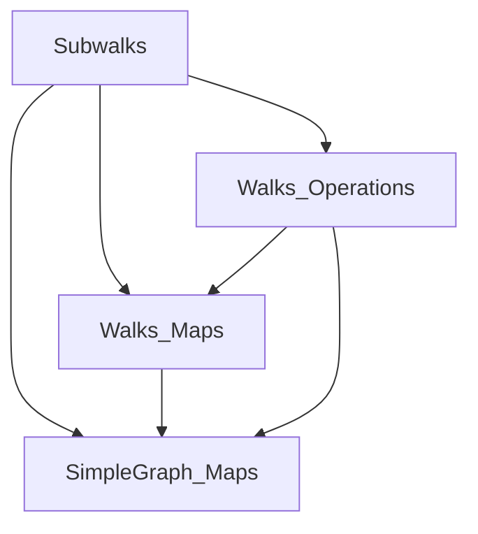
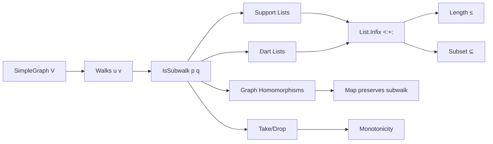

### Technical Brief: `Subwalks.lean`

---

#### **1. Key Definitions & Theorems**

| Name | Type / Signature | Purpose |
|------|------------------|---------|
| `IsSubwalk` | `def IsSubwalk {u₁ v₁ u₂ v₂} (p : G.Walk u₁ v₁) (q : G.Walk u₂ v₂) : Prop` | Defines that `p` is a *contiguous subwalk* of `q`, i.e., `q = ru ++ p ++ rv` for some `ru`, `rv`. |
| `isSubwalk_rfl` | `p.IsSubwalk p` | Reflexivity of `IsSubwalk`. |
| `nil_isSubwalk` | `(nil : G.Walk u u).IsSubwalk q` | The empty walk is a subwalk of any walk. |
| `IsSubwalk.cons` / `isSubwalk_cons` | `p.IsSubwalk q → p.IsSubwalk (q.cons h)` | Extending a superwalk at the front preserves subwalk relation. |
| `IsSubwalk.concat` / `isSubwalk_concat` | `p.IsSubwalk q → p.IsSubwalk (q.concat h)` | Extending a superwalk at the end preserves subwalk relation. |
| `IsSubwalk.trans` | `p₁.IsSubwalk p₂ → p₂.IsSubwalk p₃ → p₁.IsSubwalk p₃` | Transitivity of `IsSubwalk`. |
| `isSubwalk_nil_iff` | Characterizes when a walk is a subwalk of a nil walk. |
| `length_le_of_isSubwalk` | `p.IsSubwalk q → p.length ≤ q.length` | Subwalks are no longer than the superwalk. |
| `isSubwalk_take` / `isSubwalk_drop` | `(p.take n).IsSubwalk p`, `(p.drop n).IsSubwalk p` | Prefixes and suffixes of a walk are subwalks. |
| `isSubwalk_iff_support_isInfix` | `p₁.IsSubwalk p₂ ↔ p₁.support <:+: p₂.support` | Core equivalence: subwalks correspond to *infixes* of the support list. |
| `isSubwalk_iff_darts_isInfix` | `p₁.IsSubwalk p₂ ↔ p₁.darts <:+: p₂.darts` (for non-nil `p₁`) | Subwalks correspond to *infixes* of the darts list. |
| `isSubwalk_nil_iff_mem_support` | `(nil : G.Walk v' v').IsSubwalk p ↔ v' ∈ p.support` | A nil walk is a subwalk of `p` iff the vertex appears in `p`’s support. |
| `isSubwalk_toWalk_iff_mem_darts` | `h.toWalk.IsSubwalk p ↔ ⟨⟨u', v'⟩, h⟩ ∈ p.darts` | An edge-walk is a subwalk of `p` iff the corresponding dart is in `p.darts`. |
| `isSubwalk_toWalk_adj_iff_mem_edges` | `h.toWalk.IsSubwalk p ∨ h.symm.toWalk.IsSubwalk p ↔ s(u', v') ∈ p.edges` | An undirected edge appears in `p` iff one orientation is a subwalk. |
| `infix_support_iff_mem_edges` | `[u', v'] <:+: p.support ∨ [v', u'] <:+: p.support ↔ s(u', v') ∈ p.edges` | Edge membership in `p.edges` ↔ adjacent vertices appear consecutively in `p.support`. |
| `isSubwalk_antisymm` | `p₁.IsSubwalk p₂ ∧ p₂.IsSubwalk p₁ → p₁ = p₂` | Antisymmetry of `IsSubwalk` on walks with same endpoints. |
| `IsSubwalk.support_subset` / `edges_isInfix` / `darts_isInfix` | `p₂.IsSubwalk p₁ → p₂.support ⊆ p₁.support`, `p₁.edges <:+: p₂.edges`, etc. | Structural monotonicity of subwalks. |
| `IsSubwalk.map` | `(p₂.IsSubwalk p₁) → (p₂.map f).IsSubwalk (p₁.map f)` | Subwalks are preserved under graph homomorphisms. |
| `take_isSubwalk_take` / `drop_isSubwalk_drop` | Monotonicity of `take`/`drop` under subwalk ordering. |

---

#### **2. Naming Conventions**

- **Prefixes**:
  - `isSubwalk_`: lemmas about `IsSubwalk` (e.g., `isSubwalk_rfl`, `isSubwalk_cons`, `isSubwalk_nil_iff`).
  - `IsSubwalk.`: instance methods/properties (e.g., `IsSubwalk.trans`, `IsSubwalk.map`).
- **Suffixes**:
  - `_rfl`: reflexivity lemmas.
  - `_iff_`: characterizations via equivalences (e.g., `isSubwalk_iff_support_isInfix`).
  - `_of_append_left/right`: subwalks arising from `append`.
  - `_take` / `_drop`: subwalks from prefix/suffix operations.
- **`_copy` lemmas**: handle equality transport via `copy`.

---

#### **3. Tactic Stack**

Frequently used tactics:
- `simp` / `simp_rw`: simplification with definitional lemmas and equivalences.
- `grind`: custom tactic (likely from `Mathlib.Tactic`) for automated reasoning about lists, lengths, indices.
- `obtain ⟨...⟩ := h`: destruct existential hypotheses.
- `rw [h]`: rewrite using equalities from `obtain`.
- `induction ... using Nat.le_induction`: structural induction on natural numbers with ordering constraints.
- `ext_support`: extensionality for walks via support lists.
- `aesop` / `omega`: likely used implicitly via `grind` or `simp`.
- `convert ... using 2`: for equational reasoning with partial unification.

---

#### **4. Proof Logic**

- **Structure**: Most proofs follow a *decomposition → substitution → simplification* pattern:
  1. Unfold `IsSubwalk` via `obtain ⟨ru, rv, rfl⟩`.
  2. Construct witnesses for the target subwalk relation (e.g., `r₁.cons h`, `r₂.concat h`).
  3. Simplify using `append_assoc`, `append_nil`, `take_support_eq_support_take_succ`, etc.
- **Key idioms**:
  - Equivalences (`↔`) are proven by splitting into `→` and `←`, often using `List.infix` theory.
  - Support/dart list reasoning dominates: `support_append`, `darts_append`, `List.infix_antisymm`.
  - Transport via `copy` handles type equality (e.g., endpoint rewrites).
  - Induction on `n ≤ k` for monotonicity of `take`/`drop`.

---

#### **5. Imports**

- `Mathlib.Combinatorics.SimpleGraph.Walks.Maps`: graph homomorphisms and mapping walks.
- `Mathlib.Combinatorics.SimpleGraph.Walks.Operations`: `append`, `take`, `drop`, `concat`, `tail`, `dropLast`, `copy`.
- `Mathlib.Combinatorics.SimpleGraph.Maps`: graph homomorphisms (`→g`), edge/dart definitions.

→ Scope: **simple graphs**, **walks**, **subwalk relations**, **list-theoretic support/dart analysis**.

---

#### **6. Mermaid Diagrams**

##### **Dependency Graph (Module-Level)**



##### **Theoretical Overview (File-Level)**



##### **Core Equivalence Chain**

```mermaid
flowchart LR
  p.IsSubwalk q
  <-->|def| ∃ ru rv, q = ru ++ p ++ rv
  <-->|support| p.support <:+: q.support
  <-->|darts (p ≠ nil)| p.darts <:+: q.darts
  <-->|edges| p.edges <:+: q.edges
```

---

#### **7. Summary**

This module formalizes the **subwalk relation** on walks in simple graphs, establishing it as a **preorder** (reflexive, transitive) and **antisymmetric** on walks with fixed endpoints. It leverages deep connections between:
- Walk structure ↔ list infixes (`support`, `darts`, `edges`),
- Walk operations (`take`, `drop`, `append`) ↔ subwalk generation,
- Graph homomorphisms ↔ subwalk preservation.

The proofs are heavily list-theoretic, using `grind`, `simp`, and extensionality principles to bridge graph and list domains. The `isSubwalk_iff_*` lemmas form the backbone for reasoning about subwalks in both concrete and abstract settings.
