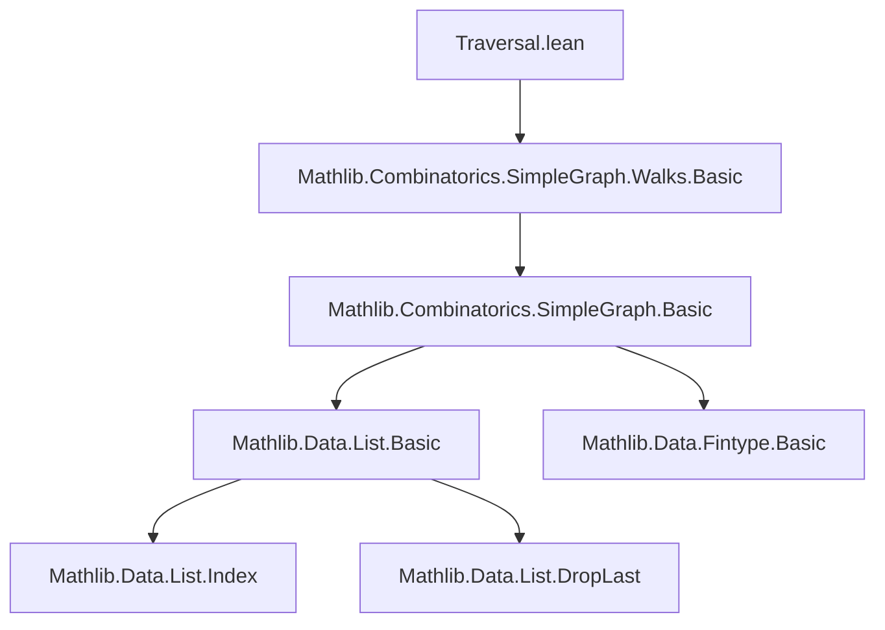
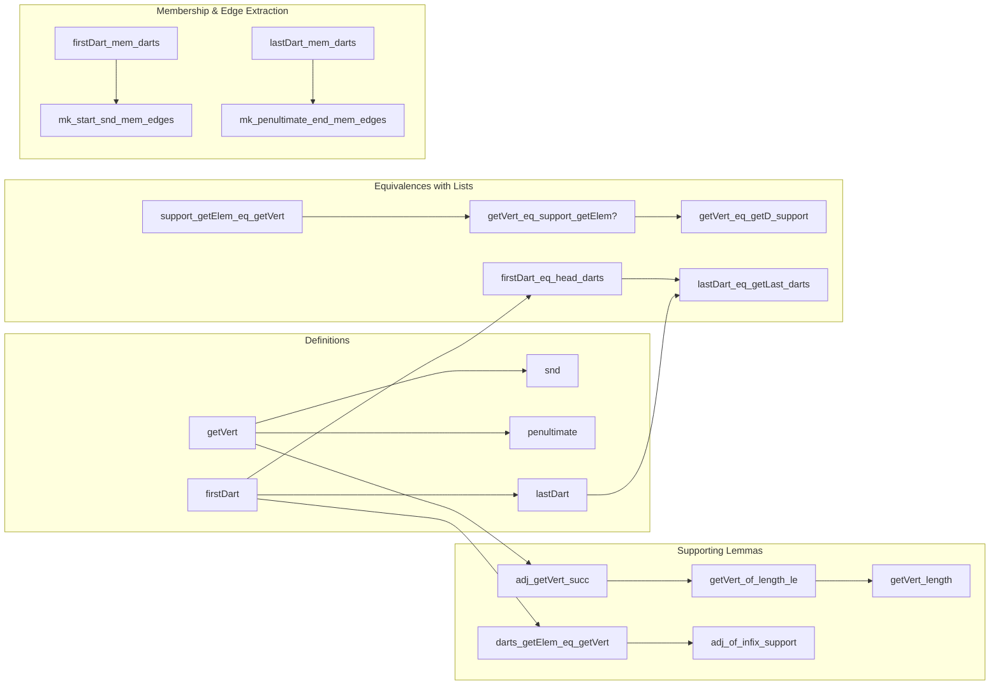

### Technical Brief: `Traversal.lean` — Traversing Walks in `SimpleGraph`

---

#### **1. Key Definitions & Theorems**

| Name | Type / Signature | Purpose |
|------|------------------|---------|
| `getVert` | `Walk u v → ℕ → V` | Extracts the *n*-th vertex of a walk; returns endpoint if *n* ≥ length |
| `snd` | `Walk u v → V` | Returns the second vertex (`getVert 1`), or start vertex if walk is nil |
| `penultimate` | `Walk u v → V` | Returns the penultimate vertex (`getVert (length - 1)`), or start vertex if nil |
| `firstDart` | `¬ p.Nil → Dart` | Constructs the first dart of a non-empty walk |
| `lastDart` | `¬ p.Nil → Dart` | Constructs the last dart of a non-empty walk |
| `adj_getVert_succ` | `i < p.length → G.Adj (p.getVert i) (p.getVert (i+1))` | Adjacency between consecutive vertices in a walk |
| `getVert_of_length_le` | `p.length ≤ i → p.getVert i = v` | If index ≥ length, returns endpoint |
| `getVert_length` | `p.getVert p.length = v` | Special case of above for `i = length` |
| `darts_getElem_eq_getVert` | `n < p.darts.length → p.darts[n] = ⟨(p.getVert n, p.getVert (n+1)), ...⟩` | Relates darts to consecutive vertices |
| `adj_of_infix_support` | `[u', v'] <:+: p.support → G.Adj u' v'` | If a pair appears as a contiguous subsequence in support, it's an edge |
| `support_getElem_eq_getVert` | `p.support[n]'h = p.getVert n` | Equivalence between list indexing on support and `getVert` |
| `firstDart_eq_head_darts` | `p.darts ≠ [] → p.firstDart h = p.darts.head h` | First dart equals head of darts list |
| `lastDart_eq_getLast_darts` | `p.darts ≠ [] → p.lastDart h = p.darts.getLast h` | Last dart equals last element of darts list |

---

#### **2. Naming Conventions**

- **Prefixes**:
  - `getVert_`: for functions/lemmas about extracting vertices by index
  - `snd`, `penultimate`: short for *second*, *penultimate*
  - `firstDart`, `lastDart`: for dart extraction
  - `head_`, `getLast_`: for list operations on `edges`/`darts`
- **Suffixes**:
  - `_eq_support_getElem`: when relating `getVert` to list indexing on support
  - `_eq_head_darts`, `_eq_getLast_darts`: when equating dart constructors with list operations
  - `_mem_`: membership lemmas (e.g., `firstDart_mem_darts`)
- **Pattern**: `mk_..._eq_head_...` / `head_..._eq_mk_...` — bidirectional rewriting lemmas

---

#### **3. Tactic Stack**

Frequently used tactics in proofs:
- `induction ... with | nil => | cons => ...` — structural induction on walks
- `cases` — on walks, naturals, options, and hypotheses
- `simp` / `simp_rw` — especially with `getVert`, `support`, `darts`, `edges`
- `grind` — custom tactic (likely from Mathlib) for automated simplification + rewriting
- `congr` / `ext` — for extensionality in equality proofs (e.g., darts)
- `lia` — for linear arithmetic on natural number inequalities
- `by_cases` — for branching on decidables like `p.Nil`, `p.darts = []`
- `obtain ⟨n, rfl⟩` — for eliminating `n ≠ 0` via `Nat.exists_eq_add_one_of_ne_zero`

---

#### **4. Proof Logic**

- **Inductive structure**: Most proofs proceed by induction on the walk `p`, handling:
  - `nil`: trivial base case
  - `cons h p`: inductive step, often reducing to smaller `p`
- **Index reasoning**: Many lemmas involve bounding indices (`i < length`, `i ≤ length`, `i ≥ length`) and use:
  - `Nat.succ_lt_succ_iff`, `Nat.succ_le_succ_iff`
  - `Nat.sub_le_of_le_add`, `Nat.add_sub_cancel`
- **Support/darts/edges alignment**:
  - Lemmas like `darts_getElem_eq_getVert` and `adj_of_infix_support` bridge walk semantics (vertex sequences) with graph structure (edges/darts).
- **Non-emptiness handling**:
  - Many definitions require `¬ p.Nil`; proofs often convert this to `0 < p.length` via `not_nil_iff_lt_length`.

---

#### **5. Imports**

- `Mathlib.Combinatorics.SimpleGraph.Walks.Basic` — core definitions of walks, adjacency, darts, edges, support, length, etc.

---

#### **6. Mermaid Diagrams**

##### **Dependency Graph (Module-Level)**

##### **Overview of File Structure**

---

#### **7. Theory Context**

This module formalizes *accessor functions* for walks in a simple graph, enabling:
- Index-based vertex retrieval (`getVert`)
- Extraction of boundary vertices (`snd`, `penultimate`)
- Construction of boundary darts (`firstDart`, `lastDart`)
- Alignment of walk semantics with list representations (`support`, `darts`, `edges`)

It serves as a foundational utility layer for higher-level walk operations (e.g., traversal algorithms, cycle detection, Eulerian path verification), where precise indexing and boundary reasoning are essential.

--- 

Let me know if you'd like a formalized summary in Lean syntax or a dependency graph for the entire `Mathlib.Combinatorics.SimpleGraph` hierarchy.
