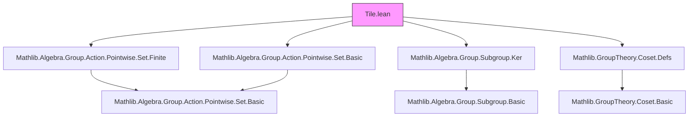

### Technical Brief: `Tile.lean`

---

#### **1. Key Definitions & Theorems**

| Name | Type / Structure | Purpose |
|------|------------------|---------|
| `Prototile G X` | `Structure` | Represents a tile in space `X` under group action `G`, with a specified subgroup of its stabilizer (`symmetries`) identifying when two copies are considered identical. |
| `Protoset G X ιₚ` | `Structure` | An indexed family of prototiles over index type `ιₚ`. Facilitates dot-notation API. |
| `PlacedTile ps` | `Structure` | A tile placed via group action: an index `i : ιₚ` and a coset `g • symmetries`, representing the image `g • (ps i)` up to symmetry. Quotiented by symmetries to avoid overcounting. |
| `coeSet` | `def` | Coercion from `PlacedTile` to `Set X`, defined via quotient lift. Ensures well-definedness modulo symmetries. |
| `induction_on` | `lemma` | Induction principle for `PlacedTile`, reducing proofs to those for `⟨i, g⟩`. |
| `ext_iff_of_exists` | `lemma` | Extensionality for `PlacedTile`: equality iff same index and existence of a common group element representing both cosets. |
| `ext_iff_of_preimage` | `lemma` | Alternative extensionality using preimage equality under quotient map. |
| `smul` | `instance` | Left action of `G` on `PlacedTile ps`, compatible with the action on `X`. |
| `coe_smul` | `lemma` | Compatibility of group action with coercion: `g • pt` as a set equals `g • (pt : Set X)`. |
| `mem_smul_iff_smul_inv_mem`, `mem_inv_smul_iff_smul_mem` | `lemmas` | Characterizations of membership under group action, useful for reasoning about placed tiles. |

---

#### **2. Naming Conventions**

- **Prefixes**:
  - `coe_`: Coercion-related definitions (`coeSet`, `coe_mk`, `coe_nonempty_iff`, etc.)
  - `smul_`: Group action-related (`smul_index`, `smul_mk_mk`, `smul_mem_smul_iff`, etc.)
  - `ext_`: Extensionality lemmas (`ext_iff_of_exists`, `ext_iff_of_preimage`)
  - `induction_`: Induction principles (`induction_on`)
- **Suffixes**:
  - `_iff`: Biconditional characterizations (`coe_nonempty_iff`, `coe_finite_iff`, `mem_smul_iff_smul_inv_mem`)
  - `_mk`: Definitions or simplifications involving constructor `⟨_, _⟩` (`coe_mk`, `coe_mk_mk`, `smul_mk_mk`)
- **Structure fields**:
  - `carrier`, `symmetries`, `tiles`, `index`, `groupElts`: Direct, descriptive names.

---

#### **3. Tactic Stack**

Frequently used tactics in proofs and definitions:

| Tactic | Usage |
|--------|-------|
| `simp` / `simp only` | Simplifying goals using `@[simp]` lemmas (e.g., `mem_coe`, `coe_mk`, `smul_mk_mk`) |
| `rw` / `rw [← ...]` | Rewriting using definitions and lemmas, often with `←` for reverse direction |
| `induction ... using ...` | Structural induction on inductively defined types (`PlacedTile.induction_on`) |
| `rcases` / `cases` | Decomposing existential or product hypotheses |
| `subst` | Substituting equalities (e.g., after `ext` or `heq_of_eq`) |
| `exact` / `refine` | Finishing proofs or constructing terms with holes |
| `set_tac` / `set_simp` (via `Set.`) | Reasoning about sets (e.g., `Set.smul_mem_smul_set_iff`) |
| `ring` / `abel` | Not used here (group is multiplicative), but `mul_assoc`, `inv_mul_cancel` used instead |
| `aesop` | Not present — proofs are mostly manual or `simp`-driven |

---

#### **4. Proof Logic**

- **Inductive structure**: `PlacedTile` is defined as a quotient of `ιₚ × G`, so proofs often proceed by:
  1. `induction pt using PlacedTile.induction_on`
  2. Reducing to `⟨i, g⟩` form
  3. Simplifying using `@[simp]` lemmas (`coe_mk`, `smul_mk_mk`, etc.)
- **Extensionality**: Proofs of equality for `PlacedTile` use:
  - `ext` (via `ext_iff_of_exists` or `ext_iff_of_preimage`)
  - Or `heq_of_eq` after showing cosets are equal
- **Well-definedness**: For quotient-based definitions (`coeSet`, `smul`), proofs verify invariance under the equivalence relation (e.g., `Quotient.liftOn'_mk''` + symmetry condition via stabilizer subgroup).
- **Set-theoretic reasoning**: Leverages `Pointwise` and `Set` API (e.g., `Set.smul_mem_smul_set_iff`, `Set.mem_smul_set_iff_inv_smul_mem`).

---

#### **5. Imports & Dependencies**

**Core imports** (define scope and foundational context):

```lean
Mathlib.Algebra.Group.Action.Pointwise.Set.Finite
Mathlib.Algebra.Group.Action.Pointwise.Set.Basic
Mathlib.Algebra.Group.Subgroup.Ker
Mathlib.GroupTheory.Coset.Defs
```

**Key dependencies**:
- `MulAction G X`: Group action on space.
- `Pointwise` set actions: `•`, `g • s`, `g⁻¹ • s`.
- `Subgroup.stabilizer`, `Subgroup.map`, `Subgroup.subtype`: For symmetry subgroups.
- `QuotientGroup`: Coset construction `G ⧸ H`.
- `Set.Finite`, `Set.Nonempty`: Finiteness and non-emptiness properties.

---

#### **6. Mermaid Diagrams**

##### **Dependency Graph (Module-Level)**



##### **Conceptual Overview (Theory Flow)**

```mermaid
flowchart LR
  subgraph Context
    G[Group G] -->|MulAction| X[Space X]
  end

  subgraph Tiles
    P[Prototile G X] -->|carrier| SetX[Set X]
    P -->|symmetries| Stab[Subgroup (stabilizer G carrier)]
  end

  subgraph Families
    PS[Protoset G X ιₚ] -->|tiles| P
  end

  subgraph Placements
    PT[PlacedTile ps] -->|index| ιₚ
    PT -->|groupElts| Quot[G ⧸ symmetries]
    PT -->|coeSet| SetX
  end

  G -->|acts on| PT
  PS -->|induces| PT

  style Context fill:#e6f7ff,stroke:#1890ff
  style Tiles fill:#f6ffed,stroke:#52c41a
  style Families fill:#fff7e6,stroke:#fa8c16
  style Placements fill:#fff0f6,stroke:#eb2f96
```

---

#### **7. Summary**

This module formalizes the *discrete* theory of tiles and tilings in a group-action setting, with:
- **Prototiles** as base tiles with symmetry data,
- **Protosets** as families of prototiles,
- **PlacedTiles** as group-orbit equivalence classes of tile placements.

It is designed for extensibility (e.g., to continuous tilings via measurable sets or closures), and emphasizes compatibility with mathlib’s algebraic and set-theoretic infrastructure. The use of quotients and symmetry-aware equivalence ensures correctness under standard tiling conventions (e.g., Grünbaum–Shephard, Greenfeld–Tao).
