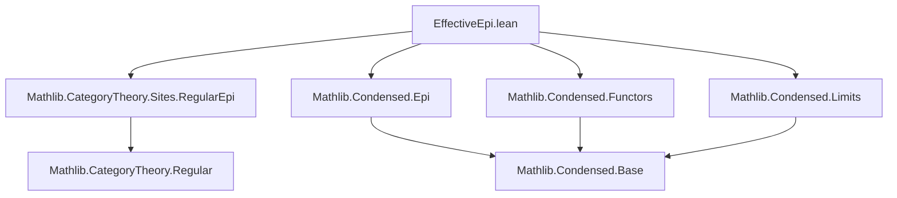

**Technical Brief: `EffectiveEpi.lean`**

---

### 1. **Key Definitions & Theorems**

| Name | Type / Statement | Purpose |
|------|------------------|---------|
| `compHausToCondensed.PreservesEpimorphisms` | `instance : compHausToCondensed.PreservesEpimorphisms` | Shows the embedding functor from compact Hausdorff spaces (`CompHausLike`) to condensed sets preserves *epimorphisms*. |
| `CondensedSet.epi_iff_locallySurjective_on_compHaus` | `↔` characterisation of epis in `CondensedSet` when tested on compact Hausdorff objects | Used to reduce epimorphism checking in `CondensedSet` to a concrete surjectivity condition on global sections over compact Hausdorff test objects. |
| `CompHaus.epi_iff_surjective` | `f : CompHaus := f.hom : X ⟶ Y` is epi ⇔ `f.hom` is surjective | Classical characterisation of epis in `CompHaus` (as surjective continuous maps). |
| `compHausToCondensed.PreservesEffectiveEpis` | `instance : compHausToCondensed.PreservesEffectiveEpis` | Immediate corollary: the functor also preserves *effective* epimorphisms (since in regular categories, effective epis are stable under pullback and coequalisers; this follows from preservation of all epis in this context). |
| `IsRegularEpiCategory CondensedSet.{u}` | `instance` | Proves `CondensedSet` is a *regular category*, i.e., has finite limits, coequalisers of kernel pairs, and stable regular epis. Derived via `inferInstanceAs (Sheaf _ _)`. |

---

### 2. **Naming Conventions**

- **`preserves_`**: Prefix for functors preserving a class of morphisms (e.g., `PreservesEpimorphisms`, `PreservesEffectiveEpis`).
- **`epi_iff_`**: Biconditional characterisations of epimorphisms in specific categories.
- **`_down`**: Notation for the underlying morphism in `CompHaus` (e.g., `g.down.hom`).
- **`pullback._`**: Standard category-theoretic constructions (`pullback.fst`, `pullback.snd`, `pullback.condition`).
- **`ULift.ext`**: Proof irrelevance/extensionality for `ULift`-based equality in universe-polymorphic settings.

---

### 3. **Tactic Stack**

| Tactic | Usage |
|--------|-------|
| `rw` | Rewriting epimorphism characterisations (`epi_iff_locallySurjective_on_compHaus`, `epi_iff_surjective`, `pullback.condition`). |
| `intro` | Introducing variables and hypotheses in proof goals. |
| `refine` | Constructing witnesses for existential goals (e.g., constructing a lift in a pullback diagram). |
| `obtain` | Extracting witnesses from surjectivity assumptions (`hf (g.down.hom y)`). |
| `exact` | Closing goals with direct evidence. |
| `rfl` | Proving definitional equalities (e.g., `pullback.condition _ _` reduces definitionally). |
| `ULift.ext` | Proving equality in `ULift`-encoded types via underlying equality. |
| `inferInstance` | Automatically inferring instances (e.g., `PreservesEffectiveEpis`, `IsRegularEpiCategory`). |

---

### 4. **Proof Logic**

The core proof proceeds as follows:

1. **Goal**: Show `compHausToCondensed f` is epi in `CondensedSet`, given `f` is epi in `CompHaus`.
2. Use `epi_iff_locallySurjective_on_compHaus` to reduce to:  
   For all compact Hausdorff $S$ and $g : S \to \mathrm{cod}(f)$, there exists a lift $S \to \mathrm{dom}(f)$.
3. Translate $g$ to a map $g.\text{down} : S \to Y$ in `CompHaus`.
4. Apply surjectivity of $f$ (via `epi_iff_surjective`) to lift $g.\text{down}(y)$ to some $x$.
5. Construct the lift as a pair $(x, y)$ in the pullback $X \times_Y S$, using `pullback.fst`, `pullback.snd`.
6. Verify the lift satisfies the required conditions using definitional equalities and `pullback.condition`.

The final corollary `PreservesEffectiveEpis` follows because in a regular category, effective epimorphisms are precisely the coequalisers of their kernel pairs — and since the functor preserves all epis *and* finite limits (as a left exact embedding), it preserves effective epis.

---

### 5. **Imports & Scope**

| Import | Role |
|--------|------|
| `Mathlib.CategoryTheory.Sites.RegularEpi` | Provides background on regular epimorphisms and regular categories. |
| `Mathlib.Condensed.Epi` | Defines epis in `CondensedSet`, including `epi_iff_locallySurjective_on_compHaus`. |
| `Mathlib.Condensed.Functors` | Contains the definition of `compHausToCondensed`. |
| `Mathlib.Condensed.Limits` | Provides pullbacks and other limit constructions in `CondensedSet`. |

---

### 6. **Mermaid Diagrams**

#### **Dependency Graph (Module-Level)**



#### **Conceptual Overview of Proof Flow**

```mermaid
flowchart LR
  A[f : X → Y in CompHaus, epi] --> B[f is surjective]
  B --> C[For any S ∈ CompHaus, g: S → Y]
  C --> D[Pullback X ×_Y S exists]
  D --> E[Construct lift y ↦ (x,y)]
  E --> F[Verify lift satisfies conditions]
  F --> G[compHausToCondensed f is epi in CondensedSet]
  G --> H[PreservesEffectiveEpis]
  H --> I[IsRegularEpiCategory CondensedSet]
```

---

### 7. **Summary**

This module establishes that the canonical embedding of compact Hausdorff spaces into condensed sets preserves epimorphisms — a key step in showing that condensed sets form a regular category. The proof leverages concrete surjectivity in `CompHaus`, pullback constructions in `CondensedSet`, and the characterisation of epis in condensed sets via test maps from compact Hausdorff spaces. The result is foundational for developing homological algebra and sheaf theory in the condensed setting.
