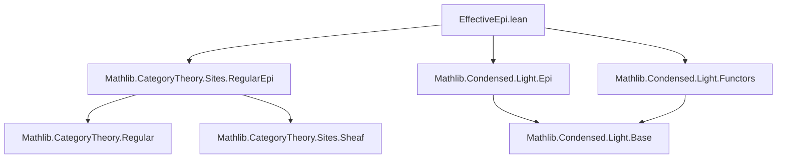

**Technical Brief: `EffectiveEpi.lean`**

---

### 1. **Key Definitions & Theorems**

| Name | Type / Signature | Purpose |
|------|------------------|---------|
| `lightProfiniteToLightCondSet.PreservesEpimorphisms` | `Instance` | Shows that the functor `lightProfiniteToLightCondSet` preserves (regular) epimorphisms. |
| `lightProfiniteToLightCondSet.PreservesEffectiveEpis` | `Instance` (via `inferInstance`) | Follows as a corollary: the functor preserves *effective* epimorphisms. |
| `IsRegularEpiCategory LightCondSet.{u}` | `Instance` | Proves that the category of light condensed sets is a *regular epimorphism category*, i.e., every extremal epimorphism is regular. |

**Auxiliary lemmas used (not top-level declarations, but critical):**
- `LightCondSet.epi_iff_locallySurjective_on_lightProfinite`: Characterizes epimorphisms in `LightCondSet` via local surjectivity on light profinite sets.
- `LightProfinite.epi_iff_surjective`: Epimorphisms in `LightProfinite` are exactly surjective continuous maps.

---

### 2. **Naming Conventions**

- **Prefixes:**
  - `lightProfiniteToLightCondSet.`: Functor name prefix.
  - `preserves`: Used for instance properties (e.g., `preserves f hf`).
  - `is_`: In `IsRegularEpiCategory`, standard categorical property naming.
- **Suffixes:**
  - `_iff_`: Biconditional characterizations (e.g., `epi_iff_...`).
  - `_condition`, `_fst`, `_snd`: Standard pullback component names.
- **General pattern:** Functional and descriptive; avoids abbreviations.

---

### 3. **Tactic Stack**

| Tactic | Usage Frequency | Role |
|--------|-----------------|------|
| `rw` | High | Rewriting definitions (epi, pullback, etc.). |
| `intro` | Medium | Introducing variables for universal properties. |
| `refine` | Medium | Constructing witnesses for existential goals. |
| `obtain` | Medium | Extracting witnesses from surjectivity hypotheses. |
| `exact` / `rfl` | Low–Medium | Finishing trivial equalities. |
| `inferInstance` | Low (top-level) | Deriving instances from existing typeclass instances. |

No heavy automation (`aesop`, `ring`, `simp_rw`) appears—proof is mostly *constructive* and *diagram-chasing* style.

---

### 4. **Proof Logic**

The proof proceeds as follows:

1. **Goal**: Show `lightProfiniteToLightCondSet` preserves epimorphisms.
2. **Rewrite** using `epi_iff_locallySurjective_on_lightProfinite`: need to show for any `S : LightProfinite`, `g : S ⟶ lightProfiniteToLightCondSet Y`, there exists a lift.
3. **Construct** the candidate lift as the pullback `pullback f g`.
4. **Use surjectivity** of `f` (via `hf` and `epi_iff_surjective`) to get a preimage `x` of `g y`.
5. **Build** the pair `⟨x, y⟩` and verify it lies in the pullback via `hx`.
6. **Verify** the required triangle commutes and uniqueness (via `rfl` and `pullback.condition`).

The proof is *explicitly constructive*, leveraging concrete descriptions of limits (pullbacks) and epimorphisms in these concrete categories.

---

### 5. **Imports**

| Import | Role |
|--------|------|
| `Mathlib.CategoryTheory.Sites.RegularEpi` | Provides background on regular epimorphisms and `IsRegularEpiCategory`. |
| `Mathlib.Condensed.Light.Epi` | Defines epimorphisms in `LightCondSet`, especially `epi_iff_locallySurjective_on_lightProfinite`. |
| `Mathlib.Condensed.Light.Functors` | Contains `lightProfiniteToLightCondSet` and related functors. |

These imports define the *ambient categorical and condensed mathematics context*.

---

### 6. **Mermaid Diagrams**

#### **Dependency Graph (Module-Level)**



#### **Conceptual Overview of Proof**

```mermaid
flowchart LR
  A[f : X ⟶ Y in LightProfinite] -->|hf| B[f is surjective]
  B --> C[For any S, g : S ⟶ Y]
  C --> D[Construct pullback P = pullback f g]
  D --> E[Use surjectivity to lift y ↦ g y]
  E --> F[Define lift s ↦ ⟨x, s⟩]
  F --> G[Verify pullback universal property]
  G --> H[Conclude f is preserved as epi]
  H --> I[lightProfiniteToLightCondSet preserves epis]
  I --> J[⇒ Preserves effective epis]
```



#### **Categorical Context**

```mermaid
graph LR
  LightProfinite --lightProfiniteToLightCondSet--> LightCondSet
  LightCondSet --is_regular--> IsRegularEpiCategory
  LightProfinite --epi=surjective--> Set
  LightCondSet --epi=locally surj--> LightProfinite^op → Set
```

---

### 7. **Summary**

This module establishes that the embedding of light profinite sets into light condensed sets preserves effective epimorphisms. The proof is constructive and relies on concrete descriptions of pullbacks and epimorphisms in both categories. It also shows that `LightCondSet` is a regular epimorphism category, inheriting this property from a sheaf category. The formalization is minimal, focused, and avoids heavy automation—emphasizing explicit diagrammatic reasoning.
