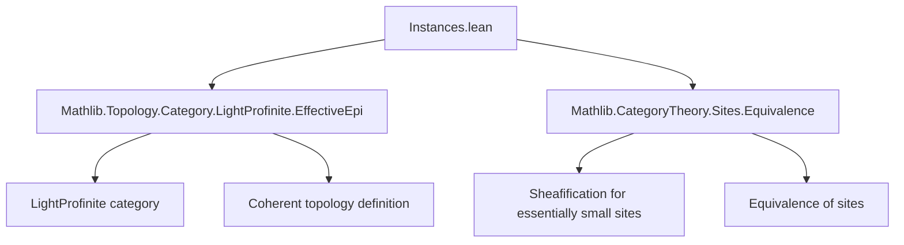

**Technical Brief: `Instances.lean` — `HasSheafify` Instances for `LightProfinite`**

---

### 1. **Key Definitions & Theorems**

| Name | Type / Signature | Purpose |
|------|------------------|---------|
| `hasSheafify` | `HasSheafify (coherentTopology LightProfinite.{u}) A` | Provides a sheafification functor for $A$-valued presheaves on the coherent site of light profinite spaces, assuming $A$ is a concrete category with suitable limit/colimit and forgetful functor properties. |
| `hasSheafify_type` | `HasSheafify (coherentTopology LightProfinite.{u}) (Type u)` | Special case of `hasSheafify` for $A = \Type u$, enabling sheafification of type-valued presheaves. |
| `WEqualsLocallyBijective.ofEssentiallySmall` | `GrothendieckTopology.WEqualsLocallyBijective A` | Constructs the property that weak equivalences are locally bijective (for the coherent topology) using that the site is essentially small. |

All three instances rely on the fact that `LightProfinite.{u}` is *essentially small* despite being large (as a full subcategory of `Top`), allowing transport of sheaf-theoretic constructions via equivalence of sites.

---

### 2. **Naming Conventions**

- **Prefixes**:
  - `hasSheafify`: Indicates existence of a sheafification adjunction.
  - `ofEssentiallySmall`: Indicates derivation from essential smallness.
- **Suffixes**:
  - `_type`: Denotes the special case where the target category is `Type u`.
- **Generic pattern**: `hasSheafifyEssentiallySmallSite _ _` — a reusable lemma for essentially small sites.

---

### 3. **Tactic Stack**

- `exact` (implicit via `instance` resolution)
- `apply` (via `instance` inference)
- No explicit tactics appear in the proof terms — the proofs are *definitionally* handled by `hasSheafifyEssentiallySmallSite` and `GrothendieckTopology.WEqualsLocallyBijective.ofEssentiallySmall`, which are themselves built on earlier lemmas in `Equivalence.lean`.

---

### 4. **Proof Logic**

- **High-level strategy**: Use the equivalence between the coherent site of `LightProfinite.{u}` and an essentially small site (via `coherentTopology.essentiallySmall` or similar).
- **Mechanism**:
  1. `hasSheafifyEssentiallySmallSite _ _` is applied — it takes:
     - A proof that the source site is essentially small (`coherentTopology LightProfinite.{u}`),
     - A proof that the target category $A$ satisfies the conditions for sheafification (limits, colimits, concrete structure, forgetful functor preserves filtered colimits & limits, reflects isos).
  2. Similarly, `ofEssentiallySmall` constructs the `WEqualsLocallyBijective` instance using the same essential smallness.

- **No induction or case analysis** is needed — the arguments are categorical and rely on pre-established equivalences.

---

### 5. **Imports**

| Import | Role |
|--------|------|
| `Mathlib.Topology.Category.LightProfinite.EffectiveEpi` | Provides background on light profinite spaces and effective epimorphisms (used in defining the coherent topology). |
| `Mathlib.CategoryTheory.Sites.Equivalence` | Supplies the key lemmas: `hasSheafifyEssentiallySmallSite`, `GrothendieckTopology.WEqualsLocallyBijective.ofEssentiallySmall`. |

---

### 6. **Dependency & Theory Overview (Mermaid Diagrams)**

#### **A. Module Dependency Graph**



#### **B. Theoretical Flow for `hasSheafify`**

```mermaid
graph LR
  S[LightProfinite.{u}] -->|essentially small| E[Small category S']
  S -->|coherentTopology| T[Site T]
  T -->|equivalence| T'[Site S']
  A[Target category A] -->|limits, colimits, concrete| F[Forgetful functor properties]
  T' & F -->|hasSheafifyEssentiallySmallSite| H[HasSheafify T A]
```

#### **C. Role in Broader Theory**

- `Instances.lean` sits *between*:
  - **Topological/Profinite foundations** (`LightProfinite.EffectiveEpi`) — defining the site,
  - **Sheaf theory machinery** (`Sites.Equivalence`) — enabling sheafification.
- It enables downstream development (e.g., sheaf cohomology on profinite spaces) by providing the required adjunctions.

---

### 7. **Summary**

This file establishes foundational sheaf-theoretic infrastructure for the coherent site on light profinite spaces. It leverages essential smallness to bypass size issues and apply general sheafification results. The instances are *non-trivial* due to the large size of `LightProfinite`, but are *canonical* thanks to categorical equivalences.

--- 

Let me know if you'd like the corresponding Lean code annotated with proof hints or a formalization roadmap for downstream sheaf cohomology results.
