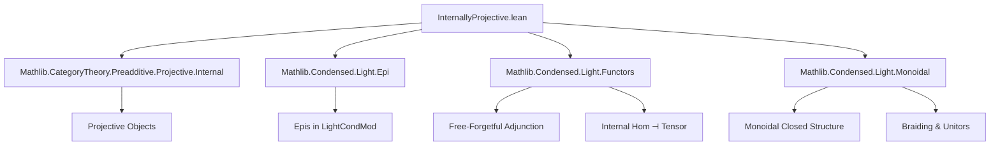

### Technical Brief: `InternallyProjective.lean`

---

#### **1. Key Definitions & Theorems**

| Name | Type / Signature | Purpose |
|------|------------------|---------|
| `ihomPoints` | `(A B : LightCondMod R) → (S : LightProfinite) → (A ⟶[LightCondMod R] B).val.obj ⟨S⟩ ≃ (P ⊗ R[S] ⟶ B)` | Establishes a bijection between internal hom $S$-points and morphisms from $P \otimes R[S]$. Used to translate between internal homs and tensor-hom adjunctions. |
| `internallyProjective_iff_tensor_condition` | `InternallyProjective P ↔ ∀ e : A ↠ B, ∀ S, ∀ g : P ⊗ R[S] ⟶ B, ∃ π : S' ↠ S, g' : P ⊗ R[S'] ⟶ A, ...` | Main characterization: $P$ is internally projective iff lifting along epimorphisms can be done *locally* over a cover $S' \to S$ in the light profinite site. |
| `internallyProjective_iff_tensor_condition'` | Same as above but with tensor flipped: $R[S] \otimes P$ | Equivalent formulation using symmetry of monoidal structure (braiding $\beta$). |
| `free_internallyProjective_iff_tensor_condition` | `InternallyProjective (free R).obj P ↔ ...` | Special case for free condensed modules on a light condensed set $P$. Uses monoidal isomorphism $\mu$ to rewrite $R[P] \otimes R[S] \cong R[P \times S]$. |
| `free_internallyProjective_iff_tensor_condition'` | Same as above with flipped tensor | Uses $\mu$ and symmetry to handle $R[S] \otimes R[P] \cong R[S \times P]$. |
| `free_lightProfinite_internallyProjective_iff_tensor_condition` | Same as `free_internallyProjective_iff_tensor_condition`, but $P : LightProfinite$ directly | Uses `lightProfiniteToLightCondSet` to embed profinite sets into condensed sets. |
| `free_lightProfinite_internallyProjective_iff_tensor_condition'` | Same with flipped tensor | Analogous to above. |

---

#### **2. Naming Conventions**

- **Prefixes**:
  - `ihom_`: internal hom-related constructions (`ihomPoints`, `ihom_map_val_app`, `ihomPoints_symm_apply`, etc.)
  - `internallyProjective_iff_`: main equivalences for internal projectivity
  - `free_`: free module constructions
  - `free_lightProfinite_`: free module on profinite objects
- **Suffixes**:
  - `_condition`: characterizing condition (e.g., tensor lifting property)
  - `_condition'`: flipped tensor version
  - `_app`, `_val`, `_obj`: component-level accessors (e.g., `.val.app`, `.val.obj`)
- **Morphisms**:
  - `π`: surjective map $S' \to S$
  - `g`, `g'`: test morphisms into $B$ / lift to $A$
  - `e`: epimorphism $A \twoheadrightarrow B$

---

#### **3. Tactic Stack**

| Tactic | Frequency | Role |
|--------|-----------|------|
| `rw` | Very High | Rewriting definitions, adjunctions, naturality squares |
| `simp` / `simp only` | Very High | Simplifying using monoidal closed structure, Yoneda, adjunctions, `μIso`, `δ`, etc. |
| `apply` / `refine` | High | Constructing witnesses (e.g., `⟨S', π, hπ, g', ?_⟩`) |
| `have` / `obtain` | High | Extracting intermediate data from assumptions |
| `cat_disch` | Medium | Category-theoretic discharge (used in `ihom_map_val_app`) |
| `dsimp` | Medium | Definitional simplification before rewriting |
| `congr` | Low | Congruence closure (used in `ihomPoints_apply`) |

> **Note**: `simp?` is used to generate optimized `simp only` lemmas (e.g., in `free_internallyProjective_iff_tensor_condition`), indicating heavy reliance on `simp`-based automation.

---

#### **4. Proof Logic**

- **Structure**: All proofs follow a *bidirectional equivalence* pattern:
  1. **Forward direction** (`→`): Assume internal projectivity (`InternallyProjective P`), i.e., $\mathrm{Hom}(P, -)$ preserves epimorphisms.
  2. Use characterization of epis in `LightCondMod R` via *local surjectivity on light profinite points* (`LightCondMod.epi_iff_locallySurjective_on_lightProfinite`).
  3. Translate the test morphism $g : P \otimes R[S] \to B$ into an internal hom point using `ihomPoints`.
  4. Apply internal projectivity to get a lift over some cover $S' \to S$.
  5. Translate back using `ihomPoints_symm_apply` and naturality lemmas (`ihom_map_val_app`, `ihomPoints_symm_comp`).

- **Backward direction** (`←`): Assume the tensor lifting condition.
  1. To show $\mathrm{Hom}(P, -)$ preserves epis, take any $e : A \twoheadrightarrow B$ and $g : P \to B$.
  2. Use unit/counit of the free-forgetful adjunction to factor $g$ as $P \otimes R[1] \to B$, then apply assumption with $S = \ast$ (terminal profinite set).
  3. Lift to $g' : P \otimes R[S'] \to A$, then use `ihomPoints_symm_apply` to get a global lift.

- **Special cases** (`free_`, `free_lightProfinite_`):
  - Use monoidal isomorphisms:
    - $\mu : R[P] \otimes R[S] \xrightarrow{\sim} R[P \times S]$
    - $\beta : R[S] \otimes R[P] \xrightarrow{\sim} R[P \otimes S]$
  - Apply the main theorem and transport along these isos using `μIso_hom`, `μIso_inv`, and naturality (`μ_natural_right`, `μ_natural_left`, `δ_μ`, etc.).

---

#### **5. Imports**

| Module | Purpose |
|--------|---------|
| `Mathlib.CategoryTheory.Preadditive.Projective.Internal` | Defines `InternallyProjective` in preadditive categories |
| `Mathlib.Condensed.Light.Epi` | Characterizes epimorphisms in `LightCondMod R` |
| `Mathlib.Condensed.Light.Functors` | Free-forgetful adjunction, internal hom, tensor product |
| `Mathlib.Condensed.Light.Monoidal` | Monoidal closed structure, braiding, unitors, associators |

> **Scope**: This file lives in the *light* condensed module theory (a simplified version of condensed modules), over a commutative ring $R$. It bridges internal projectivity (a categorical notion) with concrete lifting conditions over profinite sets.

---

#### **8. Mermaid Diagrams**

##### **Dependency Graph (Module-Level)**



##### **Theoretical Overview (File-Level)**

```mermaid
flowchart LR
  subgraph Definitions
    D1[LightCondMod R]
    D2[LightProfinite]
    D3[free R : LightCondSet → LightCondMod R]
    D4[⊗, ⟶[−]]
  end

  subgraph Core Equivalences
    E1[internallyProjective_iff_tensor_condition]
    E2[internallyProjective_iff_tensor_condition']
    E3[free_internallyProjective_iff_tensor_condition]
    E4[free_internallyProjective_iff_tensor_condition']
    E5[free_lightProfinite_...]
    E6[free_lightProfinite_...']
  end

  subgraph Technical Tools
    T1[ihomPoints]
    T2[ihom_map_val_app]
    T3[ihomPoints_symm_comp]
    T4[epi_iff_locallySurjective_on_lightProfinite]
    T5[μIso, β]
  end

  D1 -->|used in| E1
  D2 -->|used in| E1
  D3 -->|used in| E3 & E4 & E5 & E6
  D4 -->|used in| E1 & E2 & E3 & E4 & E5 & E6

  T1 -->|translates| E1
  T2 -->|naturality| E1
  T3 -->|naturality| E1
  T4 -->|epi criterion| E1
  T5 -->|rearrange tensors| E3 & E4 & E5 & E6
```

##### **Lifting Diagram (Conceptual)**

```mermaid
graph LR
  P⊗R[S'] -->|g'| A
  |π|         |e
  v           v
  P⊗R[S] -->|g| B
```

- **Goal**: For any $g$, find $π : S' \twoheadrightarrow S$ and $g'$ making the square commute.
- **Key idea**: Use internal projectivity to lift *locally* over a cover $S' \to S$ in the light profinite site.

--- 

Let me know if you'd like a formalized dependency graph (e.g., for `leanproject`), or a tactic trace for a specific proof.
