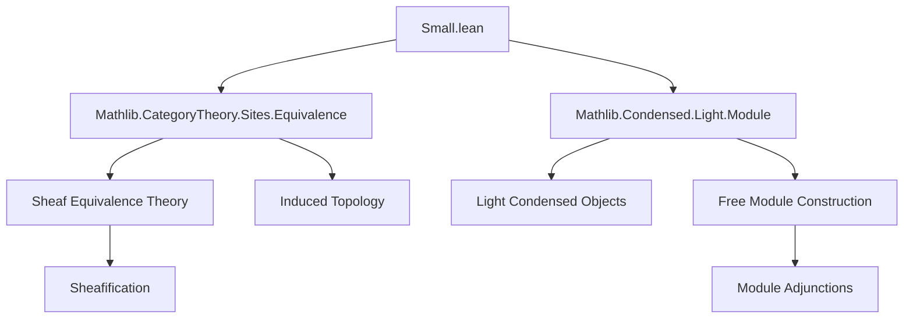

**Technical Brief: `Small.lean` — Equivalence of Light Condensed Objects and Sheaves on a Small Site**

---

### 1. **Key Definitions & Theorems**

| Name | Type / Signature | Purpose |
|------|------------------|---------|
| `equivSmall` | `LightCondensed.{u} C ≌ Sheaf (...) C` | Establishes an equivalence of categories between light condensed objects over `C` and sheaves on a small site induced from `LightProfinite`. |
| `equiv_small` (instance) | `Small (X ⟶ Y)` | Proves hom-sets in `LightCondensed` are small (i.e., in `Type (max u v)`), using fully faithfulness of `equivSmall`. |
| `equivSmallSheafificationIso` | `NatIso (...)` | Shows sheafification commutes (up to iso) with the equivalence `equivSmall`, i.e., sheafifying a presheaf before or after applying `equivSmall` yields equivalent results. |
| `equivSmallFreeIso` | `NatIso (...)` | Demonstrates that taking the free condensed module (via `free R`) commutes (up to iso) with `equivSmall`, i.e., free module construction is preserved under the equivalence. |

---

### 2. **Naming Conventions**

- **Prefixes**:
  - `equivSmall*`: All definitions/theorems relate to the equivalence `equivSmall`.
  - `Sheaf.*`: Sheaf-theoretic constructions (`Sheaf.adjunction`, `Sheaf.composeAndSheafify`, etc.).
  - `presheafToSheaf`: Standard sheafification functor.
  - `free`, `freeForgetAdjunction`: Module-theoretic constructions.

- **Suffixes**:
  - `Iso`: Natural isomorphism (e.g., `equivSmallSheafificationIso`, `equivSmallFreeIso`).
  - `equiv`: Equivalence of categories (e.g., `equivSmall`).
  - `congr*`: Congruence constructions (e.g., `sheafCongr`, `congrLeft`).

- **Structure**:
  - `op.congrLeft.inverse`: Opposite category and left congruence (used for precomposition).
  - `inducedTopology`: Topology induced via pullback along a functor.

---

### 3. **Tactic Stack**

- **Core tactics**:
  - `equivSmall := ...` uses:
    - `sheafCongr`: From `Mathlib.CategoryTheory.Sites.Equivalence`, to transport equivalences through sheafification.
    - `fullyFaithfulFunctor.homEquiv`: To construct the smallness instance.
  - `equivSmallSheafificationIso`:
    - `conjugateIsoEquiv`: From `Mathlib.CategoryTheory.Adjunction.Equivalence`, to conjugate adjunctions.
    - `NatIso.ofComponents`: Build natural isomorphism from component isos.
    - `comp`, `symm`, `isoWhiskerRight`, `Functor.associator`: Standard 2-categorical manipulations.
  - `equivSmallFreeIso`:
    - `Sheaf.adjunction`, `ModuleCat.adj`, `freeForgetAdjunction`: Module adjunctions.
    - `preimageIso`, `isoWhiskerRight`, `Functor.associator`: Again, categorical whiskering and iso manipulation.

- **No explicit `simp`, `ring`, or `aesop` usage** — relies on high-level categorical reasoning.

---

### 4. **Proof Logic**

- **Structure**:
  - **Equivalence construction** (`equivSmall`): Uses `sheafCongr` to lift the equivalence `equivSmallModel LightProfinite` (between `LightProfinite` and a small site) to sheaves over `C`.
  - **Smallness of hom-sets**: Follows directly from fully faithfulness of `equivSmall`.
  - **Preservation of constructions** (`equivSmallSheafificationIso`, `equivSmallFreeIso`):
    - Use *conjugation of adjunctions* via equivalences.
    - Construct natural isomorphisms by:
      1. Composing relevant adjunctions (`sheafificationAdjunction`, `freeForgetAdjunction`, etc.).
      2. Conjugating along the equivalence `equivSmall`.
      3. Using coherence isomorphisms (`invFunIdAssoc`, `Functor.associator`) to align domains/codomains.

- **Pattern**:
  > *Given an equivalence $F : \mathcal{C} \simeq \mathcal{D}$, and constructions $L : \mathcal{C} \to \mathcal{E}$, $R : \mathcal{D} \to \mathcal{E}$, show $L \cong R \circ F$ by conjugating the universal property (adjunction) of $L$ along $F$.*

---

### 5. **Imports & Dependencies**

| Import | Role |
|--------|------|
| `Mathlib.CategoryTheory.Sites.Equivalence` | Provides `sheafCongr`, `equivSmallModel`, `congrLeft`, etc. |
| `Mathlib.Condensed.Light.Module` | Defines `LightCondensed`, `free`, `ModuleCat`, etc. |

- **Core libraries used**:
  - `CategoryTheory.Sites`: Sheaves, induced topologies, sheafification.
  - `CategoryTheory.Adjunction.Equivalence`: Conjugation of adjunctions, `conjugateIsoEquiv`.
  - `Condensed.Light`: Light condensed objects, `LightProfinite`, `LightCondensed`.

---

### 6. **Mermaid Diagrams**

#### **Dependency Graph (Module-Level)**



#### **Conceptual Overview of `equivSmall` and Preservation Laws**

```mermaid
graph LR
  subgraph Domain
    LP[LightProfinite.{u}]
    LC[LightCondensed.{u} C]
  end

  subgraph Codomain
    SmallSite[Small Site]
    Sheaf[Sheaf(..., C)]
  end

  LP -- equivSmallModel --> SmallSite
  LC -- equivSmall --> Sheaf
  LP -- inverse.inducedTopology --> SmallSite
  SmallSite -- Sheaf(-, C) --> Sheaf

  LC -.->|sheafCongr| Sheaf

  subgraph Preservation
    Pres1[Sheafification commutes]
    Pres2[Free module commutes]
  end

  LC -- presheafToSheaf --> Sheaf
  LP -- presheafToSheaf ∘ equivSmallModel.op --> Sheaf
  Pres1 <==|equivSmallSheafificationIso| LC

  LC -- free R --> ModuleCat
  Sheaf -- Sheaf.composeAndSheafify --> Sheaf
  Pres2 <==|equivSmallFreeIso| LC
```

---

### 7. **Summary**

This file formalizes a *key structural result* in the theory of light condensed objects: that they are equivalent to sheaves on a small site (built from `LightProfinite`). It further shows that *standard constructions* — sheafification and free module generation — are *compatible* with this equivalence, via natural isomorphisms. The proofs rely heavily on categorical adjunctions and equivalence conjugation, avoiding explicit element-wise reasoning.

This is foundational for developing homological algebra and cohomology in the condensed setting, especially for small sites where set-theoretic size issues are manageable.
